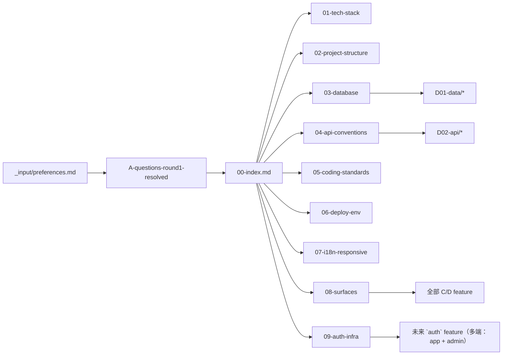

<!-- TARGET-PATH: docs/B01-architecture/00-index.md -->

# B01 · 架构与技术规范 · 索引

> **阶段**：B01-A 架构  
> **角色**：架构师  
> **feature**：全局（一次性定调，所有 feature 共用）  
> **上游依赖**：`_input/preferences.md`、`docs/A00-meta/questions/A-questions-round1-resolved.md`  
> **冻结状态**：已冻结 · 2026-04-28 · 签字: PM  
> **下游影响**：B02 权限（沿用 Supabase Auth + RBAC）、B03 设计系统（沿用前端栈与响应式断点）、所有 feature 的 C03/C04/D01/D02/D03

---

## 0. 摘要

1. **全栈 TypeScript strict**：禁止 `.js` / `.mjs` / JSDoc。
2. **前端纯 CSR/SPA**：React 19 + Vite 6 + TanStack + shadcn/ui + Tailwind 4；HTML 仅空壳，反爬虫硬性要求。
3. **后端 = Hono 容器 + Edge Functions**：业务 API 在 Hono；鉴权/回调/轻量编排在 Supabase Edge Functions（Deno）。
4. **数据访问 = supabase-js + Postgres RPC**：禁止 ORM；schema/迁移走 Supabase CLI 纯 SQL。
5. **Docker-only**：唯一 dev 环境跑在容器内，自动化测试也在容器内；生产由用户自接 Nginx + HTTPS。
6. **Supabase 本地自托管**：DB / Auth / Storage / Realtime / Edge Functions 全套自托管，**不使用 supabase.com**。
7. **多端 = `app` + `admin`**（两 surface），见 `08-surfaces.md`；鉴权基础设施见 `09-auth-infra.md`。
8. **Adapter + Mock**：第三方 / AI 缺 Key 走 mock fallback，dev 永不阻塞。

---

## 1. 文件清单

| 序号 | 文件 | 职责 | 谁会引用 |
|------|------|------|---------|
| 01 | [01-tech-stack.md](./01-tech-stack.md) | 前 / 后 / DB / AI / 部署的选型与精确版本 | 所有 D 阶段、B03 |
| 02 | [02-project-structure.md](./02-project-structure.md) | monorepo 目录布局、模块边界 | 所有 D 阶段、CI |
| 03 | [03-database.md](./03-database.md) | 命名、通用字段、软删除、迁移、RLS、jsonb | 所有 D01 |
| 04 | [04-api-conventions.md](./04-api-conventions.md) | URL/响应/错误码/分页/筛选 | 所有 D02 |
| 05 | [05-coding-standards.md](./05-coding-standards.md) | 前后端代码风格、分层、错误处理、日志 | 实现阶段 |
| 06 | [06-deploy-env.md](./06-deploy-env.md) | Docker、端口、环境变量、Key 管理 | 部署、测试 |
| 07 | [07-i18n-responsive.md](./07-i18n-responsive.md) | i18n、断点、移动适配、字体 | B03、C03 |
| 08 | [08-surfaces.md](./08-surfaces.md) | surface 清单、跨端隔离策略、路由前缀 | 所有 C/D 阶段 |
| 09 | [09-auth-infra.md](./09-auth-infra.md) | 鉴权基础设施（Token / 密码 / OAuth / 会话）| B02、未来 `auth` feature（多端单 feature） |
| 99 | [99-open-questions.md](./99-open-questions.md) | 待确认项（已清空）| — |

---

## 2. 核心原则速记

1. **全栈 TS strict** + 单文件 ≤ 1200 行
2. **后端分层**：HTTP → middlewares → routes → handlers → services → repositories → supabase-js；adapter 单独一层调外部
3. **schema 真相 = SQL 迁移**，类型由 `pnpm supabase gen types typescript --local` 同步
4. **前后端共享 Zod schema**（`packages/shared-schemas`），先 schema 后 `z.infer` 类型
5. **复杂事务 = RPC 函数**，不在应用层串多个 insert
6. **错误码集中登记**：`packages/shared-config/src/error-codes.ts`
7. **日志 = pino 结构化 JSON**，禁止打 Token / 密码 / 完整 prompt
8. **限流**：单 IP 60 r/min、单用户 120 r/min、登录/发码 5 r/min、支付 10 r/min（强制 `Idempotency-Key`）
9. **多端目录变体**：本项目两 surface，C03/C04/C05/D02 必须按 `<surface>/` 拆子目录；C01 R baseline 与 D01 D 表结构是单一真相，跨端共享

---

## 3. 引用关系图

---

## 99. 待确认问题
（无 · 99-open-questions.md 已清空）
