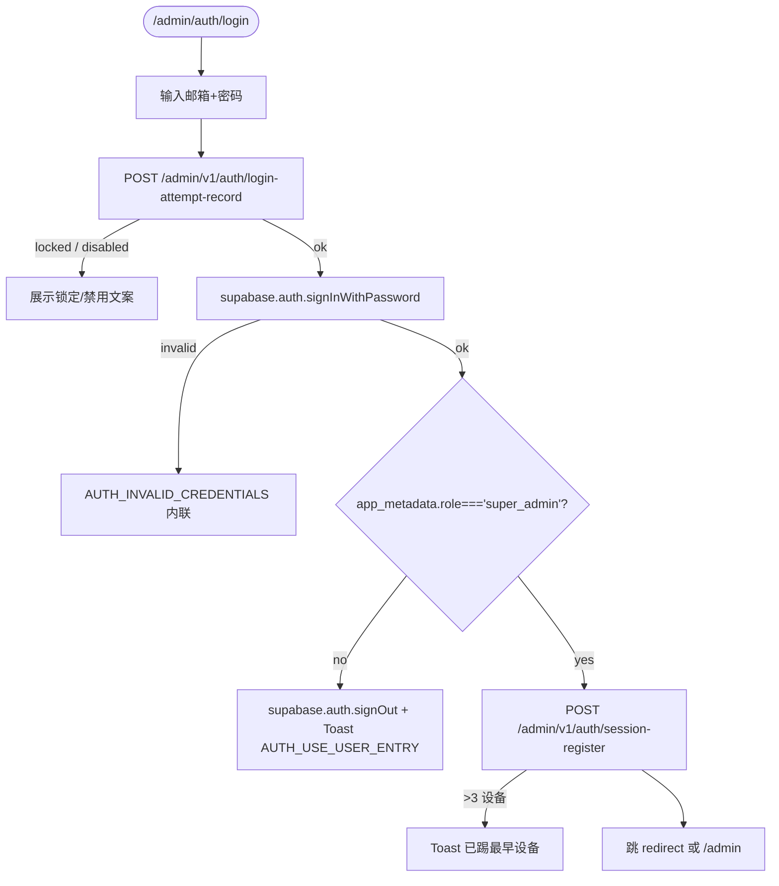
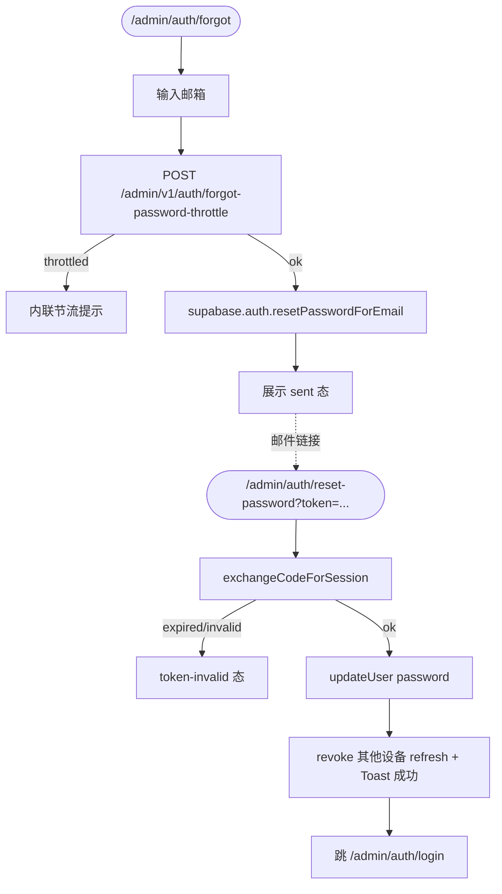
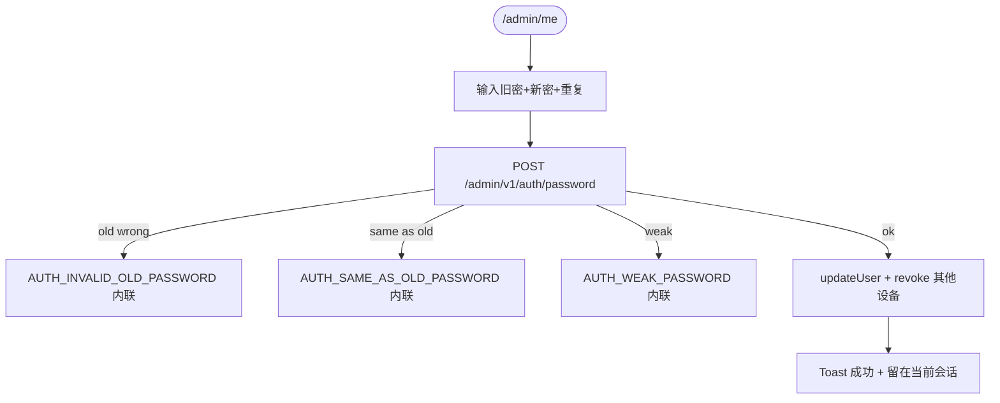
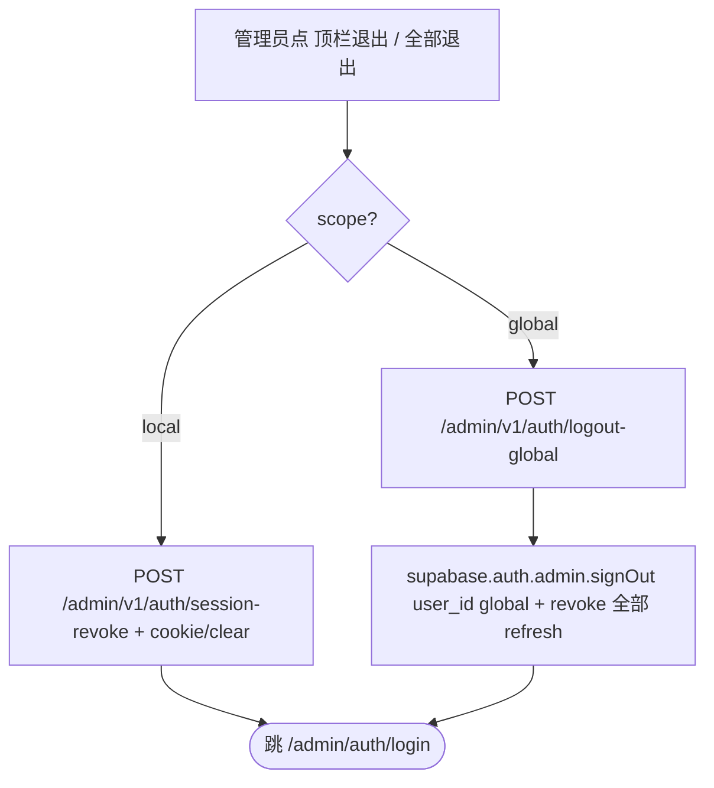

<!-- TARGET-PATH: docs/C01-requirements/admin-auth/flows/main-flow.md -->

# C01 · 主流程 · `admin-auth`

> 4 条主路径 mermaid 图。详细异常分支见 [`exception-flow.md`](./exception-flow.md)。

---

## 1. 邮密登录 (R-001 + R-002 + R-004)

## 2. 忘记密码 → 重置 (R-006)

## 3. 改密 (R-007)

## 4. 退出 (R-008)

