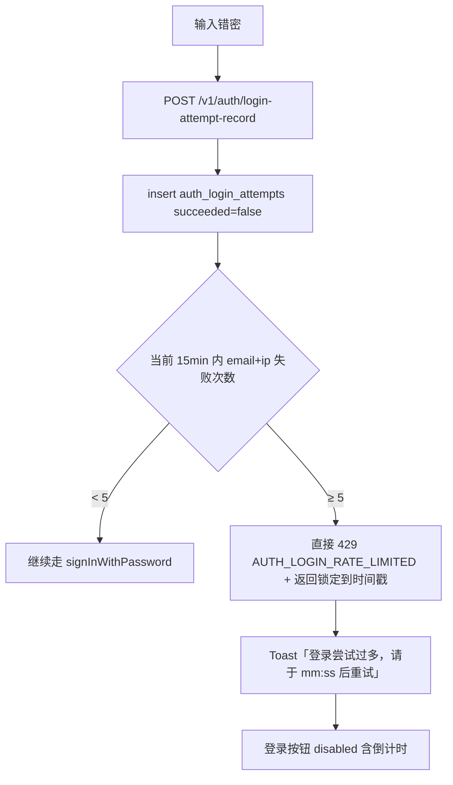
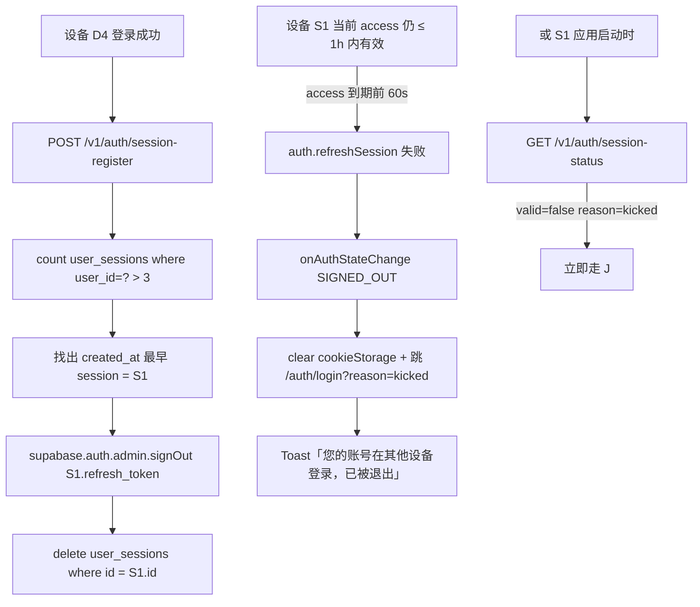
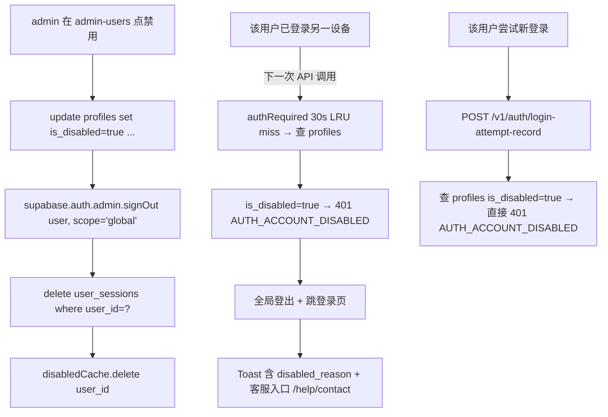
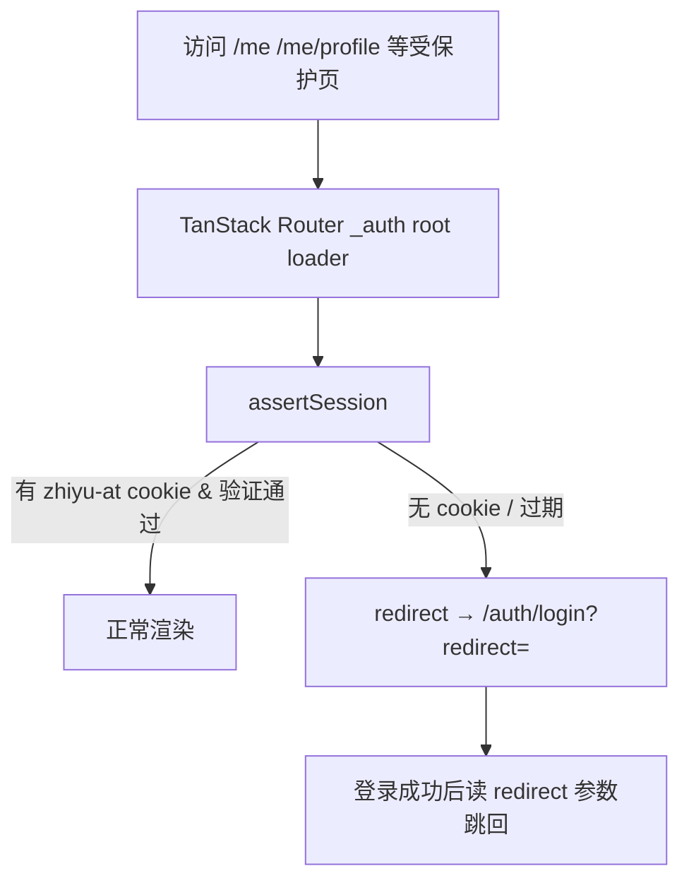

<!-- TARGET-PATH: docs/C01-requirements/app-auth/flows/exception-flow.md -->

# `app-auth` · 异常流程

> **阶段**：C01-R · **feature**：`app-auth`  
> **上游**：[`../baseline.md`](../baseline.md) · [`main-flow.md`](./main-flow.md)  
> **冻结状态**：已冻结 · 2026-05-16

---

## 1. 错密锁定（5/15min）



> 锁定到期自动解锁；管理员可手动清 `auth_login_attempts`（admin-users feature 提供）。

## 2. 第 4 设备登录被踢



## 3. 账号被禁用



## 4. OAuth 失败 / 取消

```mermaid
flowchart TD
    A[/auth/login 点 Google] --> B[supabase.auth.signInWithOAuth redirect Google]
    B --> C{Google 结果}
    C -->|用户拒绝授权| D[静默回 /auth/login，无 Toast]
    C -->|provider_error| E[/auth/callback?error=...]
    E --> F[Toast: AUTH_OAUTH_FAILED + 「重试 / 用邮箱登录」]
    C -->|成功但 admin 端登录页| G[/admin/auth/callback]
    G --> H[role check → 非 super_admin]
    H --> I[signOut + Toast: AUTH_NOT_ADMIN]
```

> **管理端不展示 Google 按钮**，因此分支 G/H/I 主要存在于「app 端账号误用 admin 入口」场景。

## 5. 邮箱验证 / 重置链接过期

```mermaid
flowchart TD
    A[/auth/callback?type=signup&token=...] --> B[exchangeCodeForSession]
    B -->|otp_expired / token_used| C[页面切换至「链接已过期」状态]
    C --> D[展示「重新发送验证邮件」按钮]
    D --> E[POST /v1/auth/register-throttle 复用]
    E --> F[Supabase admin resendEmailConfirmation]

    G[/auth/reset-password?token=...] --> H[exchangeCodeForSession recovery]
    H -->|expired / used| I[页面切换至「token-invalid」状态]
    I --> J[展示「重新发起忘记密码」按钮 → 跳 /auth/forgot]
```

## 6. 网络断 / 5xx

- 任意 auth 接口 5xx 或 fetch 失败 → 顶部 Toast「服务异常，请稍后重试」+ 表单保持已填值；
- supabase-js 内置自动 retry（最多 3 次，指数退避）；3 次后失败正式抛出。

## 7. 守卫拦截（未登录访问受保护页）



> 详细守卫实现见 [`B02-permissions/03-authz-mechanism §2.1`](../../B02-permissions/03-authz-mechanism.md)。
