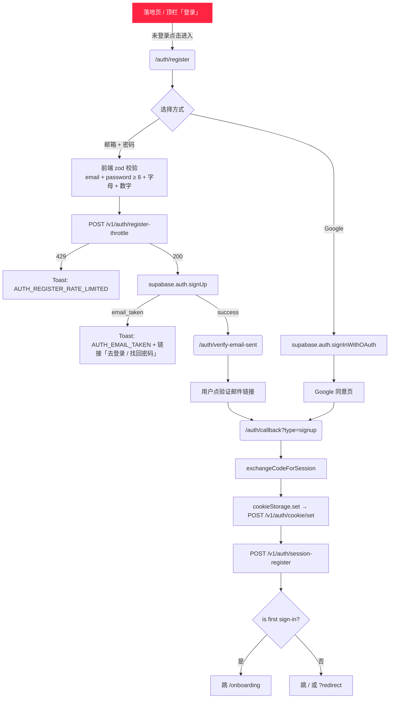

<!-- TARGET-PATH: docs/C01-requirements/app-auth/flows/main-flow.md -->

# `app-auth` · 主流程

> **阶段**：C01-R · **feature**：`app-auth`  
> **上游**：[`../baseline.md`](../baseline.md)  
> **冻结状态**：已冻结 · 2026-05-16

---

## 1. 邮箱注册主流程



> **R 覆盖**：R-app-auth-001 / 002 / 014 / 015。

## 2. 登录主流程

```mermaid
flowchart TD
    A[/auth/login] --> B[输入 email + password]
    B --> C[POST /v1/auth/login-attempt-record]
    C -->|429 locked| D[Toast: AUTH_LOGIN_RATE_LIMITED + 剩余倒计时]
    C -->|401 disabled| E[Toast: AUTH_ACCOUNT_DISABLED + 客服入口]
    C -->|200| F[supabase.auth.signInWithPassword]
    F -->|email_not_confirmed| G[Toast: AUTH_EMAIL_NOT_VERIFIED + 「重发验证邮件」按钮]
    F -->|invalid_credentials| H[Toast: AUTH_INVALID_CREDENTIALS<br/>不暴露邮箱是否存在]
    F -->|success| I[cookieStorage.set]
    I --> J[POST /v1/auth/session-register]
    J -->|超 3 台 → 踢最早| K[最早设备下次 refresh 失败 → 全局登出]
    J --> L{role check}
    L -->|user| M[跳 / 或 ?redirect]
    L -->|super_admin 误进 app| N[signOut + Toast AUTH_USE_ADMIN_ENTRY]
```

> **R 覆盖**：R-app-auth-003 / 004 / 005 / 006 / 011 / 013。

## 3. 个人中心 - 修改资料主流程

```mermaid
flowchart TD
    A[/me] --> B[/me/profile]
    B --> C[GET /v1/me]
    C --> D[展示当前 display_name / avatar_url / locale]
    D --> E[用户编辑 + 提交]
    E --> F[PATCH /v1/me]
    F -->|400 validation| G[字段下内联红字]
    F -->|200| H[Toast「已保存」+ 写本地缓存 + 顶栏头像热更新]
```

> **R 覆盖**：R-app-auth-008。

## 4. 修改密码 + 全设备登出主流程

```mermaid
flowchart TD
    A[/me/security] --> B[输入旧密 + 新密 + 确认新密]
    B --> C[zod: 新密 ≥ 8 + 字母 + 数字 + ≠ 旧密]
    C --> D[POST /v1/me/password]
    D -->|401 旧密错| E[内联红字「旧密码不正确」]
    D -->|400 弱密| F[内联红字「密码强度不足」]
    D -->|200| G[Toast「密码已修改」+ 自动跳 /me]
    G --> H[后端 supabase.auth.admin.signOut user, scope='others']
    H --> I[其他设备下次 refresh 失败 → 全局登出]

    A --> J{选择退出}
    J -->|本设备退出| K[supabase.auth.signOut local + POST cookie/clear + POST session-revoke]
    J -->|全部设备退出| L[POST 自定义 logout-global → admin.signOut global + 删 user_sessions]
    K --> M[跳 /auth/login]
    L --> M
```

> **R 覆盖**：R-app-auth-009 / 010。
