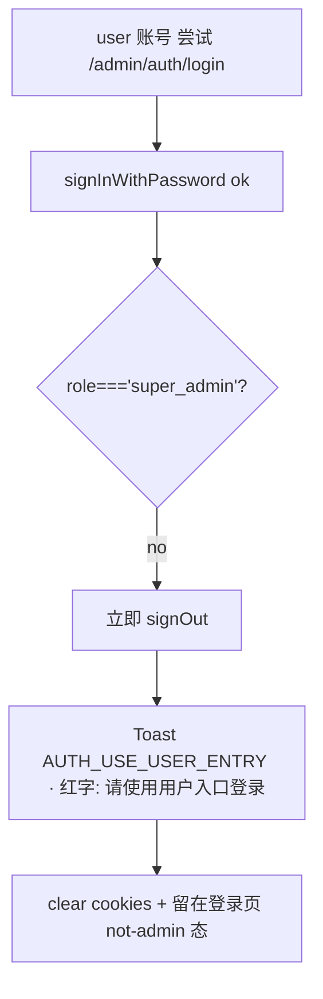
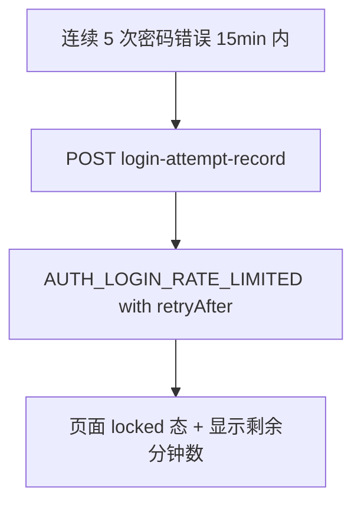
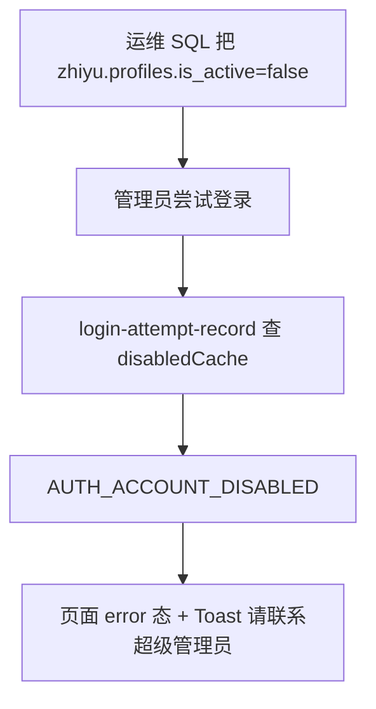
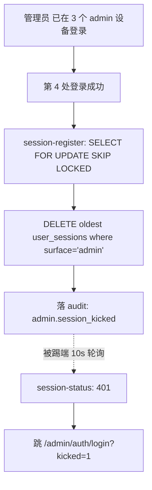
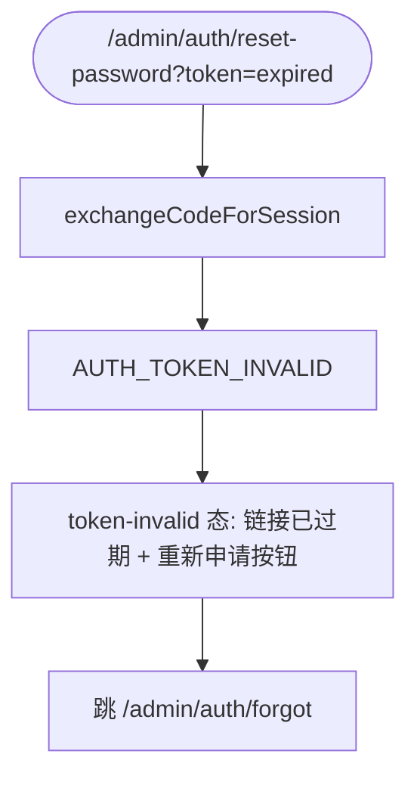
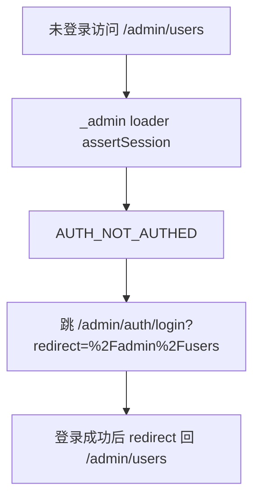
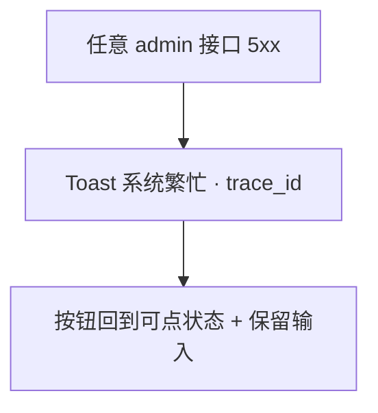

<!-- TARGET-PATH: docs/C01-requirements/auth/flows/exception-flow.md -->

# C01 · 异常流程 · `auth`

---

## 1. 非 super_admin 角色登录 (R-001/002)

## 2. 锁定 (R-005)

## 3. 禁用账号 (R-005)

## 4. 第 4 设备 → 踢最早 (R-004)

## 5. 重置链接过期 (R-006)

## 6. 守卫拦截 (R-009)

## 7. 5xx 兜底

