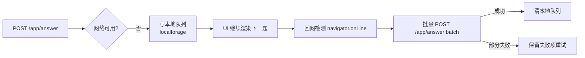
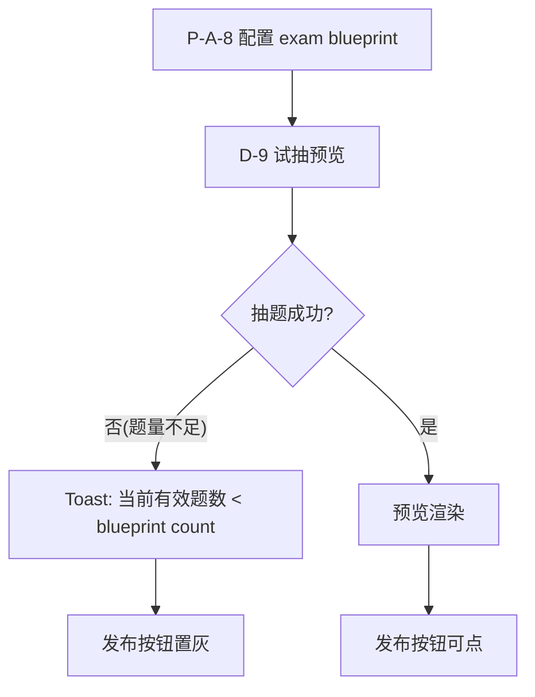
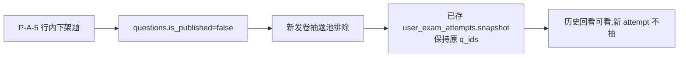
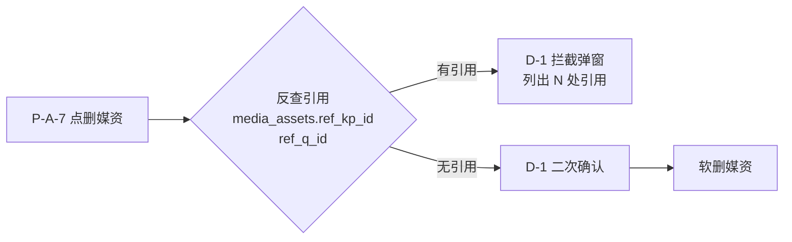
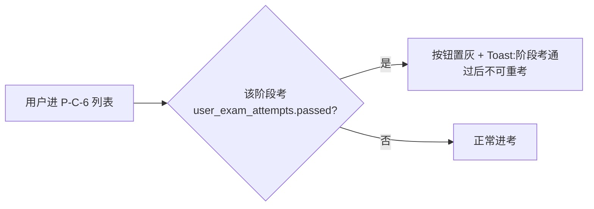
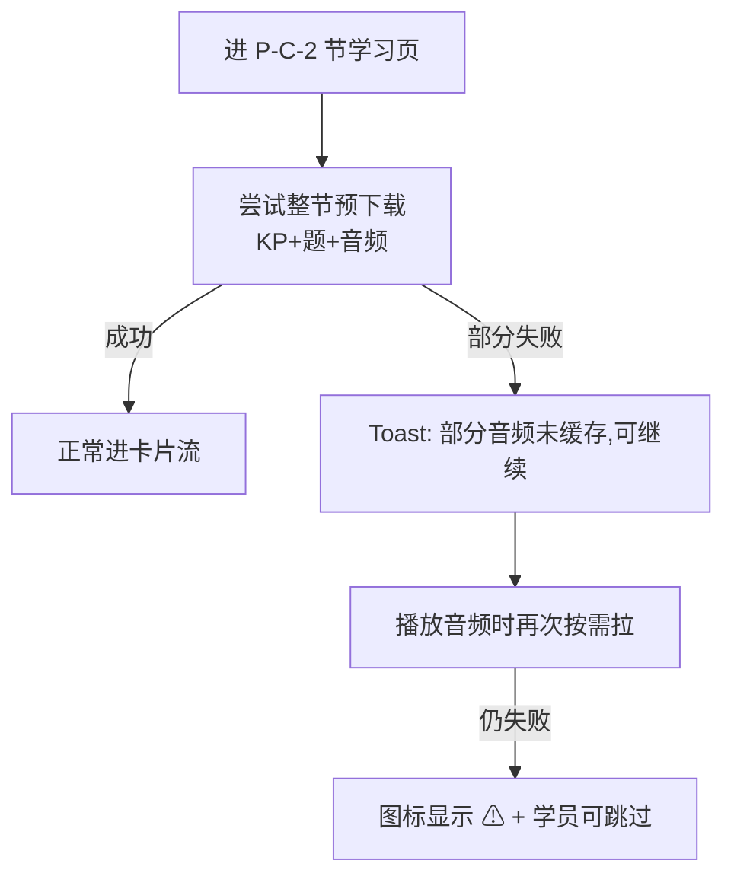
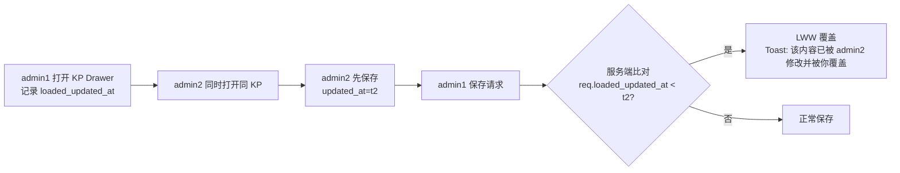

<!-- TARGET-PATH: docs/C01-requirements/course/flows/exception-flow.md -->

# 异常流程 · course

## FX-course-01 · 答题弱网

## FX-course-02 · 试抽失败 → exam 发布拦截

## FX-course-03 · 题目下架 → 已存 attempt 不变

## FX-course-04 · 媒资引用拦截

## FX-course-05 · 阶段考已通过不可重考

## FX-course-06 · 离线进节包预下载失败

## FX-course-07 · 多管理员并发编辑 KP

