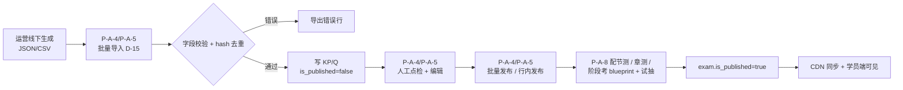
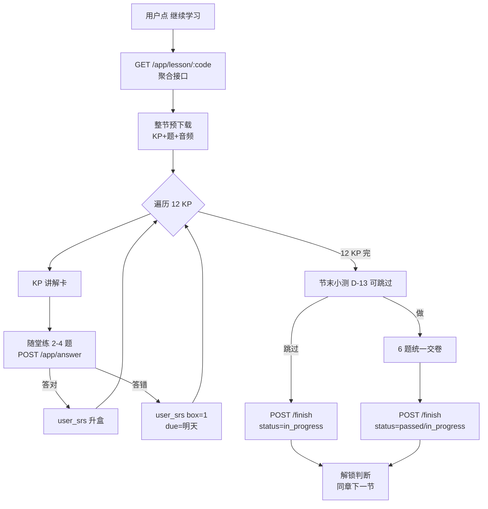
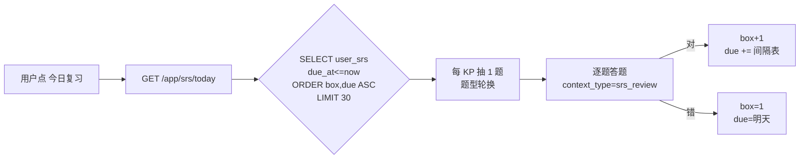
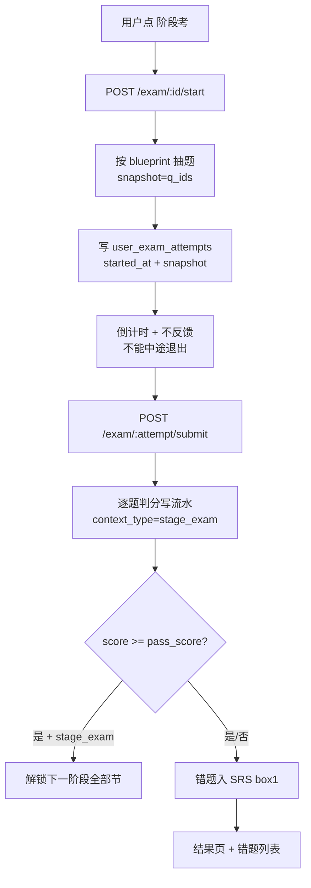
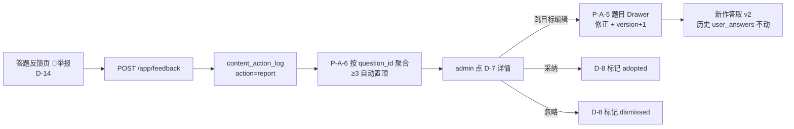
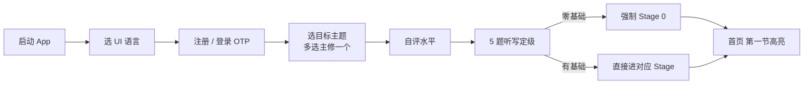

<!-- TARGET-PATH: docs/C01-requirements/course/flows/main-flow.md -->

# 主流程 · course

> 信息源:〔历史素材〕 §6.2-6.8。

## FL-course-01 · 内容上架主链路(管理端)

## FL-course-02 · 学员学习一节(应用端)

## FL-course-03 · SRS 每日复习

## FL-course-04 · 考试

## FL-course-05 · 学员举报闭环

## FL-course-06 · 首次进入引导

