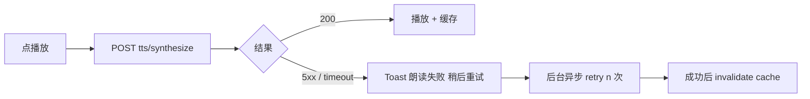
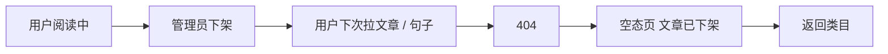
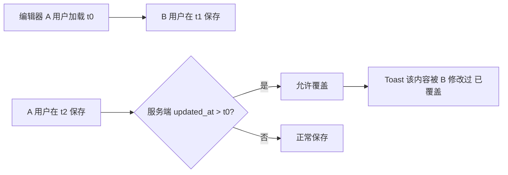
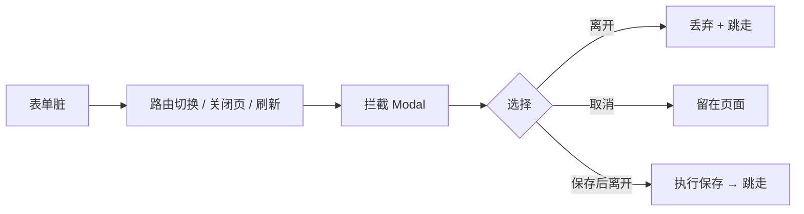
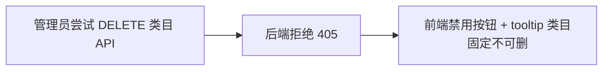
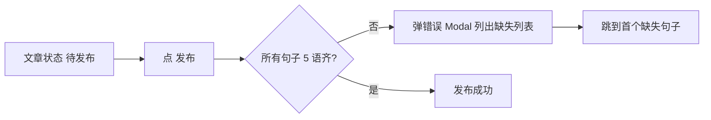

<!-- TARGET-PATH: docs/C01-requirements/discover-china/flows/exception-flow.md -->

# C01 · 异常流程图 · discover-china

> 7 个异常流

## E1 · 应用端 04-12 类目未登录

```mermaid
flowchart LR
  A[点 04-12 类目卡片] --> B[弹 登录提示 Modal]
  B --> C{选择}
  C -- 主按钮 登录 --> D[/auth/login?redirect=/china/categories/04]
  C -- 取消 --> E[关闭 Modal 留在类目卡片页]
```

## E2 · TTS 调用失败



## E3 · 文章下架时正在阅读



## E4 · 管理端保存被覆盖



## E5 · 未保存离开拦截



## E6 · 删除类目尝试



## E7 · 5 语未填全发布


