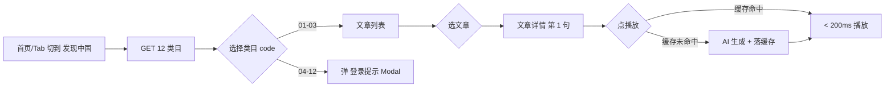
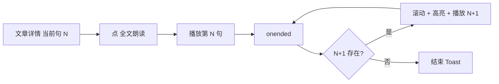
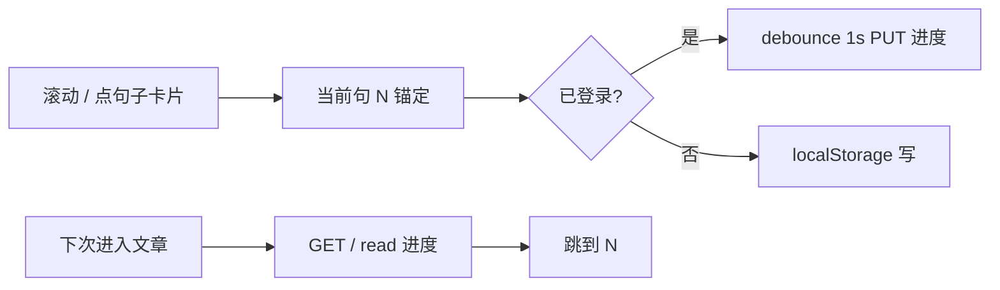
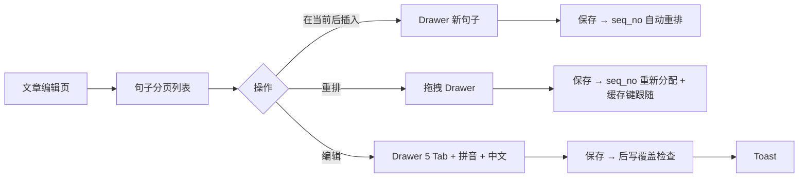
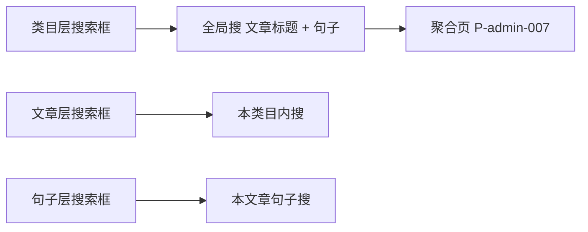

<!-- TARGET-PATH: docs/C01-requirements/discover-china/flows/main-flow.md -->

# C01 · 主流程图 · discover-china

> 6 张主流(应用端 3 + 管理端 3)

## ① 应用端 · 访客首次浏览 01-03 公开类目



## ② 应用端 · 用户全文朗读



## ③ 应用端 · 进度记忆



## ④ 管理端 · 新建文章

```mermaid
flowchart LR
  A[/admin/china] --> B[选类目卡片] --> C[文章列表]
  C --> D[点 新建文章] --> E[Modal 填名称 5 语 + 拼音]
  E --> F[提交 → 系统生成 12 位 code] --> G[跳编辑页]
  G --> H[添加首句] --> I[5 语 Tab 填写] --> J[保存]
  J --> K{发布?}
  K -- 是 --> L[发布 → 应用端可见]
  K -- 否 --> M[保留 待发布]
```

## ⑤ 管理端 · 句子编辑 + 任意位置插入



## ⑥ 管理端 · 三级搜索


