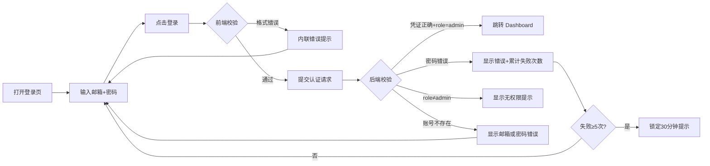
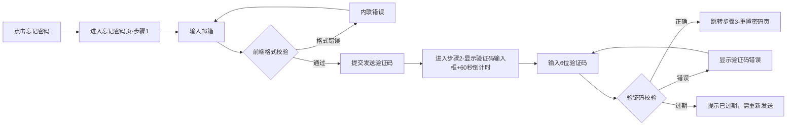
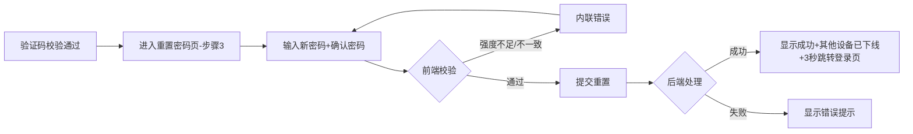
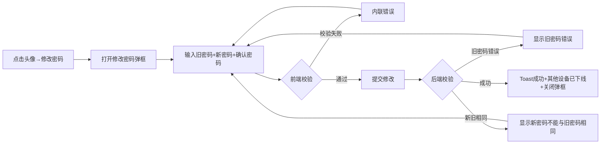

# 业务流程图

## FL-auth-001 账号入口：邮箱密码登录

涉及模块：M-auth-001 / 涉及状态机：SM-auth-001

## FL-auth-002 账号入口：忘记密码（发送验证码）

涉及模块：M-auth-001

## FL-auth-003 账号入口：重置密码

涉及模块：M-auth-001 / 涉及状态机：SM-auth-001

## FL-auth-004 账号入口：修改密码

涉及模块：M-auth-001

## 流程清单
| FL-ID | 名称 | 类型 | 涉及模块 | 涉及 SM | 增量标记 |
|-------|------|------|---------|---------|---------|
| FL-auth-001 | 邮箱密码登录 | 主流程 | M-auth-001 | SM-auth-001 | [本轮新增] |
| FL-auth-002 | 忘记密码 | 主流程 | M-auth-001 | 无 | [本轮新增] |
| FL-auth-003 | 重置密码 | 主流程 | M-auth-001 | SM-auth-001 | [本轮新增] |
| FL-auth-004 | 修改密码 | 次流程 | M-auth-001 | 无 | [本轮新增] |
