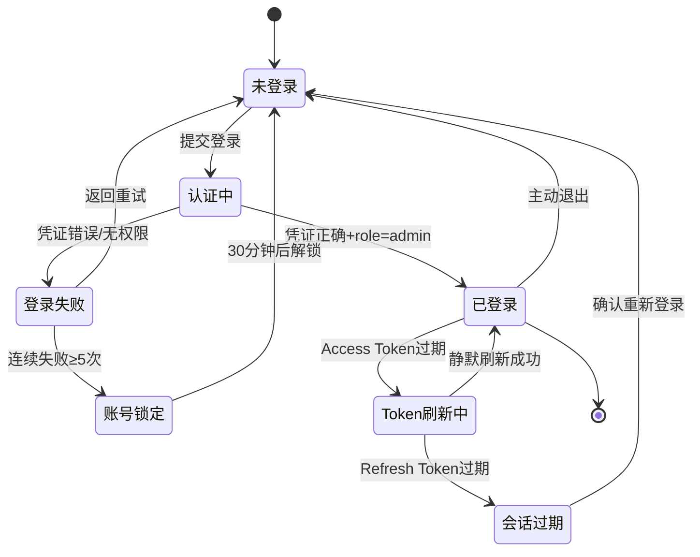

# 状态机

## SM-auth-001 登录会话状态

| 转移 ID | 起态 | 终态 | 触发者 | 条件 | 前置校验 | 后置动作 | R-ID | 增量标记 |
|---------|------|------|--------|------|---------|---------|------|---------|
| TR-001 | 未登录 | 认证中 | 用户 | 点击登录 | 前端表单校验 | 发起认证请求 | R-auth-001 | [本轮新增] |
| TR-002 | 认证中 | 已登录 | 系统 | 凭证正确+role=admin | JWT 解析 | 写入 Token、跳转 Dashboard | R-auth-001 | [本轮新增] |
| TR-003 | 认证中 | 登录失败 | 系统 | 凭证错误或无权限 | 无 | 第 1-2 次仅显示"邮箱或密码错误"；第 3 次起显示"邮箱或密码错误（已失败 N/5 次）" | R-auth-002, R-auth-008 | [本轮变更] |
| TR-004 | 登录失败 | 账号锁定 | 系统 | 连续 ≥5 次 | 无 | 显示锁定提示 | R-auth-002 | [本轮新增] |
| TR-005 | 已登录 | Token刷新中 | 系统 | Access Token 过期 | 无 | 静默调用刷新 | R-auth-007 | [本轮新增] |
| TR-006 | Token刷新中 | 会话过期 | 系统 | Refresh Token 过期 | 无 | 弹窗提示 | R-auth-007 | [本轮新增] |
| TR-007 | 已登录 | 未登录 | 用户 | 点击退出 | 无 | 清除 Token、跳转登录页 | R-auth-006 | [本轮新增] |

终态/不可回退声明：
- 「已登录」为主终态，可通过退出或过期离开
- 「账号锁定」定时自动解除，不可人为提前解锁

## 覆盖检查
- [x] 每状态有出/入边或为终态
- [x] 每转移标了触发者
- [x] 无不可达/死循环
