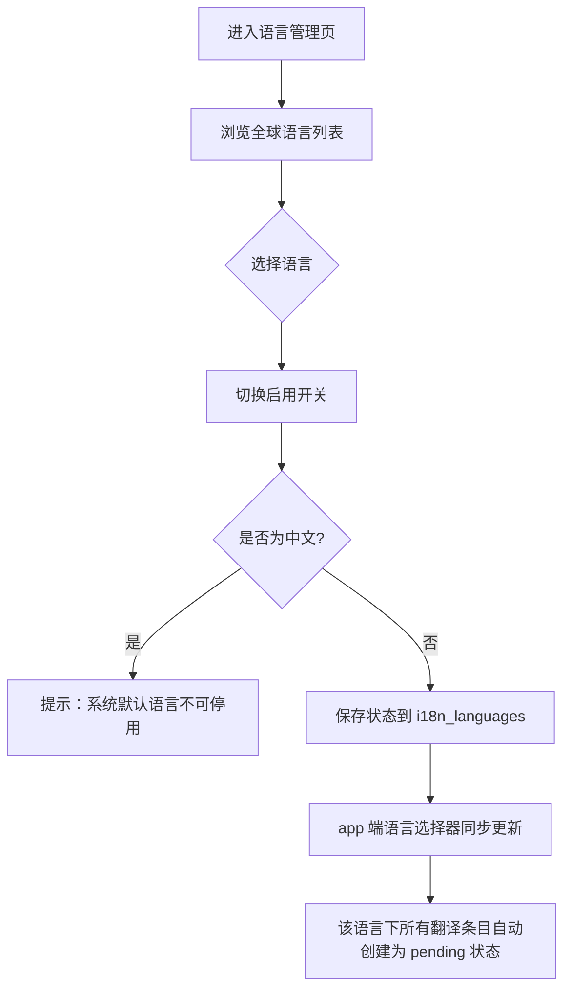
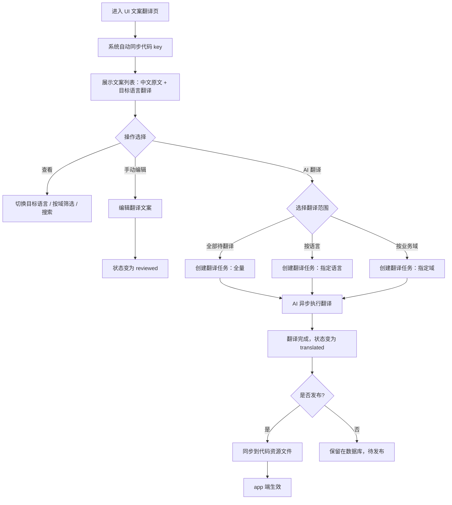
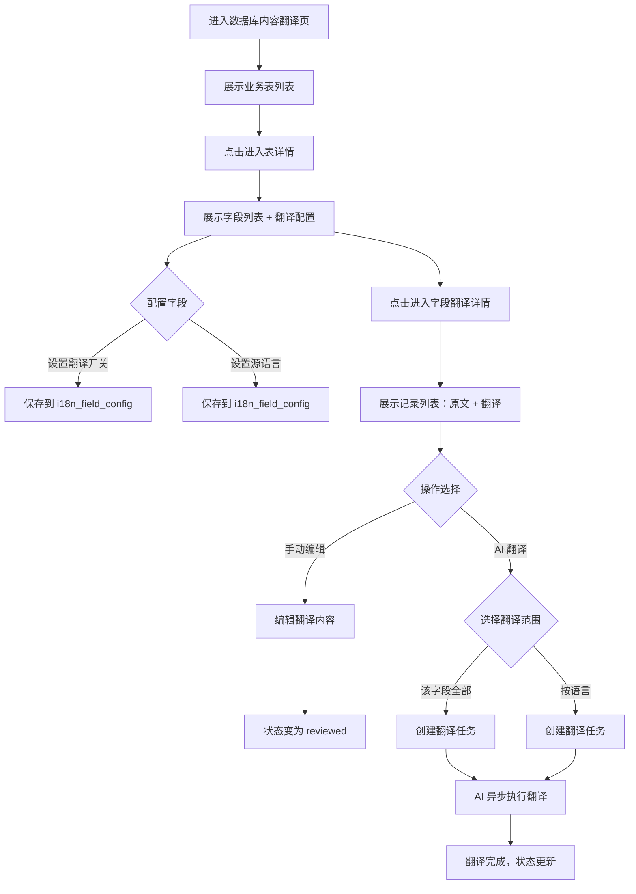
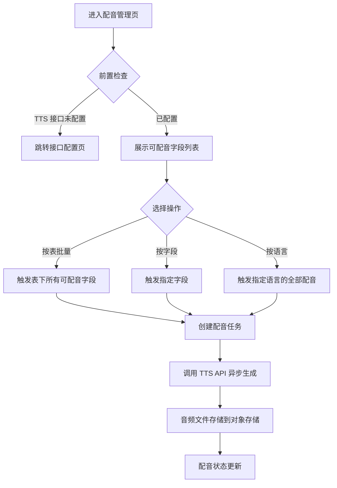
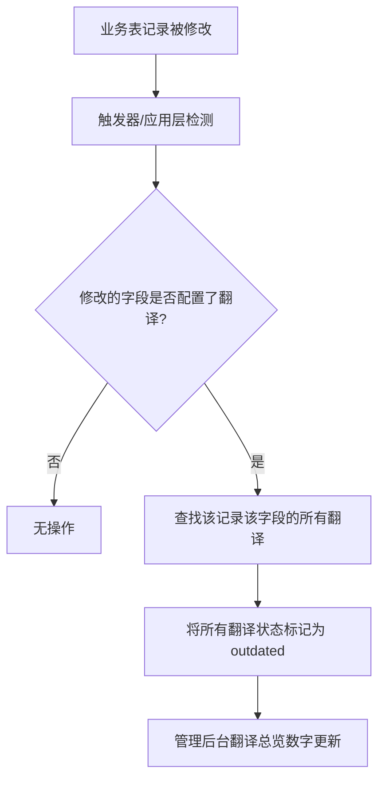

# 业务流程图

## FL-i18n-001 语言启用流程

```mermaid
flowchart TD
    A[进入语言管理页] --> B[浏览全球语言列表]
    B --> C{选择语言}
    C --> D[切换启用开关]
    D --> E{是否为中文?}
    E -->|是| F[提示：系统默认语言不可停用]
    E -->|否| G[保存状态到 i18n_languages]
    G --> H[app 端语言选择器同步更新]
    H --> I[该语言下所有翻译条目自动创建为 pending 状态]
```

## FL-i18n-002 UI 文案翻译流程

```mermaid
flowchart TD
    A[进入 UI 文案翻译页] --> B[系统自动同步代码 key]
    B --> C[展示文案列表：中文原文 + 目标语言翻译]
    C --> D{操作选择}
    D -->|查看| E[切换目标语言 / 按域筛选 / 搜索]
    D -->|手动编辑| F[编辑翻译文案]
    F --> G[状态变为 reviewed]
    D -->|AI 翻译| H{选择翻译范围}
    H -->|全部待翻译| I[创建翻译任务：全量]
    H -->|按语言| J[创建翻译任务：指定语言]
    H -->|按业务域| K[创建翻译任务：指定域]
    I & J & K --> L[AI 异步执行翻译]
    L --> M[翻译完成，状态变为 translated]
    M --> N{是否发布?}
    N -->|是| O[同步到代码资源文件]
    O --> P[app 端生效]
    N -->|否| Q[保留在数据库，待发布]
```

## FL-i18n-003 数据库内容翻译流程

```mermaid
flowchart TD
    A[进入数据库内容翻译页] --> B[展示业务表列表]
    B --> C[点击进入表详情]
    C --> D[展示字段列表 + 翻译配置]
    D --> E{配置字段}
    E -->|设置翻译开关| F[保存到 i18n_field_config]
    E -->|设置源语言| G[保存到 i18n_field_config]
    D --> H[点击进入字段翻译详情]
    H --> I[展示记录列表：原文 + 翻译]
    I --> J{操作选择}
    J -->|手动编辑| K[编辑翻译内容]
    K --> L[状态变为 reviewed]
    J -->|AI 翻译| M{选择翻译范围}
    M -->|该字段全部| N[创建翻译任务]
    M -->|按语言| O[创建翻译任务]
    N & O --> P[AI 异步执行翻译]
    P --> Q[翻译完成，状态更新]
```

## FL-i18n-004 配音生成流程

```mermaid
flowchart TD
    A[进入配音管理页] --> B{前置检查}
    B -->|TTS 接口未配置| C[跳转接口配置页]
    B -->|已配置| D[展示可配音字段列表]
    D --> E{选择操作}
    E -->|按表批量| F[触发表下所有可配音字段]
    E -->|按字段| G[触发指定字段]
    E -->|按语言| H[触发指定语言的全部配音]
    F & G & H --> I[创建配音任务]
    I --> J[调用 TTS API 异步生成]
    J --> K[音频文件存储到对象存储]
    K --> L[配音状态更新]
```

## FL-i18n-005 源文变更检测流程

```mermaid
flowchart TD
    A[业务表记录被修改] --> B[触发器/应用层检测]
    B --> C{修改的字段是否配置了翻译?}
    C -->|否| D[无操作]
    C -->|是| E[查找该记录该字段的所有翻译]
    E --> F[将所有翻译状态标记为 outdated]
    F --> G[管理后台翻译总览数字更新]
```
