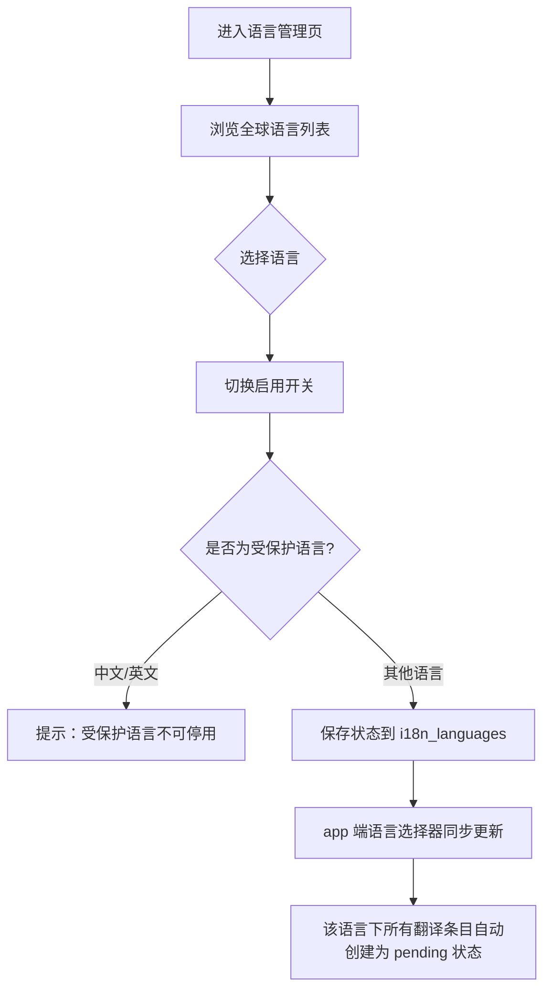
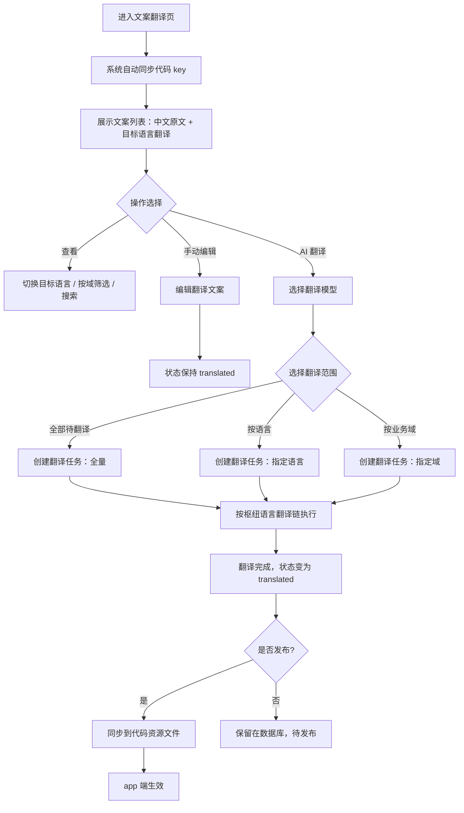
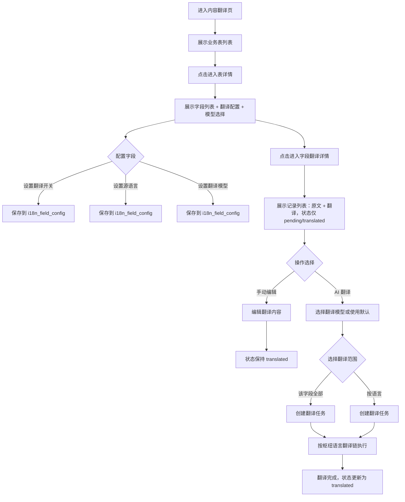
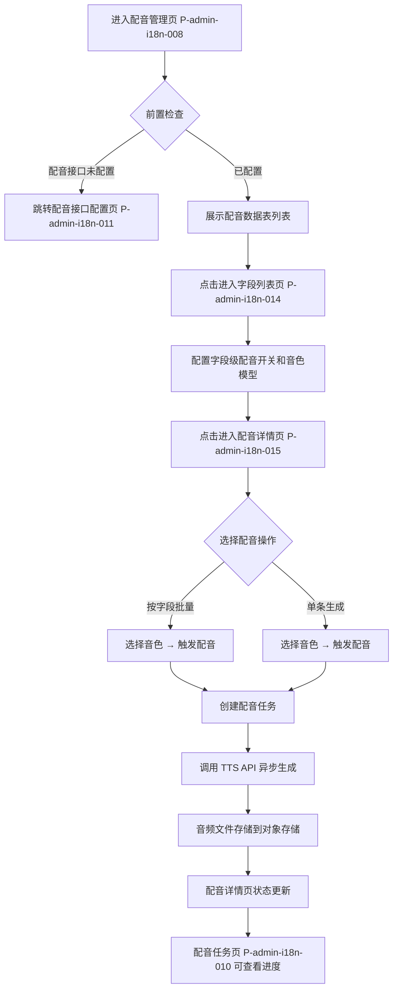
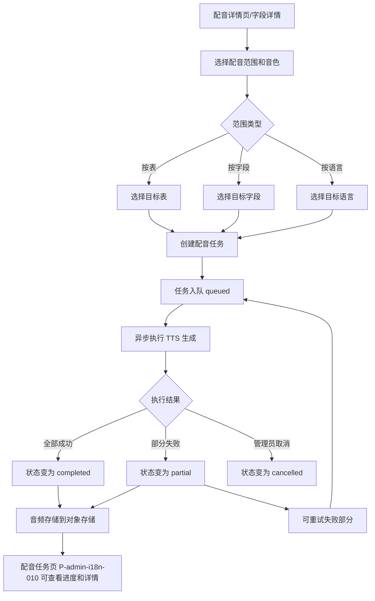
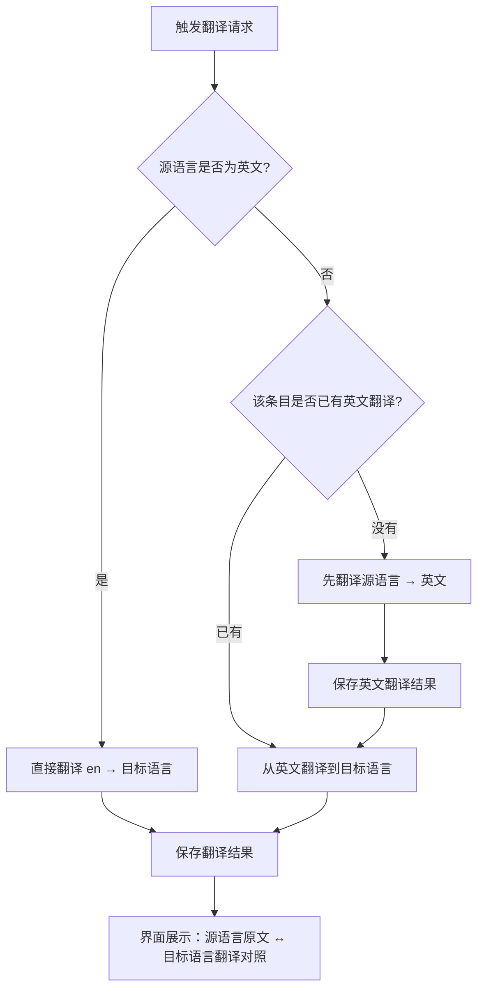
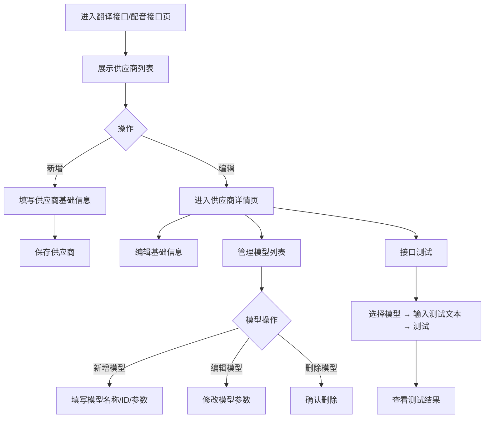

# 业务流程图

## FL-i18n-001 语言启用流程

## FL-i18n-002 文案翻译流程

## FL-i18n-003 内容翻译流程

## FL-i18n-004 配音生成流程

## FL-i18n-005 源文变更检测流程

## FL-i18n-006 配音任务流程

## FL-i18n-007 枢纽语言翻译链流程

> **规则要点**：
> 1. 英文（en）是唯一枢纽语言，任何语言间的翻译必须以英文为媒介
> 2. 翻译前先查询英文翻译是否存在，避免重复翻译
> 3. 界面上只展示源语言和目标语言的对照，英文中间过程对用户不可见
> 4. 如果源语言就是英文，直接翻译，无需中间步骤

## FL-i18n-008 供应商配置流程

