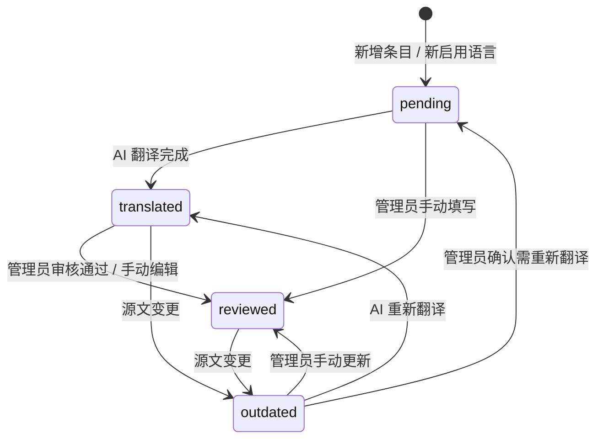
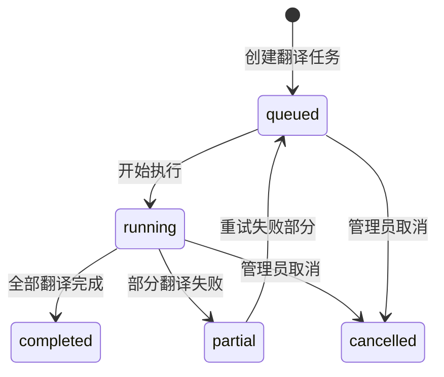

# 状态机

## SM-i18n-001 翻译条目状态

> 适用于 UI 文案翻译和数据库内容翻译，按（条目 × 语言）独立计算状态。

### 状态定义

| 状态 | 含义 | 视觉标记 | 触发条件 |
|------|------|---------|---------|
| `pending` | 待翻译 | 🔴 红色 | 新建条目 / 新启用语言 / 手动重置 |
| `translated` | AI 已翻译 | 🟡 黄色 | AI 翻译任务完成 |
| `reviewed` | 已审核 | 🟢 绿色 | 管理员手动编辑或确认 |
| `outdated` | 已过期 | 🟠 橙色 | 源文内容变更 |

### 约束
- 每个翻译条目的每种目标语言各自维护独立状态
- 状态不可跳过（pending 不能直接到 outdated）
- 删除源记录时，对应翻译条目物理删除

## SM-i18n-002 翻译任务状态

### 状态定义

| 状态 | 含义 |
|------|------|
| `queued` | 已入队，等待执行 |
| `running` | 正在执行翻译 |
| `completed` | 全部完成 |
| `partial` | 部分完成，部分失败 |
| `cancelled` | 已取消 |
