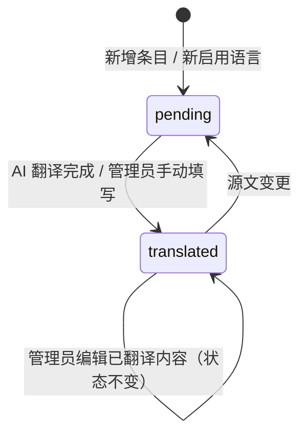
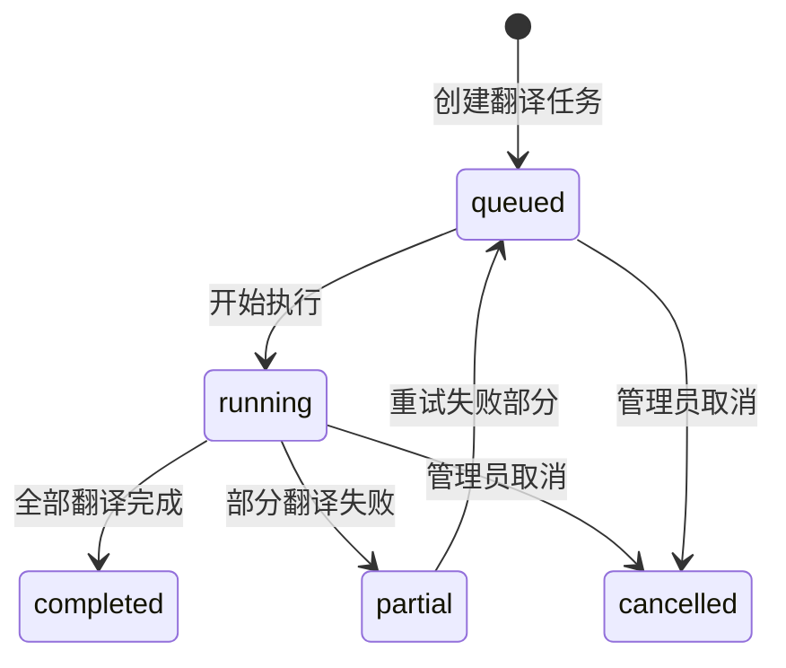

# 状态机

## SM-i18n-001 翻译条目状态

> 适用于 UI 文案翻译和数据库内容翻译，按（条目 × 语言）独立计算状态。仅两种状态，无审核和过期概念。

### 状态定义

| 状态 | 含义 | 视觉标记 | 触发条件 |
|------|------|---------|---------|
| `pending` | 待翻译 | 🔴 红色 | 新建条目 / 新启用语言 / 源文变更后自动回退 |
| `translated` | 已翻译 | 🟢 绿色 | AI 翻译完成 / 管理员手动编辑 |

### 约束
- 每个翻译条目的每种目标语言各自维护独立状态
- 管理员编辑已翻译内容时，状态保持 `translated` 不变
- 源文变更时，状态自动回退为 `pending`（等价于旧设计中的 outdated，但直接回退为待翻译，无需人工确认）
- 删除源记录时，对应翻译条目物理删除

## SM-i18n-002 翻译任务状态

> 适用于 AI 翻译批次任务（文案翻译 + 内容翻译），在 P-admin-i18n-007 翻译任务列表页展示。

### 状态定义

| 状态 | 含义 |
|------|------|
| `queued` | 已入队，等待执行 |
| `running` | 正在执行翻译 |
| `completed` | 全部完成 |
| `partial` | 部分完成，部分失败 |
| `cancelled` | 已取消 |

## SM-i18n-003 配音任务状态

> 适用于 TTS 配音批次任务，在 P-admin-i18n-010 配音任务列表页展示。与翻译任务状态机结构相同，但独立管理。

### 状态定义

| 状态 | 含义 |
|------|------|
| `queued` | 已入队，等待执行 |
| `running` | 正在执行 TTS 配音 |
| `completed` | 全部完成 |
| `partial` | 部分完成，部分失败 |
| `cancelled` | 已取消 |
