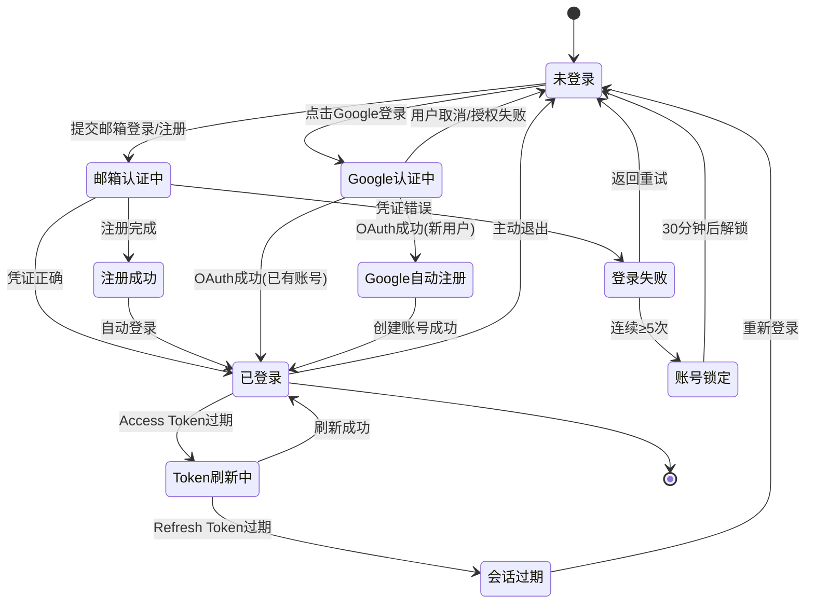

# 状态机

## SM-auth-001 登录会话状态

| 转移 ID | 起态 | 终态 | 触发者 | 条件 | R-ID | 增量标记 |
|---------|------|------|--------|------|------|---------|
| TR-001 | 未登录 | 邮箱认证中 | 用户 | 提交登录 | R-auth-002 | [本轮新增] |
| TR-002 | 未登录 | Google认证中 | 用户 | 点击 Google 按钮 | R-auth-003 | [本轮新增] |
| TR-003 | 邮箱认证中 | 已登录 | 系统 | 凭证正确 | R-auth-002 | [本轮新增] |
| TR-004 | 邮箱认证中 | 注册成功 | 系统 | 注册完成 | R-auth-001 | [本轮新增] |
| TR-005 | Google认证中 | 已登录 | 系统 | 已有账号 | R-auth-003 | [本轮新增] |
| TR-006 | Google认证中 | Google自动注册 | 系统 | 新用户 | R-auth-012 | [本轮新增] |
| TR-007 | 登录失败 | 账号锁定 | 系统 | ≥5 次；第 1-2 次仅显示"邮箱或密码错误"，第 3 次起显示"邮箱或密码错误（已失败 N/5 次）" | R-auth-004 | [本轮变更] |
| TR-008 | 已登录 | Token刷新中 | 系统 | AT 过期 | R-auth-009 | [本轮新增] |
| TR-009 | Token刷新中 | 会话过期 | 系统 | RT 过期 | R-auth-009 | [本轮新增] |
| TR-010 | 已登录 | 未登录 | 用户 | 退出 | R-auth-008 | [本轮新增] |

终态/不可回退声明：
- 「已登录」为主终态
- 「账号锁定」定时自动解除

## 覆盖检查
- [x] 每状态有出/入边或为终态
- [x] 每转移标了触发者
- [x] 无不可达/死循环
