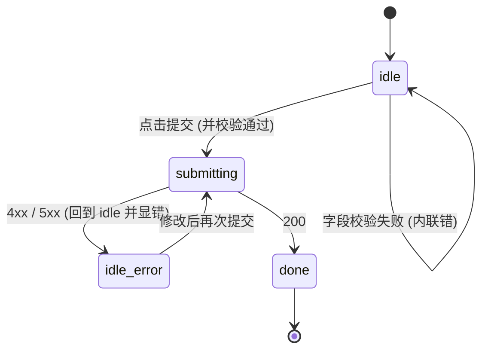
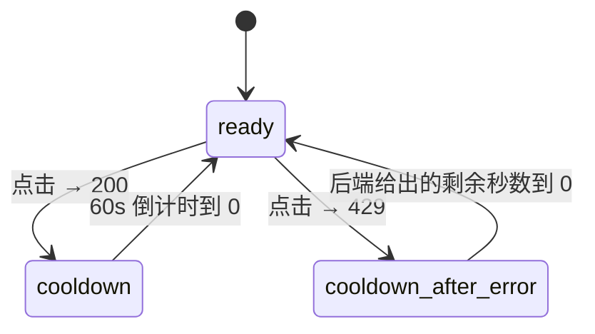
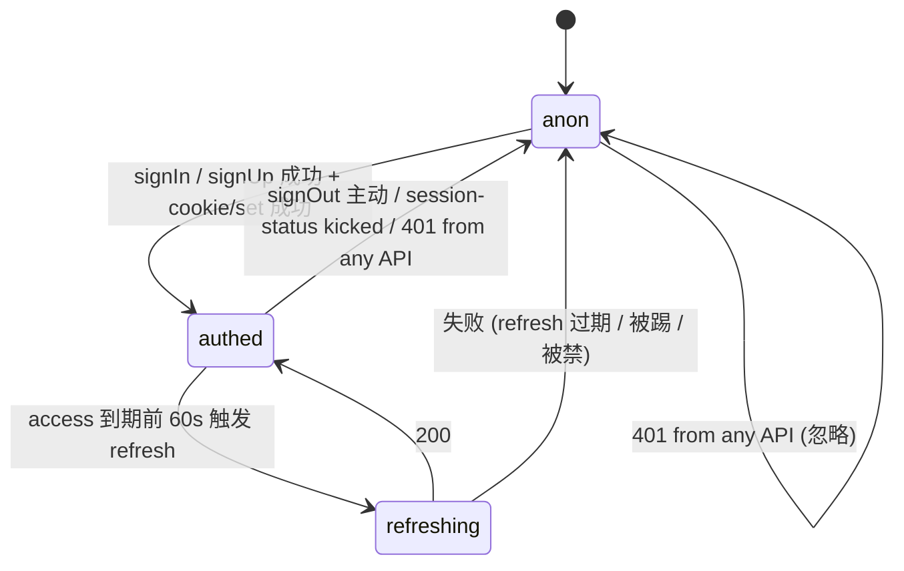
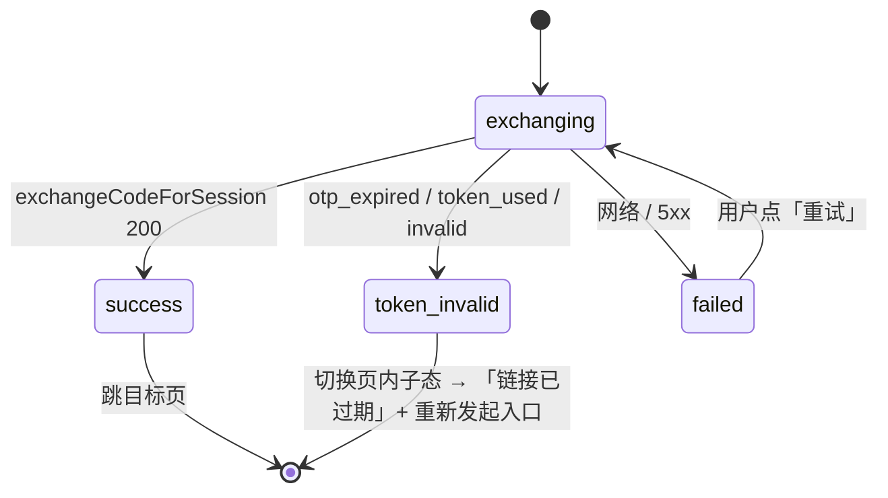

<!-- TARGET-PATH: docs/C02-ia/auth/app/03-state-machines.md -->

# `auth` · 状态机

> **冻结状态**：已冻结 · 2026-05-16

---

## SM-auth-app-01 · 通用提交按钮（注册 / 登录 / 忘密 / 重置 / 改资料 / 改密）

| 状态 | 按钮 | 输入 | UI 反馈 |
|------|------|------|---------|
| idle | 可点 / 校验通过才高亮 | 可写 | — |
| submitting | loading + disabled | readonly | 自身 spinner |
| idle_error | 可点 | 可写 | 字段下内联红字 (4xx) 或顶部 Toast (5xx) |
| done | — | — | Toast 或跳转 |

## SM-auth-app-02 · 重发验证邮件按钮 / 忘密发送按钮

> 文案：`重新发送 (NNs)`，倒计时实时刷新；按钮 disabled 期间禁止点击。

## SM-auth-app-03 · 用户会话（前端 supabase-js + cookieStorage）

- 转 `anon` 时统一动作：清 cookieStorage + clear Zustand authStore + 跳 `/auth/login?reason=<kicked|disabled|expired|signout>`；
- `reason=signout` 不弹 Toast；其他 reason 在登录页根据 query 弹 Toast。

## SM-auth-app-04 · 验证邮件 / 重置链接 token 校验

