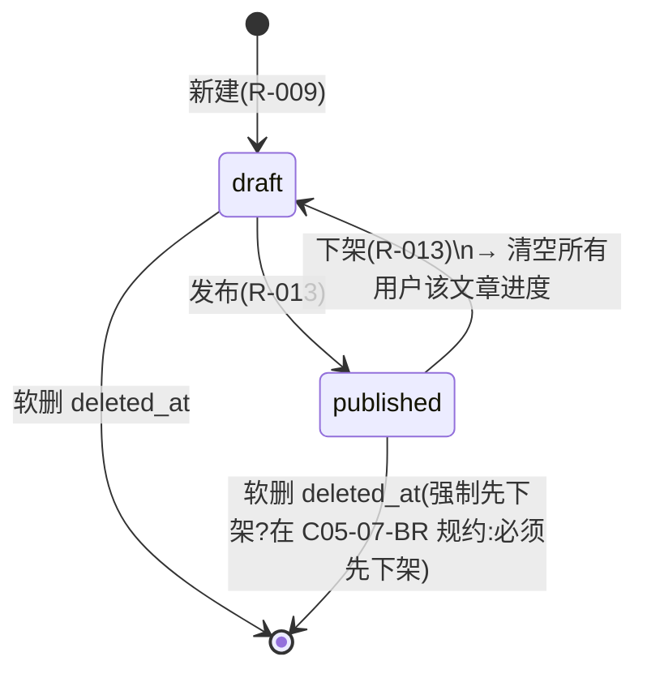
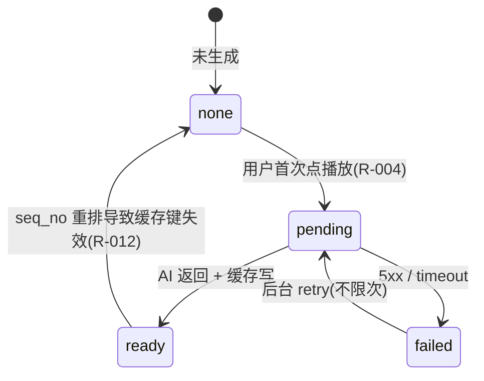
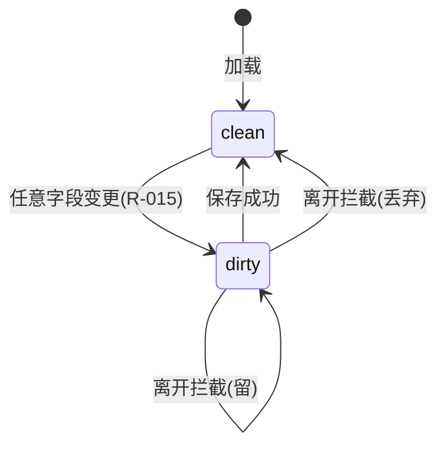
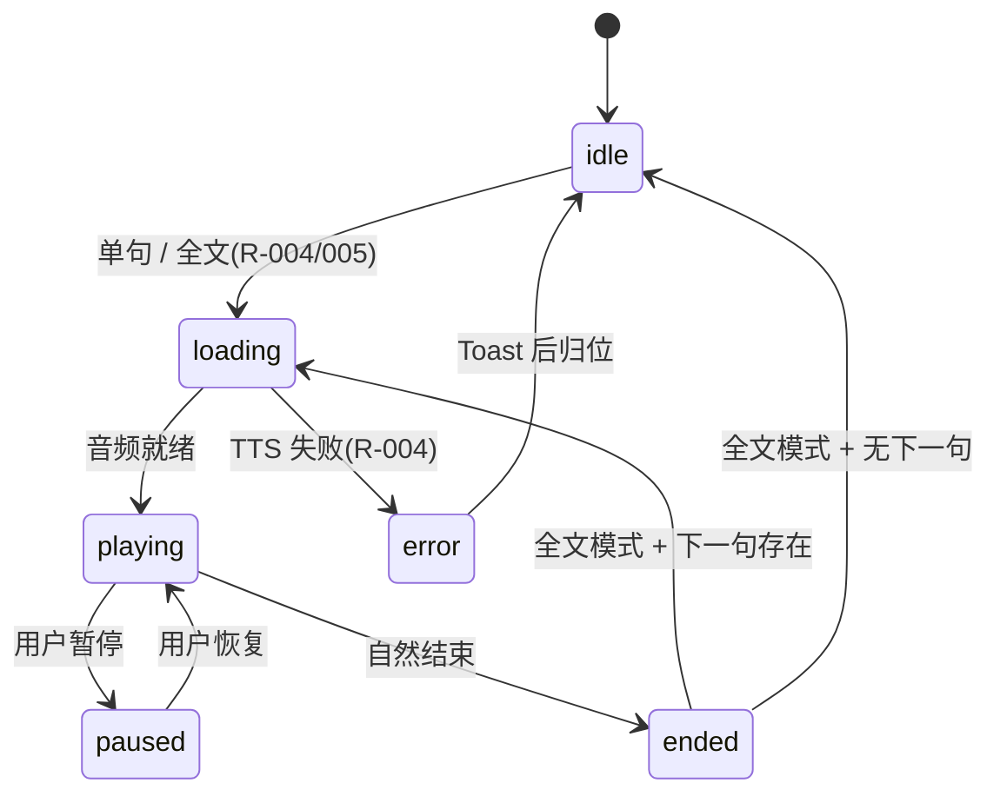

<!-- TARGET-PATH: docs/C02-ia/discover-china/_shared/state-machines.md -->

# 03 · 状态机

## SM-discover-china-01 · 文章发布状态

| 状态 | 应用端可见 | 管理端可编辑 |
|------|----------|-------------|
| `draft` | 否 | 是 |
| `published` | 是 | 是 |

## SM-discover-china-02 · 句子 TTS 音频生成

## SM-discover-china-03 · 管理端表单脏检查

## SM-discover-china-04 · 应用端 TTS 播放器

