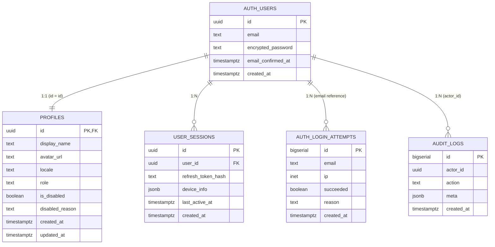

<!-- TARGET-PATH: docs/D01-data/app-auth/01-er-diagram.md -->

# `app-auth` · 子 ER 图

> 完整 DDL 与索引在 [`B02-permissions/04-data-model.md`](../../B02-permissions/04-data-model.md)；本图只截取 `app-auth` 范围内涉及的字段。
