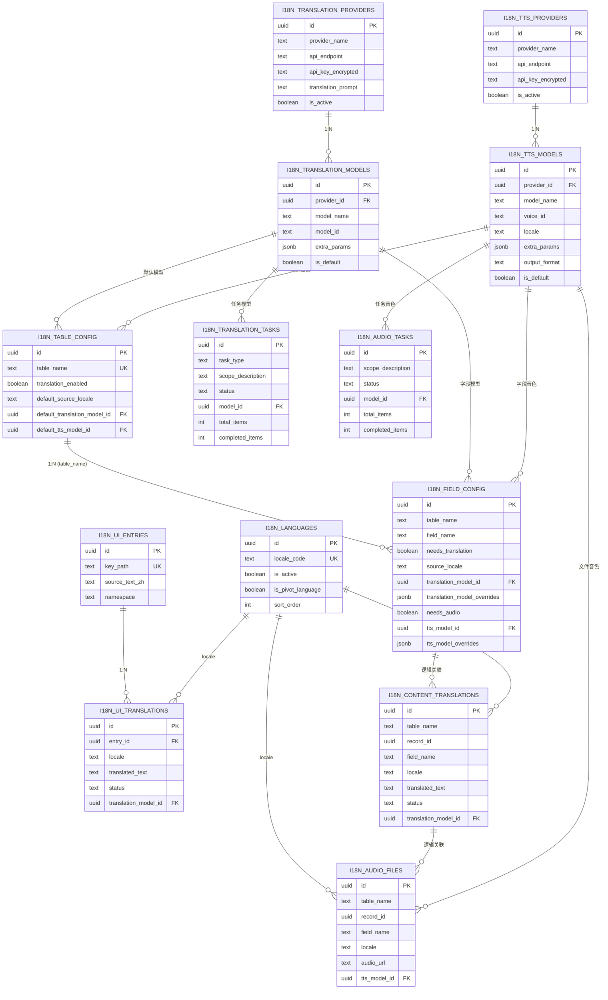

# 数据规范 · translation-hub · 共用总览

> **适用系统**：admin, app
> **关联 R-ID**：R-i18n-001~067
> **不做**：状态机定义(C02)、路由/接口(D02)、页面(C03)
> **特殊说明**：i18n 模块为通用框架级设计，所有表均在 `public` 域下。数据库内容翻译通过独立翻译表实现，不修改业务表 schema。
> **实体清单**：01-i18n-languages ~ 13-i18n-tts-models
> **枚举清单**：enums.md

---

## 1. ER 图

---

## 2. 业务规则与校验

| BR-ID | 来源 R-ID | 涉及实体/字段 | 描述(一句) | 实现层 |
|-------|-----------|---------------|-----------|--------|
| BR-i18n-001 | R-i18n-002 | i18n_languages.locale_code='zh' | 中文不可停用（系统默认语言） | Application + DB CHECK |
| BR-i18n-002 | R-i18n-002 | i18n_languages.locale_code='en' | 英文不可停用（枢纽语言） | Application + DB CHECK |
| BR-i18n-003 | R-i18n-015/027 | — | 翻译链以英文为唯一枢纽 | Service |
| BR-i18n-004 | R-i18n-023 | i18n_field_config | 字段级配置优先于表级 | Service |
| BR-i18n-005 | R-i18n-028 | i18n_content_translations.status | 源文变更自动回退为 pending | Trigger/Service |
| BR-i18n-006 | R-i18n-014/026 | status | 手动编辑后 status 保持 translated | Service |
| BR-i18n-007 | R-i18n-032 | i18n_translation_tasks | 取消后已完成部分保留 | Service |
| BR-i18n-008 | R-i18n-050 | i18n_field_config.needs_audio | 配音独立于翻译 | Application |
| BR-i18n-009 | R-i18n-053 | i18n_field_config.needs_audio | 配音字段级>表级 | Service |
| BR-i18n-010 | R-i18n-046 | i18n_translation_providers/models | 多供应商多模型 | Application |
| BR-i18n-011 | R-i18n-029 | i18n_field_config.translation_model_overrides | 语言级模型覆盖>字段级>表级 | Service |

---

## 3. 索引策略

| IDX-ID | 表 | 字段 | 类型 | 唯一 | 支撑查询 |
|--------|-----|------|------|------|---------|
| uniq_languages_locale | i18n_languages | (locale_code) | btree | 是 | 按 locale 查语言 |
| uniq_table_config | i18n_table_config | (table_name) | btree | 是 | 按表名查配置 |
| uniq_field_config | i18n_field_config | (table_name, field_name) | btree | 是 | 按表+字段查配置 |
| uniq_ui_entry_key | i18n_ui_entries | (key_path) | btree | 是 | 按 key 查文案 |
| uniq_ui_trans | i18n_ui_translations | (entry_id, locale) | btree | 是 | 按条目+语言查翻译 |
| idx_ui_trans_status | i18n_ui_translations | (locale, status) | btree | 否 | 按语言+状态统计 |
| uniq_content_trans | i18n_content_translations | (table_name, record_id, field_name, locale) | btree | 是 | 查指定记录字段翻译 |
| idx_content_trans_table | i18n_content_translations | (table_name, field_name, locale, status) | btree | 否 | 按表+字段+语言+状态筛选 |
| uniq_audio_file | i18n_audio_files | (table_name, record_id, field_name, locale) | btree | 是 | 查指定记录字段配音 |
| idx_trans_tasks_status | i18n_translation_tasks | (status, created_at) | btree | 否 | 翻译任务列表筛选 |
| idx_audio_tasks_status | i18n_audio_tasks | (status, created_at) | btree | 否 | 配音任务列表筛选 |
| uniq_trans_model | i18n_translation_models | (provider_id, model_id) | btree | 是 | 按供应商+模型 ID 查模型 |
| uniq_tts_model | i18n_tts_models | (provider_id, voice_id) | btree | 是 | 按供应商+音色 ID 查模型 |

---

## 4. 种子数据

| 表 | 用途 | 示例 | 写入时机 |
|-----|------|------|---------|
| i18n_languages | 预置全球主流语言 | 约 50 条，zh/en 默认启用 | 首次部署 |

---

## 5. 增量融合报告

### 5.1 本轮新增摘要
共 13 张表：i18n_languages, i18n_table_config, i18n_field_config, i18n_ui_entries, i18n_ui_translations, i18n_content_translations, i18n_translation_tasks, i18n_audio_tasks, i18n_audio_files, i18n_translation_providers, i18n_translation_models, i18n_tts_providers, i18n_tts_models。定义 7 个枚举类型。

### 5.2 融合点 / 冲突点 / 已有变更
- 与 auth 模块无数据耦合
- i18n_content_translations 通过 (table_name, record_id) 逻辑关联任意业务表，无物理外键
- 原 i18n_audio_config 表已被 i18n_tts_providers + i18n_tts_models 替代
- 新增 i18n_audio_tasks 表（原设计缺失独立配音任务表）
- 新增 i18n_translation_providers/models 表（原设计仅支持单供应商）
- translation_status_enum 简化为 pending/translated（移除 reviewed/outdated）
- i18n_languages 新增 is_pivot_language 字段，英文种子数据默认启用

---

## 6. 自检报告

**完整性 — R-ID 覆盖对照**

| R-ID 范围 | 承接实体/规则 |
|-----------|-------------|
| R-i18n-001~003 语言管理 | i18n_languages |
| R-i18n-010~017 文案翻译 | i18n_ui_entries + i18n_ui_translations |
| R-i18n-020~029 内容翻译 | i18n_table_config + i18n_field_config + i18n_content_translations |
| R-i18n-030~032 翻译任务 | i18n_translation_tasks |
| R-i18n-040 翻译总览 | 聚合查询，无独立表 |
| R-i18n-045~047 翻译接口 | i18n_translation_providers + i18n_translation_models |
| R-i18n-050~055 配音管理 | i18n_field_config + i18n_audio_files |
| R-i18n-056~058 音色管理 | i18n_tts_models |
| R-i18n-060~062 配音任务 | i18n_audio_tasks |
| R-i18n-063 配音总览 | 聚合查询，无独立表 |
| R-i18n-065~067 配音接口 | i18n_tts_providers + i18n_tts_models |

- [x] 每条 R-ID 均有实体或规则承接
- [x] 外键/逻辑关联明确
- [x] 主键统一 uuid
- [x] 索引覆盖主查询路径
- [x] 配音任务独立表（i18n_audio_tasks）
- [x] 翻译/配音供应商均支持多供应商多模型

---

## 99. 待确认问题

无
