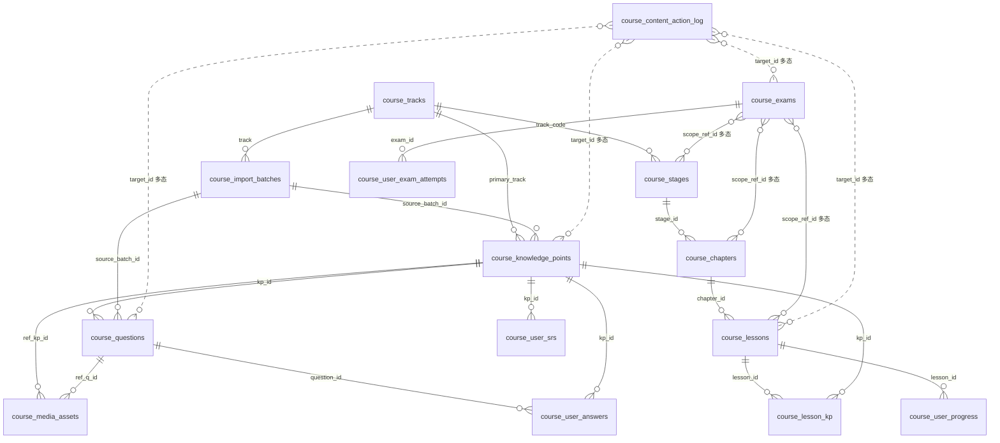

<!-- TARGET-PATH: docs/D01-data/course/01-er-diagram.md -->

# 01 · ER 图 · course

## 主键 / 外键策略
- 全表主键 `uuid`(`gen_random_uuid()`);业务唯一键单独 UNIQUE;
- 父子链 (`tracks → stages → chapters → lessons`) FK `ON DELETE RESTRICT`(禁止误删父级);
- 学员相关 (`user_*`) FK `ON DELETE CASCADE`(账号注销级联清理);
- 多态弱引用(`exams.scope_ref_id`, `content_action_log.target_id`, `media_assets.ref_*`)无 FK 约束,由应用层 + 触发器保证;
- 角色字段 (`created_by / updated_by / created_admin_id / actor_id`) FK → `auth.users(id) ON DELETE SET NULL`(参考 B02 `AUTH_USE_USER_ENTRY=false` 阶段策略,后续如启用扩展表则随之迁移)。
