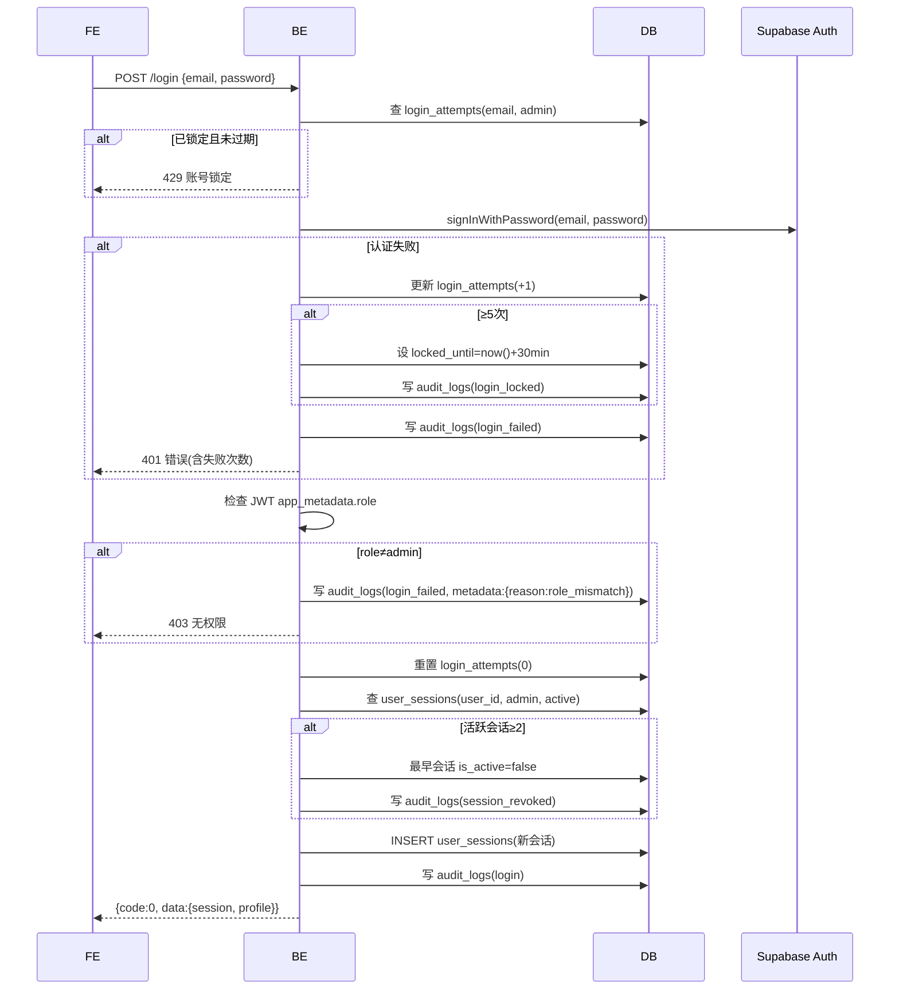

# 登录

## `POST /api/v1/admin/auth/login` · 管理员邮箱登录

**基础信息**

| 项 | 值 |
|----|-----|
| API-ID | API-admin-auth-login |
| SM 转移 | SM-auth-001:TR-001→TR-002(成功) / TR-003(失败) / TR-004(锁定) |
| R-ID | R-auth-001, R-auth-002, R-auth-008, R-auth-011 |
| 角色 | 公开 |
| 行级权限 | 无 |
| 幂等 | 否 |

**请求参数**

| 位置 | 字段 | 类型 | 必填 | 校验(一句) | D01 来源 |
|------|------|------|------|-----------|---------|
| Body | email | string | 是 | 邮箱格式 | — |
| Body | password | string | 是 | 非空 | — |
| Header | User-Agent | string | 否 | — | user_sessions.device_info |
| Header | X-Forwarded-For | string | 否 | — | user_sessions.ip_address |

**业务流程**



**业务规则**

| BR-ID | 校验内容 | 失败 code |
|-------|---------|----------|
| BR-002 | 连续5次失败锁定30分钟 | 42901 |
| BR-002a | 第1-2次仅返回错误，第3次起返回失败计数 | 40101 |
| BR-013 | 必须role=admin | 40301 |
| BR-012 | 活跃会话≥2时踢最早设备 | 无(自动处理) |

> role≠admin 的失败不计入 login_attempts（凭证本身正确，防止合法 app 用户误触被锁）。

**成功响应**

```json
{
  "code": 0,
  "data": {
    "access_token": "...",
    "refresh_token": "...",
    "user": { "id": "uuid", "email": "...", "display_name": "...", "role": "admin" }
  },
  "msg": "ok"
}
```

**失败响应**

| HTTP | code | 含义 | 触发条件 |
|------|------|------|---------|
| 400 | 40001 | 参数校验失败 | 邮箱格式错误 |
| 401 | 40101 | 邮箱或密码错误 | 凭证不匹配(含 failure_count) |
| 403 | 40301 | 无权限 | role≠admin |
| 429 | 42901 | 账号锁定 | 连续≥5次失败(含 locked_until) |

**副作用**
- 成功：重置 login_attempts、创建 user_sessions、写 audit_logs(login)
- 密码错误：更新 login_attempts、写 audit_logs(login_failed/login_locked)
- 角色不符：写 audit_logs(login_failed, role_mismatch)
- 超限踢下线：更新旧会话、写 audit_logs(session_revoked)
