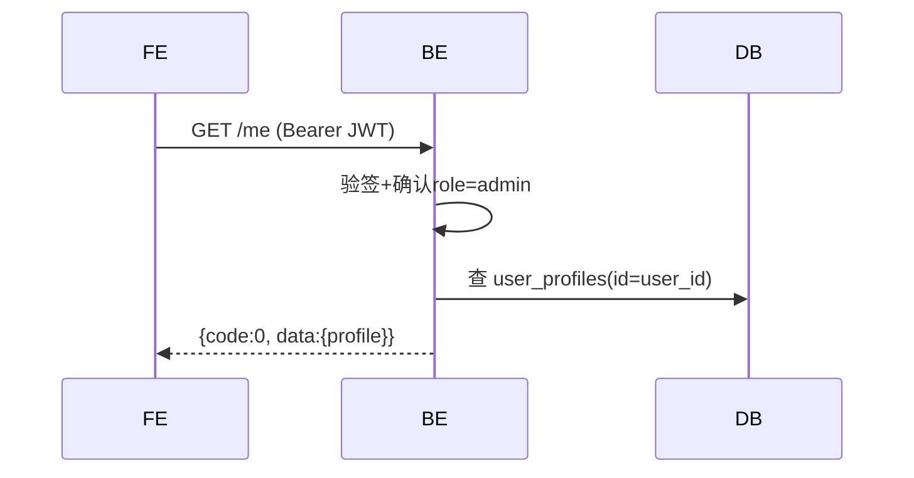

# 会话管理

## `GET /api/v1/admin/auth/me` · 获取管理员信息

**基础信息**

| 项 | 值 |
|----|-----|
| API-ID | API-admin-auth-me |
| SM 转移 | 无 |
| R-ID | — |
| 角色 | Bearer JWT + admin |
| 行级权限 | auth.uid() = 自身 |
| 幂等 | 是 |

**请求参数**

| 位置 | 字段 | 类型 | 必填 | 校验(一句) | D01 来源 |
|------|------|------|------|-----------|---------|
| Header | Authorization | string | 是 | Bearer JWT | — |

**业务流程**



**业务规则**

无特殊规则。

**成功响应**

```json
{
  "code": 0,
  "data": {
    "id": "uuid",
    "email": "admin@example.com",
    "display_name": "管理员",
    "role": "admin"
  },
  "msg": "ok"
}
```

**失败响应**

| HTTP | code | 含义 | 触发条件 |
|------|------|------|---------|
| 401 | 40101 | Token无效 | JWT验签失败 |
| 403 | 40301 | 无权限 | role≠admin |

**副作用**
无
