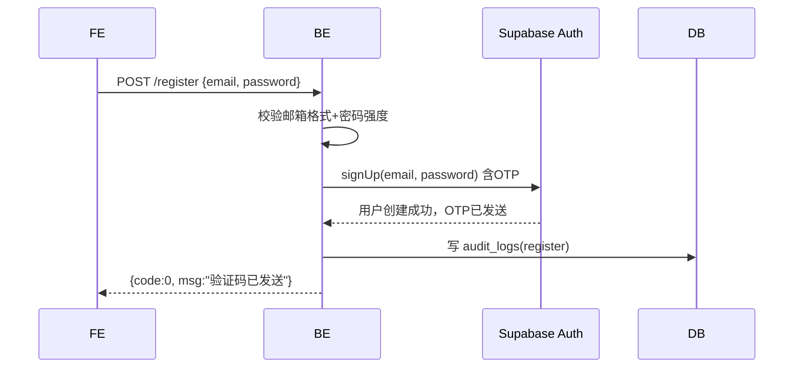
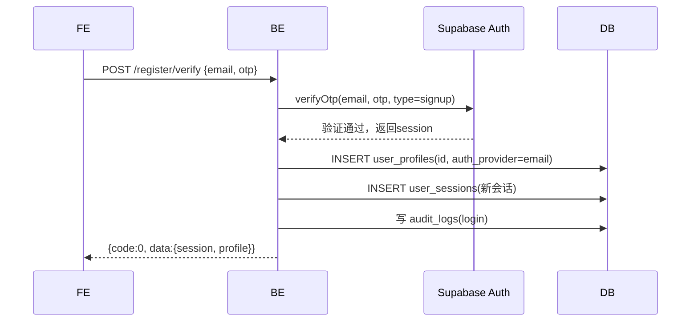

# 注册

## `POST /api/v1/app/auth/register` · 邮箱注册+发OTP

**基础信息**

| 项 | 值 |
|----|-----|
| API-ID | API-app-auth-register |
| SM 转移 | SM-auth-001:TR-004(部分：创建账号+发OTP) |
| R-ID | R-auth-001, R-auth-010, R-auth-011, R-auth-015 |
| 角色 | 公开 |
| 行级权限 | 无 |
| 幂等 | 否 |

**请求参数**

| 位置 | 字段 | 类型 | 必填 | 校验(一句) | D01 来源 |
|------|------|------|------|-----------|---------|
| Body | email | string | 是 | 邮箱格式 | — |
| Body | password | string | 是 | ≥8字符含字母+数字 | — |

**业务流程**



**业务规则**

| BR-ID | 校验内容 | 失败 code |
|-------|---------|----------|
| BR-001 | 密码强度 | 40001 |
| — | 邮箱格式 | 40001 |
| — | 邮箱已注册 | 40901 |

**成功响应**

```json
{ "code": 0, "data": { "email": "user@example.com" }, "msg": "ok" }
```

**失败响应**

| HTTP | code | 含义 | 触发条件 |
|------|------|------|---------|
| 400 | 40001 | 参数校验失败 | 邮箱格式错误/密码强度不足 |
| 409 | 40901 | 邮箱已注册 | Supabase 返回邮箱重复 |
| 503 | 50301 | 服务异常 | Supabase Auth 不可用 |

**副作用**
- Supabase 发送 OTP 邮件至用户邮箱
- 写入 audit_logs(action=register)

---

## `POST /api/v1/app/auth/register/verify` · 验证注册OTP

**基础信息**

| 项 | 值 |
|----|-----|
| API-ID | API-app-auth-verify-register |
| SM 转移 | SM-auth-001:TR-004(完成注册→自动登录) |
| R-ID | R-auth-001, R-auth-015 |
| 角色 | 公开 |
| 行级权限 | 无 |
| 幂等 | 否 |

**请求参数**

| 位置 | 字段 | 类型 | 必填 | 校验(一句) | D01 来源 |
|------|------|------|------|-----------|---------|
| Body | email | string | 是 | 邮箱格式 | — |
| Body | otp | string | 是 | 6位数字 | — |

**业务流程**



**业务规则**

| BR-ID | 校验内容 | 失败 code |
|-------|---------|----------|
| BR-003 | 验证码5分钟有效 | 40102 |
| — | 验证码正确性 | 40103 |

**成功响应**

```json
{
  "code": 0,
  "data": {
    "access_token": "...",
    "refresh_token": "...",
    "user": { "id": "uuid", "email": "...", "display_name": null, "auth_provider": "email", "has_password": true }
  },
  "msg": "ok"
}
```

**失败响应**

| HTTP | code | 含义 | 触发条件 |
|------|------|------|---------|
| 401 | 40102 | 验证码过期 | OTP超过5分钟 |
| 401 | 40103 | 验证码错误 | OTP不匹配 |

**副作用**
- 创建 user_profiles 记录
- 创建 user_sessions 记录
- 写入 audit_logs(action=login)
