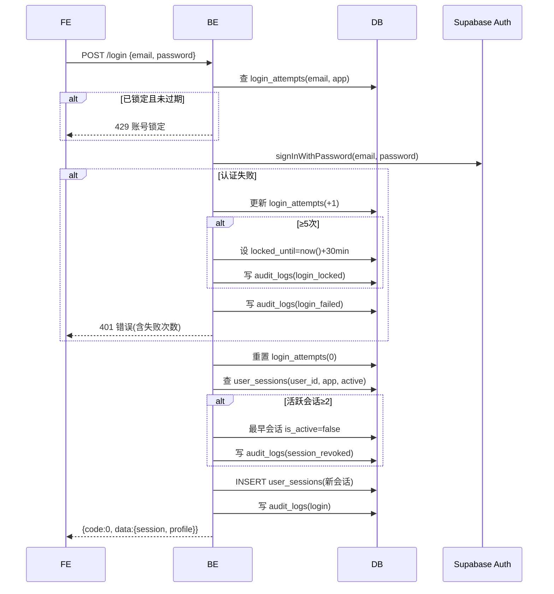
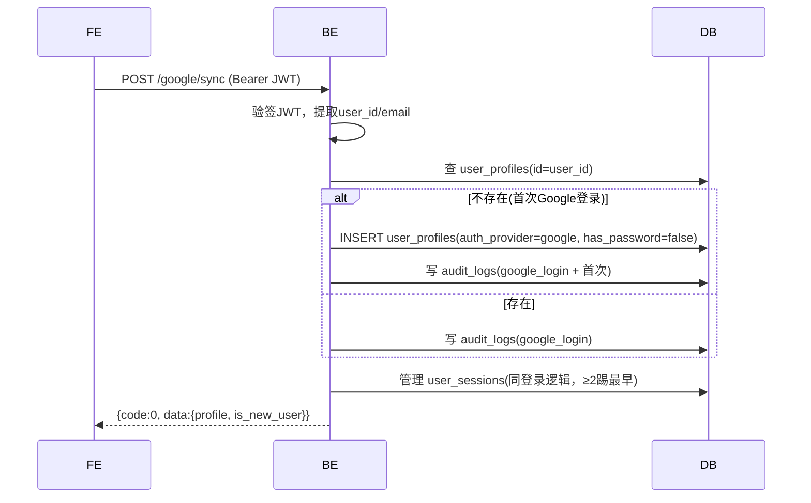

# 登录

## `POST /api/v1/app/auth/login` · 邮箱密码登录

**基础信息**

| 项 | 值 |
|----|-----|
| API-ID | API-app-auth-login |
| SM 转移 | SM-auth-001:TR-001→TR-003(成功) / TR-007(失败→锁定) |
| R-ID | R-auth-002, R-auth-004, R-auth-016 |
| 角色 | 公开 |
| 行级权限 | 无 |
| 幂等 | 否 |

**请求参数**

| 位置 | 字段 | 类型 | 必填 | 校验(一句) | D01 来源 |
|------|------|------|------|-----------|---------|
| Body | email | string | 是 | 邮箱格式 | — |
| Body | password | string | 是 | 非空 | — |
| Header | User-Agent | string | 否 | — | user_sessions.device_info |
| Header | X-Forwarded-For | string | 否 | — | user_sessions.ip_address |

**业务流程**



**业务规则**

| BR-ID | 校验内容 | 失败 code |
|-------|---------|----------|
| BR-002 | 连续5次失败锁定30分钟 | 42901 |
| BR-002a | 第1-2次仅返回错误，第3次起返回失败计数 | 40101 |
| BR-012 | 活跃会话≥2时踢下线最早设备 | 无(自动处理) |

**成功响应**

```json
{
  "code": 0,
  "data": {
    "access_token": "...",
    "refresh_token": "...",
    "user": { "id": "uuid", "email": "...", "display_name": "...", "auth_provider": "email", "has_password": true }
  },
  "msg": "ok"
}
```

**失败响应**

| HTTP | code | 含义 | 触发条件 |
|------|------|------|---------|
| 400 | 40001 | 参数校验失败 | 邮箱格式错误 |
| 401 | 40101 | 邮箱或密码错误 | 凭证不匹配(含 failure_count 字段) |
| 429 | 42901 | 账号锁定 | 连续≥5次失败，含 locked_until 字段 |

> 失败响应 data 中携带 `failure_count` 和 `max_attempts`(=5)，前端据此决定显示"邮箱或密码错误"或追加"已失败N/5次"。

**副作用**
- 成功：重置 login_attempts、创建 user_sessions、写 audit_logs(login)
- 失败：更新 login_attempts、写 audit_logs(login_failed/login_locked)
- 超限踢下线：更新旧会话 is_active=false、写 audit_logs(session_revoked)

---

## `POST /api/v1/app/auth/google/sync` · Google登录后同步

**基础信息**

| 项 | 值 |
|----|-----|
| API-ID | API-app-auth-google-sync |
| SM 转移 | SM-auth-001:TR-005(已有账号) / TR-006(新用户自动注册) |
| R-ID | R-auth-003, R-auth-012, R-auth-016 |
| 角色 | Bearer JWT |
| 行级权限 | auth.uid() = 自身 |
| 幂等 | 是(同一用户多次调用结果相同) |

**请求参数**

| 位置 | 字段 | 类型 | 必填 | 校验(一句) | D01 来源 |
|------|------|------|------|-----------|---------|
| Header | Authorization | string | 是 | Bearer JWT | — |
| Header | User-Agent | string | 否 | — | user_sessions.device_info |

> Google OAuth 由前端 supabase-js 完成，本接口仅在 OAuth 成功后由前端携带 JWT 调用。

**业务流程**



**业务规则**

| BR-ID | 校验内容 | 失败 code |
|-------|---------|----------|
| BR-010 | Google首登自动创建user角色 | 无(自动处理) |
| BR-012 | 活跃会话≥2时踢最早设备 | 无(自动处理) |

**成功响应**

```json
{
  "code": 0,
  "data": {
    "user": { "id": "uuid", "email": "...", "display_name": "...", "auth_provider": "google", "has_password": false },
    "is_new_user": true
  },
  "msg": "ok"
}
```

**失败响应**

| HTTP | code | 含义 | 触发条件 |
|------|------|------|---------|
| 401 | 40101 | Token无效 | JWT验签失败 |

**副作用**
- 首次：创建 user_profiles 记录
- 管理 user_sessions(踢下线+新建)
- 写入 audit_logs
