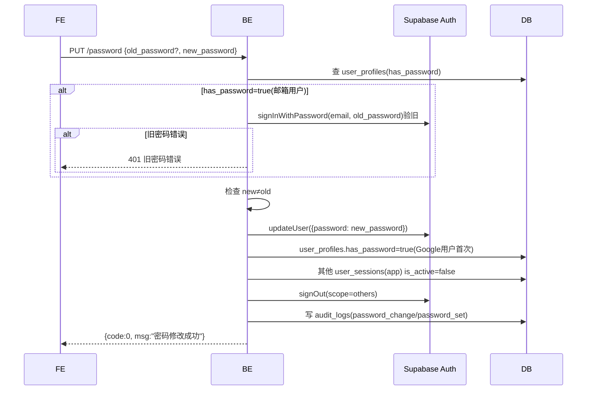

# 密码管理

## `PUT /api/v1/app/auth/password` · 修改/设置密码

**基础信息**

| 项 | 值 |
|----|-----|
| API-ID | API-app-auth-change-password |
| SM 转移 | 无 |
| R-ID | R-auth-007, R-auth-010, R-auth-014 |
| 角色 | Bearer JWT |
| 行级权限 | auth.uid() = 自身 |
| 幂等 | 否 |

**请求参数**

| 位置 | 字段 | 类型 | 必填 | 校验(一句) | D01 来源 |
|------|------|------|------|-----------|---------|
| Header | Authorization | string | 是 | Bearer JWT | — |
| Body | old_password | string | 条件 | 邮箱用户必填，Google用户不填 | — |
| Body | new_password | string | 是 | ≥8字符含字母+数字 | — |

**业务流程**



**业务规则**

| BR-ID | 校验内容 | 失败 code |
|-------|---------|----------|
| BR-001 | 密码强度 | 40001 |
| BR-007 | 邮箱用户需旧密码(has_password=true) | 40104 |
| BR-008 | Google用户不需旧密码(has_password=false) | 无(跳过校验) |
| BR-009 | 新密码≠旧密码 | 40002 |

**成功响应**

```json
{ "code": 0, "data": null, "msg": "ok" }
```

**失败响应**

| HTTP | code | 含义 | 触发条件 |
|------|------|------|---------|
| 400 | 40001 | 密码强度不足 | 不满足要求 |
| 400 | 40002 | 新密码与旧密码相同 | new=old |
| 401 | 40101 | Token无效 | JWT过期 |
| 401 | 40104 | 旧密码错误 | 邮箱用户旧密码不匹配 |

**副作用**
- 其他 user_sessions(app) is_active=false + Supabase signOut(scope=others)
- Google 用户首次：更新 user_profiles.has_password=true
- 写入 audit_logs(password_change 或 password_set)
