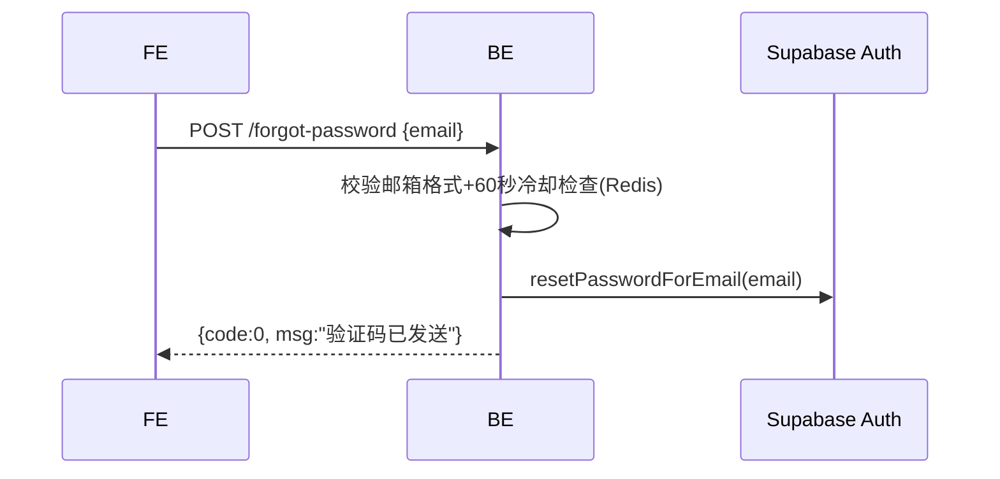
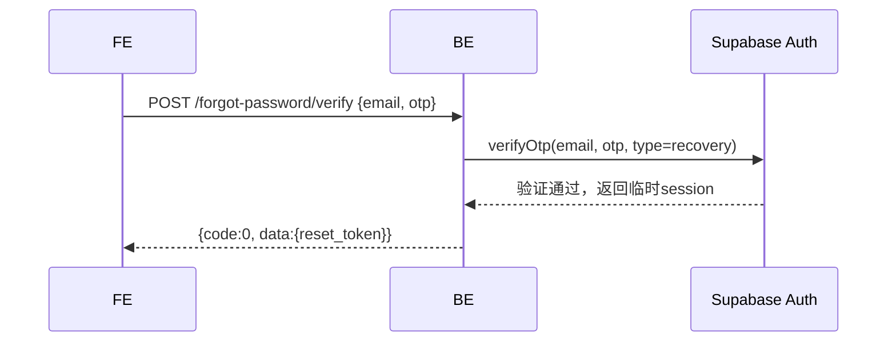
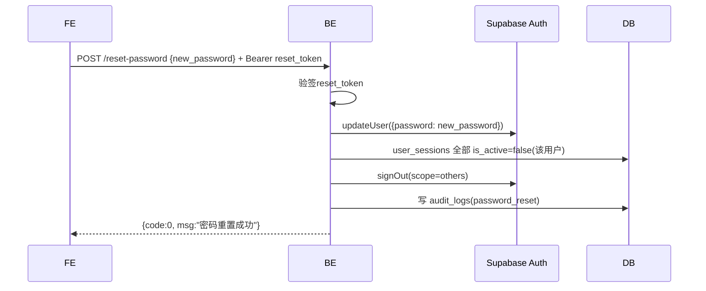
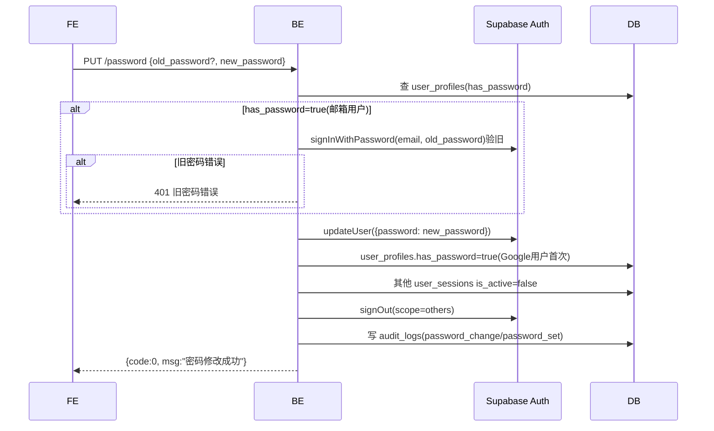

# 密码管理

## `POST /api/v1/app/auth/forgot-password` · 发送重置验证码

**基础信息**

| 项 | 值 |
|----|-----|
| API-ID | API-app-auth-forgot-password |
| SM 转移 | 无 |
| R-ID | R-auth-005 |
| 角色 | 公开 |
| 行级权限 | 无 |
| 幂等 | 否 |

**请求参数**

| 位置 | 字段 | 类型 | 必填 | 校验(一句) | D01 来源 |
|------|------|------|------|-----------|---------|
| Body | email | string | 是 | 邮箱格式 | — |

**业务流程**



> 无论邮箱是否存在，均返回"已发送"，防止邮箱枚举攻击。

**业务规则**

| BR-ID | 校验内容 | 失败 code |
|-------|---------|----------|
| BR-004 | 60秒发送冷却(后端Redis兜底) | 42901 |

**成功响应**

```json
{ "code": 0, "data": { "email": "user@example.com" }, "msg": "ok" }
```

**失败响应**

| HTTP | code | 含义 | 触发条件 |
|------|------|------|---------|
| 400 | 40001 | 参数校验失败 | 邮箱格式错误 |
| 429 | 42901 | 请求过于频繁 | 60秒内重复请求 |

**副作用**
- Supabase 发送 OTP 邮件（邮箱存在时）

---

## `POST /api/v1/app/auth/forgot-password/verify` · 验证重置OTP

**基础信息**

| 项 | 值 |
|----|-----|
| API-ID | API-app-auth-verify-reset-otp |
| SM 转移 | 无 |
| R-ID | R-auth-005 |
| 角色 | 公开 |
| 行级权限 | 无 |
| 幂等 | 否 |

**请求参数**

| 位置 | 字段 | 类型 | 必填 | 校验(一句) | D01 来源 |
|------|------|------|------|-----------|---------|
| Body | email | string | 是 | 邮箱格式 | — |
| Body | otp | string | 是 | 6位数字 | — |

**业务流程**



> 验证通过后返回 reset_token（Supabase verifyOtp 返回的临时 access_token），用于下一步重置密码。

**业务规则**

| BR-ID | 校验内容 | 失败 code |
|-------|---------|----------|
| BR-003 | 验证码5分钟有效 | 40102 |
| — | 验证码正确性 | 40103 |

**成功响应**

```json
{ "code": 0, "data": { "reset_token": "..." }, "msg": "ok" }
```

**失败响应**

| HTTP | code | 含义 | 触发条件 |
|------|------|------|---------|
| 401 | 40102 | 验证码过期 | OTP超过5分钟 |
| 401 | 40103 | 验证码错误 | OTP不匹配 |

**副作用**
无

---

## `POST /api/v1/app/auth/reset-password` · 重置密码

**基础信息**

| 项 | 值 |
|----|-----|
| API-ID | API-app-auth-reset-password |
| SM 转移 | 无 |
| R-ID | R-auth-006, R-auth-010 |
| 角色 | 公开(需 reset_token) |
| 行级权限 | 无 |
| 幂等 | 否 |

**请求参数**

| 位置 | 字段 | 类型 | 必填 | 校验(一句) | D01 来源 |
|------|------|------|------|-----------|---------|
| Header | Authorization | string | 是 | Bearer reset_token | — |
| Body | new_password | string | 是 | ≥8字符含字母+数字 | — |

**业务流程**



**业务规则**

| BR-ID | 校验内容 | 失败 code |
|-------|---------|----------|
| BR-001 | 密码强度 | 40001 |
| BR-011 | 其他设备自动下线 | 无(自动处理) |

**成功响应**

```json
{ "code": 0, "data": null, "msg": "ok" }
```

**失败响应**

| HTTP | code | 含义 | 触发条件 |
|------|------|------|---------|
| 400 | 40001 | 密码强度不足 | 不满足≥8字符含字母+数字 |
| 401 | 40101 | Token无效 | reset_token过期或无效 |

**副作用**
- 该用户所有 user_sessions 设为 is_active=false
- Supabase signOut(scope=others)
- 写入 audit_logs(password_reset)

---

## `PUT /api/v1/app/auth/password` · 修改/设置密码

**基础信息**

| 项 | 值 |
|----|-----|
| API-ID | API-app-auth-change-password |
| SM 转移 | 无 |
| R-ID | R-auth-007, R-auth-010, R-auth-014 |
| 角色 | Bearer JWT |
| 行级权限 | auth.uid() = 自身 |
| 幂等 | 否 |

**请求参数**

| 位置 | 字段 | 类型 | 必填 | 校验(一句) | D01 来源 |
|------|------|------|------|-----------|---------|
| Header | Authorization | string | 是 | Bearer JWT | — |
| Body | old_password | string | 条件 | 邮箱用户必填，Google用户不填 | — |
| Body | new_password | string | 是 | ≥8字符含字母+数字 | — |

**业务流程**



**业务规则**

| BR-ID | 校验内容 | 失败 code |
|-------|---------|----------|
| BR-001 | 密码强度 | 40001 |
| BR-007 | 邮箱用户需旧密码 | 40104 |
| BR-008 | Google用户不需旧密码 | 无(跳过校验) |
| BR-009 | 新密码≠旧密码 | 40002 |
| BR-011 | 其他设备自动下线 | 无(自动处理) |

**成功响应**

```json
{ "code": 0, "data": null, "msg": "ok" }
```

**失败响应**

| HTTP | code | 含义 | 触发条件 |
|------|------|------|---------|
| 400 | 40001 | 密码强度不足 | 不满足要求 |
| 400 | 40002 | 新密码与旧密码相同 | new=old |
| 401 | 40101 | Token无效 | JWT过期 |
| 401 | 40104 | 旧密码错误 | 邮箱用户旧密码不匹配 |

**副作用**
- 其他 user_sessions is_active=false + Supabase signOut(scope=others)
- Google 用户首次：更新 user_profiles.has_password=true
- 写入 audit_logs(password_change 或 password_set)
