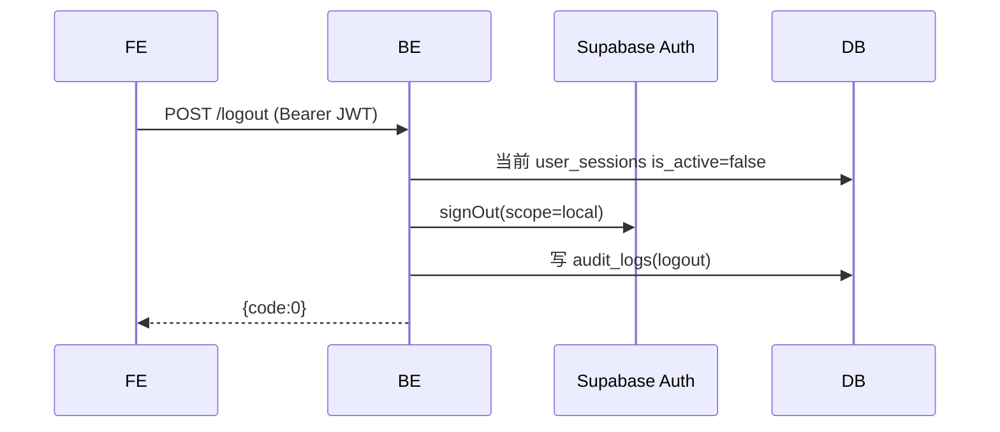
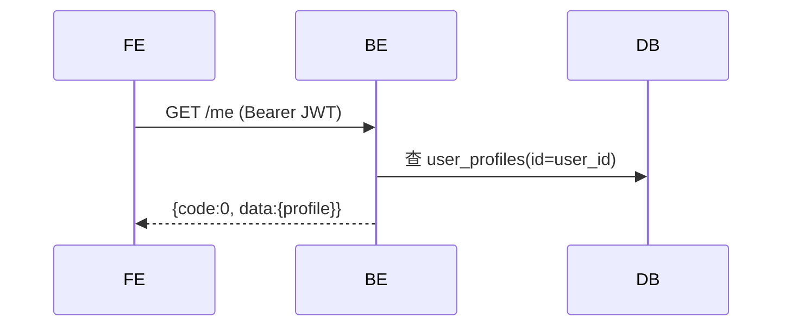

# 会话管理

## `POST /api/v1/app/auth/logout` · 退出登录

**基础信息**

| 项 | 值 |
|----|-----|
| API-ID | API-app-auth-logout |
| SM 转移 | SM-auth-001:TR-010 |
| R-ID | R-auth-008 |
| 角色 | Bearer JWT |
| 行级权限 | auth.uid() = 自身 |
| 幂等 | 是 |

**请求参数**

| 位置 | 字段 | 类型 | 必填 | 校验(一句) | D01 来源 |
|------|------|------|------|-----------|---------|
| Header | Authorization | string | 是 | Bearer JWT | — |

**业务流程**



**业务规则**

无特殊规则。

**成功响应**

```json
{ "code": 0, "data": null, "msg": "ok" }
```

**失败响应**

| HTTP | code | 含义 | 触发条件 |
|------|------|------|---------|
| 401 | 40101 | Token无效 | JWT验签失败 |

**副作用**
- 当前 user_sessions.is_active=false
- 写入 audit_logs(logout)

---

## `GET /api/v1/app/auth/me` · 获取当前用户信息

**基础信息**

| 项 | 值 |
|----|-----|
| API-ID | API-app-auth-me |
| SM 转移 | 无 |
| R-ID | R-auth-014 |
| 角色 | Bearer JWT |
| 行级权限 | auth.uid() = 自身 |
| 幂等 | 是 |

**请求参数**

| 位置 | 字段 | 类型 | 必填 | 校验(一句) | D01 来源 |
|------|------|------|------|-----------|---------|
| Header | Authorization | string | 是 | Bearer JWT | — |

**业务流程**



**业务规则**

无特殊规则。

**成功响应**

```json
{
  "code": 0,
  "data": {
    "id": "uuid",
    "email": "user@example.com",
    "display_name": null,
    "avatar_url": null,
    "auth_provider": "email",
    "has_password": true
  },
  "msg": "ok"
}
```

**失败响应**

| HTTP | code | 含义 | 触发条件 |
|------|------|------|---------|
| 401 | 40101 | Token无效 | JWT验签失败 |

**副作用**
无
