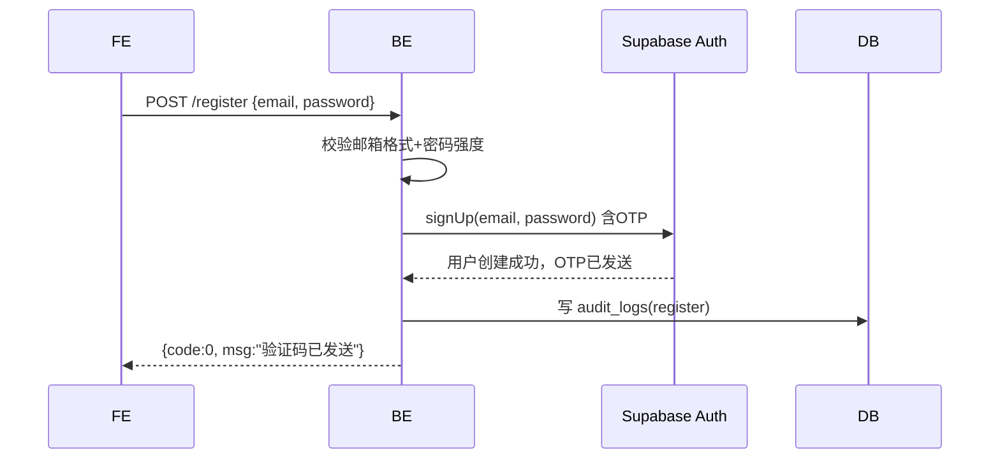
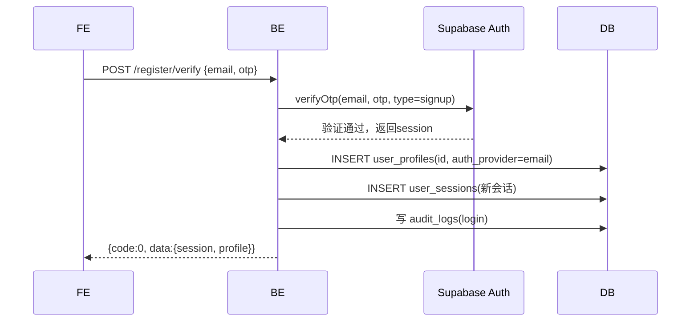
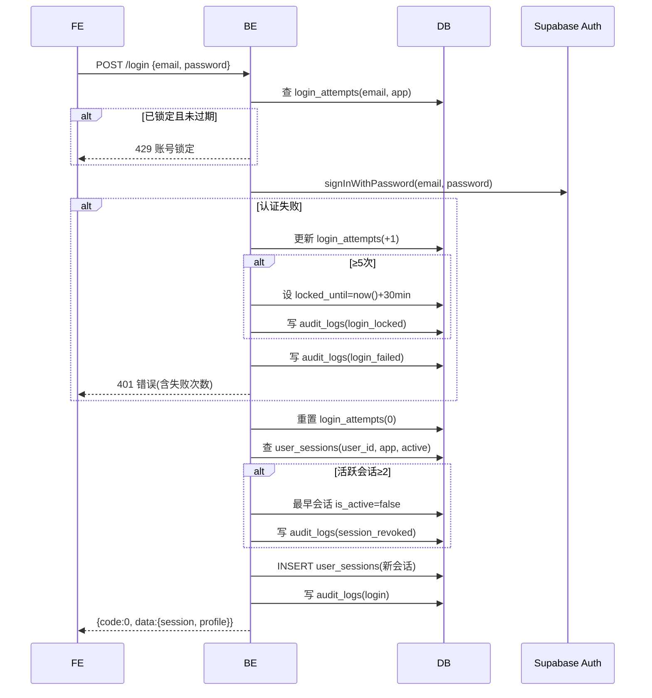
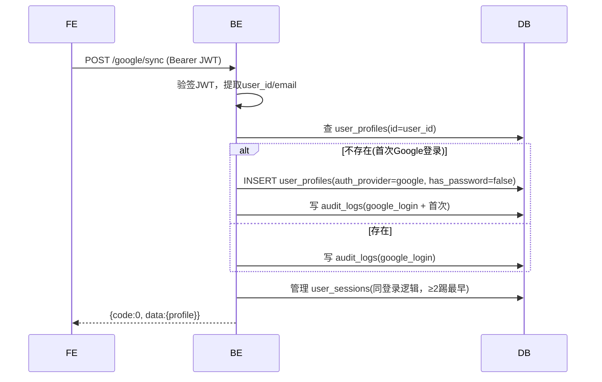
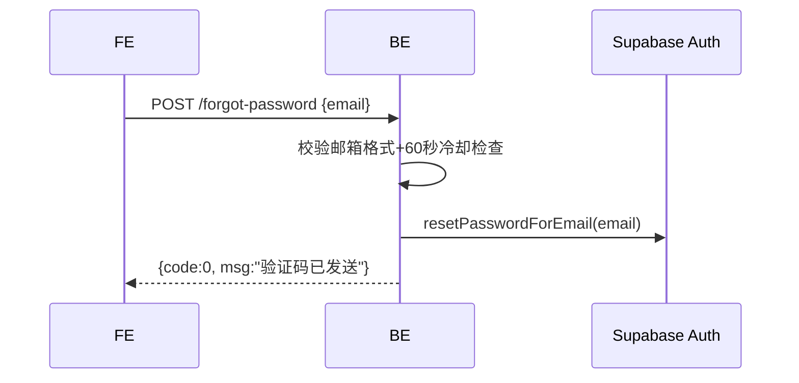
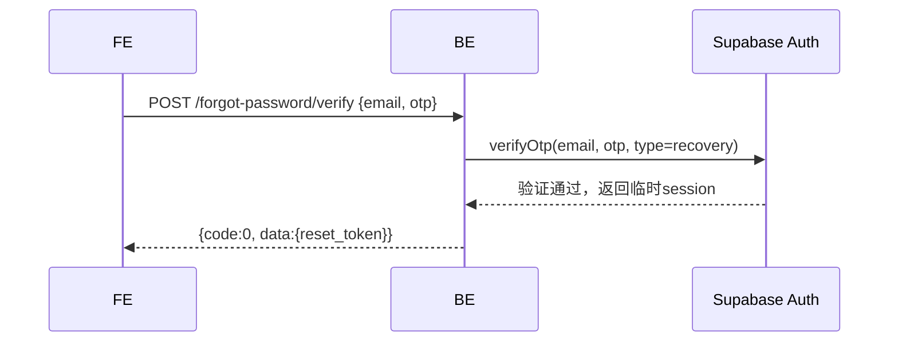
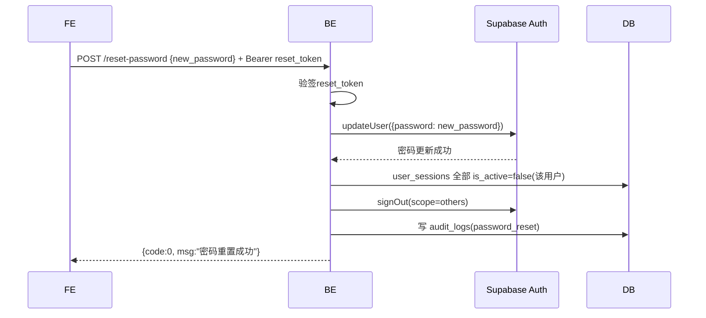
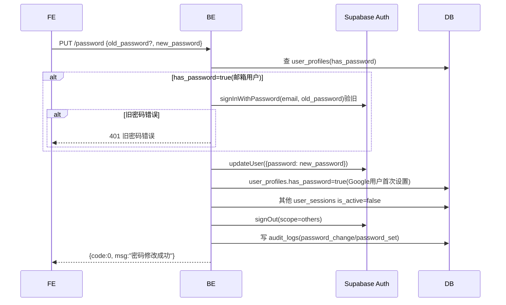
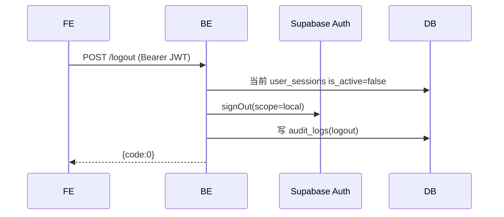
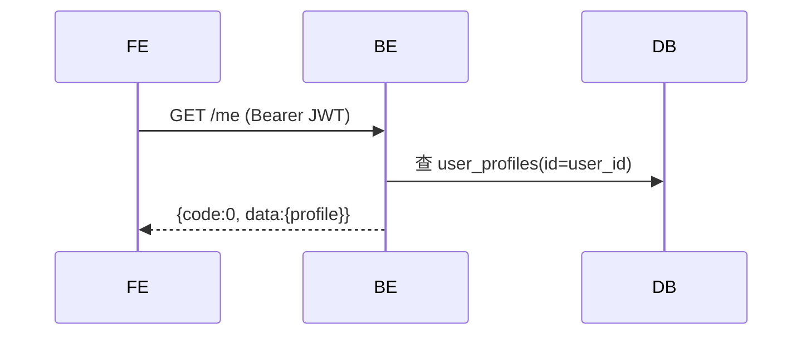

# 接口规范 · account-entry

> **系统**：app
> **关联 R-ID**：R-auth-001~016
> **不做**：表结构(D01)、页面/原型(C02/C03)
> **特殊说明**：Token 刷新由前端 `supabase-js` 自动处理(B01-09)，不经后端；Google OAuth 弹窗由前端 `supabase.auth.signInWithOAuth()` 发起，成功后调后端同步接口。

---

## 1. 路由表

### 1.1 page-id → URL 映射

| page-id | 页面名称 | URL | 鉴权 | 可见角色 |
|---------|---------|-----|------|---------|
| P-app-auth-001 | 登录页 | /login | 公开 | 全部 |
| P-app-auth-002 | 注册页 | /register | 公开 | 全部 |
| P-app-auth-003 | 忘记密码页 | /forgot-password | 公开 | 全部 |
| P-app-auth-004 | 重置密码页 | /reset-password | 公开(需验证码token) | 全部 |
| P-app-auth-005 | 修改/设置密码页 | /settings/password | Bearer JWT | ROLE-USER |
| P-app-auth-006 | 设置页 | /settings | Bearer JWT | ROLE-USER |

---

## 2. 接口清单

| API-ID | 方法 | 路径 | 职责(≤10字) | 角色 | R-ID | SM 转移 |
|--------|------|------|------------|------|------|--------|
| API-app-auth-register | POST | /api/v1/app/auth/register | 邮箱注册+发OTP | 公开 | R-auth-001, R-auth-010, R-auth-011, R-auth-015 | TR-004 |
| API-app-auth-verify-register | POST | /api/v1/app/auth/register/verify | 验证注册OTP | 公开 | R-auth-001, R-auth-015 | TR-004→已登录 |
| API-app-auth-login | POST | /api/v1/app/auth/login | 邮箱密码登录 | 公开 | R-auth-002, R-auth-004, R-auth-016 | TR-001, TR-003, TR-007 |
| API-app-auth-google-sync | POST | /api/v1/app/auth/google/sync | Google登录后同步 | Bearer JWT | R-auth-003, R-auth-012, R-auth-016 | TR-005, TR-006 |
| API-app-auth-forgot-password | POST | /api/v1/app/auth/forgot-password | 发送重置验证码 | 公开 | R-auth-005 | 无 |
| API-app-auth-verify-reset-otp | POST | /api/v1/app/auth/forgot-password/verify | 验证重置OTP | 公开 | R-auth-005 | 无 |
| API-app-auth-reset-password | POST | /api/v1/app/auth/reset-password | 重置密码 | 公开(需验证token) | R-auth-006, R-auth-010 | 无 |
| API-app-auth-change-password | PUT | /api/v1/app/auth/password | 修改/设置密码 | Bearer JWT | R-auth-007, R-auth-010, R-auth-014 | 无 |
| API-app-auth-logout | POST | /api/v1/app/auth/logout | 退出登录 | Bearer JWT | R-auth-008 | TR-010 |
| API-app-auth-me | GET | /api/v1/app/auth/me | 获取当前用户信息 | Bearer JWT | R-auth-014 | 无 |

---

## 3. 接口详情

### 3.1 `POST /api/v1/app/auth/register` · 邮箱注册+发OTP

**基础信息**

| 项 | 值 |
|----|-----|
| API-ID | API-app-auth-register |
| SM 转移 | SM-auth-001:TR-004(部分：创建账号+发OTP) |
| R-ID | R-auth-001, R-auth-010, R-auth-011, R-auth-015 |
| 角色 | 公开 |
| 行级权限 | 无 |
| 幂等 | 否 |

**请求参数**

| 位置 | 字段 | 类型 | 必填 | 校验(一句) | D01 来源 |
|------|------|------|------|-----------|---------|
| Body | email | string | 是 | 邮箱格式 | — |
| Body | password | string | 是 | ≥8字符含字母+数字 | — |

**业务流程**



**业务规则**

| BR-ID | 校验内容 | 失败 code |
|-------|---------|----------|
| BR-001 | 密码强度 | 40001 |
| — | 邮箱格式 | 40001 |
| — | 邮箱已注册 | 40901 |

**成功响应**

```json
{ "code": 0, "data": { "email": "user@example.com" }, "msg": "ok" }
```

**失败响应**

| HTTP | code | 含义 | 触发条件 |
|------|------|------|---------|
| 400 | 40001 | 参数校验失败 | 邮箱格式错误/密码强度不足 |
| 409 | 40901 | 邮箱已注册 | Supabase 返回邮箱重复 |
| 503 | 50301 | 服务异常 | Supabase Auth 不可用 |

**副作用**
- Supabase 发送 OTP 邮件至用户邮箱
- 写入 audit_logs(action=register)

---

### 3.2 `POST /api/v1/app/auth/register/verify` · 验证注册OTP

**基础信息**

| 项 | 值 |
|----|-----|
| API-ID | API-app-auth-verify-register |
| SM 转移 | SM-auth-001:TR-004(完成注册→自动登录) |
| R-ID | R-auth-001, R-auth-015 |
| 角色 | 公开 |
| 行级权限 | 无 |
| 幂等 | 否 |

**请求参数**

| 位置 | 字段 | 类型 | 必填 | 校验(一句) | D01 来源 |
|------|------|------|------|-----------|---------|
| Body | email | string | 是 | 邮箱格式 | — |
| Body | otp | string | 是 | 6位数字 | — |

**业务流程**



**业务规则**

| BR-ID | 校验内容 | 失败 code |
|-------|---------|----------|
| BR-003 | 验证码5分钟有效 | 40102 |
| — | 验证码正确性 | 40103 |

**成功响应**

```json
{
  "code": 0,
  "data": {
    "access_token": "...",
    "refresh_token": "...",
    "user": { "id": "uuid", "email": "...", "display_name": null, "auth_provider": "email", "has_password": true }
  },
  "msg": "ok"
}
```

**失败响应**

| HTTP | code | 含义 | 触发条件 |
|------|------|------|---------|
| 401 | 40102 | 验证码过期 | OTP超过5分钟 |
| 401 | 40103 | 验证码错误 | OTP不匹配 |

**副作用**
- 创建 user_profiles 记录
- 创建 user_sessions 记录
- 写入 audit_logs(action=login)

---

### 3.3 `POST /api/v1/app/auth/login` · 邮箱密码登录

**基础信息**

| 项 | 值 |
|----|-----|
| API-ID | API-app-auth-login |
| SM 转移 | SM-auth-001:TR-001→TR-003(成功) / TR-007(失败→锁定) |
| R-ID | R-auth-002, R-auth-004, R-auth-016 |
| 角色 | 公开 |
| 行级权限 | 无 |
| 幂等 | 否 |

**请求参数**

| 位置 | 字段 | 类型 | 必填 | 校验(一句) | D01 来源 |
|------|------|------|------|-----------|---------|
| Body | email | string | 是 | 邮箱格式 | — |
| Body | password | string | 是 | 非空 | — |
| Header | User-Agent | string | 否 | — | user_sessions.device_info |
| Header | X-Forwarded-For | string | 否 | — | user_sessions.ip_address |

**业务流程**



**业务规则**

| BR-ID | 校验内容 | 失败 code |
|-------|---------|----------|
| BR-002 | 连续5次失败锁定30分钟 | 42901 |
| BR-002a | 第1-2次仅返回错误，第3次起返回失败计数 | 40101 |
| BR-012 | 活跃会话≥2时踢下线最早设备 | 无(自动处理) |

**成功响应**

```json
{
  "code": 0,
  "data": {
    "access_token": "...",
    "refresh_token": "...",
    "user": { "id": "uuid", "email": "...", "display_name": "...", "auth_provider": "email", "has_password": true }
  },
  "msg": "ok"
}
```

**失败响应**

| HTTP | code | 含义 | 触发条件 |
|------|------|------|---------|
| 400 | 40001 | 参数校验失败 | 邮箱格式错误 |
| 401 | 40101 | 邮箱或密码错误 | 凭证不匹配(含 failure_count 字段) |
| 429 | 42901 | 账号锁定 | 连续≥5次失败，含 locked_until 字段 |

> 失败响应 data 中携带 `failure_count` 和 `max_attempts`(=5)，前端据此决定显示"邮箱或密码错误"或追加"已失败N/5次"。

**副作用**
- 成功：重置 login_attempts、创建 user_sessions、写 audit_logs(login)
- 失败：更新 login_attempts、写 audit_logs(login_failed/login_locked)
- 超限踢下线：更新旧会话 is_active=false、写 audit_logs(session_revoked)

---

### 3.4 `POST /api/v1/app/auth/google/sync` · Google登录后同步

**基础信息**

| 项 | 值 |
|----|-----|
| API-ID | API-app-auth-google-sync |
| SM 转移 | SM-auth-001:TR-005(已有账号) / TR-006(新用户自动注册) |
| R-ID | R-auth-003, R-auth-012, R-auth-016 |
| 角色 | Bearer JWT |
| 行级权限 | auth.uid() = 自身 |
| 幂等 | 是(同一用户多次调用结果相同) |

**请求参数**

| 位置 | 字段 | 类型 | 必填 | 校验(一句) | D01 来源 |
|------|------|------|------|-----------|---------|
| Header | Authorization | string | 是 | Bearer JWT | — |
| Header | User-Agent | string | 否 | — | user_sessions.device_info |

> Google OAuth 由前端 supabase-js 完成，本接口仅在 OAuth 成功后由前端携带 JWT 调用，同步 profile 和 session。

**业务流程**



**业务规则**

| BR-ID | 校验内容 | 失败 code |
|-------|---------|----------|
| BR-010 | Google首登自动创建user角色 | 无(自动处理) |
| BR-012 | 活跃会话≥2时踢最早设备 | 无(自动处理) |

**成功响应**

```json
{
  "code": 0,
  "data": {
    "user": { "id": "uuid", "email": "...", "display_name": "...", "auth_provider": "google", "has_password": false },
    "is_new_user": true
  },
  "msg": "ok"
}
```

**失败响应**

| HTTP | code | 含义 | 触发条件 |
|------|------|------|---------|
| 401 | 40101 | Token无效 | JWT验签失败 |

**副作用**
- 首次：创建 user_profiles 记录
- 管理 user_sessions(踢下线+新建)
- 写入 audit_logs

---

### 3.5 `POST /api/v1/app/auth/forgot-password` · 发送重置验证码

**基础信息**

| 项 | 值 |
|----|-----|
| API-ID | API-app-auth-forgot-password |
| SM 转移 | 无 |
| R-ID | R-auth-005 |
| 角色 | 公开 |
| 行级权限 | 无 |
| 幂等 | 否 |

**请求参数**

| 位置 | 字段 | 类型 | 必填 | 校验(一句) | D01 来源 |
|------|------|------|------|-----------|---------|
| Body | email | string | 是 | 邮箱格式 | — |

**业务流程**



> 无论邮箱是否存在，均返回"已发送"，防止邮箱枚举攻击。

**业务规则**

| BR-ID | 校验内容 | 失败 code |
|-------|---------|----------|
| BR-004 | 60秒发送冷却 | 42901 |

**成功响应**

```json
{ "code": 0, "data": { "email": "user@example.com" }, "msg": "ok" }
```

**失败响应**

| HTTP | code | 含义 | 触发条件 |
|------|------|------|---------|
| 400 | 40001 | 参数校验失败 | 邮箱格式错误 |
| 429 | 42901 | 请求过于频繁 | 60秒内重复请求 |

**副作用**
- Supabase 发送 OTP 邮件（邮箱存在时）

---

### 3.6 `POST /api/v1/app/auth/forgot-password/verify` · 验证重置OTP

**基础信息**

| 项 | 值 |
|----|-----|
| API-ID | API-app-auth-verify-reset-otp |
| SM 转移 | 无 |
| R-ID | R-auth-005 |
| 角色 | 公开 |
| 行级权限 | 无 |
| 幂等 | 否 |

**请求参数**

| 位置 | 字段 | 类型 | 必填 | 校验(一句) | D01 来源 |
|------|------|------|------|-----------|---------|
| Body | email | string | 是 | 邮箱格式 | — |
| Body | otp | string | 是 | 6位数字 | — |

**业务流程**



> 验证通过后返回 reset_token（临时 access_token），用于下一步重置密码。

**业务规则**

| BR-ID | 校验内容 | 失败 code |
|-------|---------|----------|
| BR-003 | 验证码5分钟有效 | 40102 |
| — | 验证码正确性 | 40103 |

**成功响应**

```json
{ "code": 0, "data": { "reset_token": "..." }, "msg": "ok" }
```

**失败响应**

| HTTP | code | 含义 | 触发条件 |
|------|------|------|---------|
| 401 | 40102 | 验证码过期 | OTP超过5分钟 |
| 401 | 40103 | 验证码错误 | OTP不匹配 |

**副作用**
无

---

### 3.7 `POST /api/v1/app/auth/reset-password` · 重置密码

**基础信息**

| 项 | 值 |
|----|-----|
| API-ID | API-app-auth-reset-password |
| SM 转移 | 无 |
| R-ID | R-auth-006, R-auth-010 |
| 角色 | 公开(需 reset_token) |
| 行级权限 | 无 |
| 幂等 | 否 |

**请求参数**

| 位置 | 字段 | 类型 | 必填 | 校验(一句) | D01 来源 |
|------|------|------|------|-----------|---------|
| Header | Authorization | string | 是 | Bearer reset_token | — |
| Body | new_password | string | 是 | ≥8字符含字母+数字 | — |

**业务流程**



**业务规则**

| BR-ID | 校验内容 | 失败 code |
|-------|---------|----------|
| BR-001 | 密码强度 | 40001 |
| BR-011 | 其他设备自动下线 | 无(自动处理) |

**成功响应**

```json
{ "code": 0, "data": null, "msg": "ok" }
```

**失败响应**

| HTTP | code | 含义 | 触发条件 |
|------|------|------|---------|
| 400 | 40001 | 密码强度不足 | 不满足≥8字符含字母+数字 |
| 401 | 40101 | Token无效 | reset_token过期或无效 |

**副作用**
- 该用户所有 user_sessions 设为 is_active=false
- Supabase signOut(scope=others) 撤销其他会话
- 写入 audit_logs(password_reset)

---

### 3.8 `PUT /api/v1/app/auth/password` · 修改/设置密码

**基础信息**

| 项 | 值 |
|----|-----|
| API-ID | API-app-auth-change-password |
| SM 转移 | 无 |
| R-ID | R-auth-007, R-auth-010, R-auth-014 |
| 角色 | Bearer JWT |
| 行级权限 | auth.uid() = 自身 |
| 幂等 | 否 |

**请求参数**

| 位置 | 字段 | 类型 | 必填 | 校验(一句) | D01 来源 |
|------|------|------|------|-----------|---------|
| Header | Authorization | string | 是 | Bearer JWT | — |
| Body | old_password | string | 条件 | 邮箱用户必填，Google用户不填 | — |
| Body | new_password | string | 是 | ≥8字符含字母+数字 | — |

**业务流程**



**业务规则**

| BR-ID | 校验内容 | 失败 code |
|-------|---------|----------|
| BR-001 | 密码强度 | 40001 |
| BR-007 | 邮箱用户需旧密码 | 40104 |
| BR-008 | Google用户不需旧密码 | 无(跳过校验) |
| BR-009 | 新密码≠旧密码 | 40002 |
| BR-011 | 其他设备自动下线 | 无(自动处理) |

**成功响应**

```json
{ "code": 0, "data": null, "msg": "ok" }
```

**失败响应**

| HTTP | code | 含义 | 触发条件 |
|------|------|------|---------|
| 400 | 40001 | 密码强度不足 | 不满足要求 |
| 400 | 40002 | 新密码与旧密码相同 | new=old |
| 401 | 40101 | Token无效 | JWT过期 |
| 401 | 40104 | 旧密码错误 | 邮箱用户旧密码不匹配 |

**副作用**
- 其他 user_sessions is_active=false + Supabase signOut(scope=others)
- Google 用户首次：更新 user_profiles.has_password=true
- 写入 audit_logs(password_change 或 password_set)

---

### 3.9 `POST /api/v1/app/auth/logout` · 退出登录

**基础信息**

| 项 | 值 |
|----|-----|
| API-ID | API-app-auth-logout |
| SM 转移 | SM-auth-001:TR-010 |
| R-ID | R-auth-008 |
| 角色 | Bearer JWT |
| 行级权限 | auth.uid() = 自身 |
| 幂等 | 是 |

**请求参数**

| 位置 | 字段 | 类型 | 必填 | 校验(一句) | D01 来源 |
|------|------|------|------|-----------|---------|
| Header | Authorization | string | 是 | Bearer JWT | — |

**业务流程**



**业务规则**

无特殊规则。

**成功响应**

```json
{ "code": 0, "data": null, "msg": "ok" }
```

**失败响应**

| HTTP | code | 含义 | 触发条件 |
|------|------|------|---------|
| 401 | 40101 | Token无效 | JWT验签失败 |

**副作用**
- 当前 user_sessions.is_active=false
- 写入 audit_logs(logout)

---

### 3.10 `GET /api/v1/app/auth/me` · 获取当前用户信息

**基础信息**

| 项 | 值 |
|----|-----|
| API-ID | API-app-auth-me |
| SM 转移 | 无 |
| R-ID | R-auth-014 |
| 角色 | Bearer JWT |
| 行级权限 | auth.uid() = 自身 |
| 幂等 | 是 |

**请求参数**

| 位置 | 字段 | 类型 | 必填 | 校验(一句) | D01 来源 |
|------|------|------|------|-----------|---------|
| Header | Authorization | string | 是 | Bearer JWT | — |

**业务流程**



**业务规则**

无特殊规则。

**成功响应**

```json
{
  "code": 0,
  "data": {
    "id": "uuid",
    "email": "user@example.com",
    "display_name": null,
    "avatar_url": null,
    "auth_provider": "email",
    "has_password": true
  },
  "msg": "ok"
}
```

**失败响应**

| HTTP | code | 含义 | 触发条件 |
|------|------|------|---------|
| 401 | 40101 | Token无效 | JWT验签失败 |

**副作用**
无

---

## 4. 错误码汇总

| code | HTTP | 含义 | 文案 | 触发接口 |
|------|------|------|------|---------|
| 40001 | 400 | 参数校验失败 | 请检查输入内容 | register, login, forgot-password, reset-password, change-password |
| 40002 | 400 | 新密码与旧密码相同 | 新密码不能与旧密码相同 | change-password |
| 40101 | 401 | 认证失败 | 邮箱或密码错误 | login, me, logout, change-password, google-sync |
| 40102 | 401 | 验证码过期 | 验证码已过期，请重新发送 | verify-register, verify-reset-otp |
| 40103 | 401 | 验证码错误 | 验证码错误 | verify-register, verify-reset-otp |
| 40104 | 401 | 旧密码错误 | 旧密码错误 | change-password |
| 40901 | 409 | 资源冲突 | 该邮箱已注册 | register |
| 42901 | 429 | 请求限流 | 请求过于频繁/账号已锁定 | login, forgot-password |
| 50301 | 503 | 第三方异常 | 服务暂不可用 | register, login |

---

## 5. 并发与幂等

| API-ID | 并发场景 | 策略 | 失败处理 |
|--------|---------|------|---------|
| API-app-auth-login | 同一邮箱并发登录 | login_attempts 行级锁(SELECT FOR UPDATE) | 重试 |
| API-app-auth-google-sync | 同一用户并发调用 | user_profiles UPSERT(ON CONFLICT DO NOTHING) | 幂等，无需处理 |

---

## 6. 事件/Webhook

无

---

## 7. 增量融合报告

### 7.1 本轮新增 / 融合点 / 冲突点
首轮产出。共 10 个接口。无融合/冲突。

---

## 8. 自检报告

**R-ID 覆盖**

| R-ID | 承接 API-ID |
|------|------------|
| R-auth-001 邮箱注册 | API-app-auth-register + verify-register |
| R-auth-002 邮箱登录 | API-app-auth-login |
| R-auth-003 Google登录 | API-app-auth-google-sync (OAuth由前端supabase-js驱动) |
| R-auth-004 登录限流 | API-app-auth-login (BR-002/BR-002a) |
| R-auth-005 忘记密码 | API-app-auth-forgot-password + verify-reset-otp |
| R-auth-006 重置密码 | API-app-auth-reset-password |
| R-auth-007 修改密码 | API-app-auth-change-password |
| R-auth-008 退出登录 | API-app-auth-logout |
| R-auth-009 Token过期 | 前端supabase-js自动刷新(B01-09)，不经后端 |
| R-auth-010 密码强度 | register, reset-password, change-password 的请求校验 |
| R-auth-011 邮箱格式 | 各接口 email 字段校验 |
| R-auth-012 Google自动注册 | API-app-auth-google-sync |
| R-auth-013 登录注册切换 | 前端路由，无需后端接口 |
| R-auth-014 Google密码管理 | API-app-auth-change-password + me |
| R-auth-015 注册验证码 | API-app-auth-register + verify-register |
| R-auth-016 多设备限制 | login + google-sync 中的会话管理逻辑 |

- [x] 每条 R-ID 均有接口承接（R-auth-009/013 为前端行为，无需后端接口）

**SM 转移覆盖**

| SM 转移 | 承接 API-ID |
|---------|------------|
| TR-001 未登录→认证中 | API-app-auth-login |
| TR-002 未登录→Google认证中 | 前端supabase-js |
| TR-003 认证中→已登录 | API-app-auth-login(成功) |
| TR-004 认证中→注册成功→已登录 | API-app-auth-register + verify-register |
| TR-005 Google认证中→已登录 | API-app-auth-google-sync |
| TR-006 Google认证中→自动注册 | API-app-auth-google-sync |
| TR-007 登录失败→账号锁定 | API-app-auth-login(BR-002) |
| TR-008 已登录→Token刷新中 | 前端supabase-js |
| TR-009 Token刷新中→会话过期 | 前端supabase-js |
| TR-010 已登录→未登录(退出) | API-app-auth-logout |

- [x] 每条 SM 转移均有接口或前端行为承接

**D01 一致性**
- [x] 入参/出参字段名、类型与 D01 实体字段一致
- [x] 校验规则与 D01 BR-ID 一致

**B01 一致性**
- [x] 错误码范围遵守 B01（40001-40099参数、40101-40199认证、40901-40999冲突、42901-42999限流、50301-50399第三方）
- [x] URL 命名遵守 B01（/api/v1/app/auth/...）

**page-id 覆盖**
- [x] 6 个 page-id 100% 来自 C02，不增不减

**边界**
- [x] 未写 UI/HTML
- [x] 未修改 SM
- [x] API-ID 带 app 前缀
- [x] 不跨系统
- [x] 单文件 < 1200 行

---

## 99. 待确认问题

| 编号 | 问题 | AI 默认方案 | 影响 |
|------|------|-----------|------|
| Q-001 | Google OAuth 回调后前端如何识别"首次登录" | google-sync 返回 is_new_user 字段 | 前端据此决定是否显示引导 |
答案：你决定，选择好的。
| Q-002 | 验证码发送冷却(BR-004)由后端还是前端控制 | 后端 Redis/内存 + 前端倒计时双重控制 | 60秒冷却需后端兜底防绕过 |
答案：你决定，选择好的。
| Q-003 | reset-password 的 reset_token 如何传递 | verify-reset-otp 返回 Supabase 临时 session 的 access_token 作为 reset_token | 开发阶段确认 Supabase verifyOtp 返回值结构 |
答案：你决定，选择好的。
