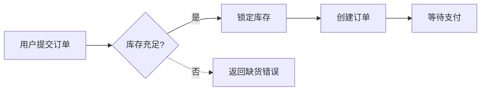

# 02 · 通用约定：澄清协议与输出格式

> 所有阶段、所有模板共用本约定。AI 在任何阶段开口前必须先读本文件。

---

## 一、澄清协议（强制）

### 1.1 触发时机
当 AI 收到一份"用户输入模板"的填写结果，**第一轮回复必须且只能**是按本节格式生成的"澄清提问清单"，不允许：
- 直接给最终输出
- 自己脑补默认值
- 说"我先按理解写一版你看看"

### 1.2 澄清问题的格式

输出文件命名：`<阶段>-questions-round<N>.md`，例如 `R-questions-round1.md`。

文件结构强制如下：

```markdown
# <阶段名> 澄清提问 · 第 <N> 轮

> 本轮共 <X> 个问题。请按编号回答；若某问题选"采纳推荐"，写 `Q3 = 推荐` 即可。
> 未回答的问题视为"采纳推荐"，AI 出报告时将以推荐项执行并在脚注标记。

---

## 阻断级（必须回答，否则无法出下游）

### Q1. <一句话问题>
- **背景**：<为什么问这个，影响什么>
- **可选项**：
  - A. <选项 A>
  - B. <选项 B>
  - C. 其他（请说明）
- **推荐**：<A/B/...>，理由：<一句话>
- **影响范围**：<会决定哪份下游文件的哪一节>

### Q2. ...

---

## 优化级（可不答，AI 走推荐）

### Q10. ...
```

### 1.3 问题数量与质量约束
- 阻断级问题 ≤ 10 个，优化级 ≤ 20 个；超出说明上游模板没填够，应退回让用户补。
- 每个问题必须有**推荐**和**影响范围**——没有这两项的问题视为不合格，AI 必须自查重写。
- 禁止"开放式问题"（如"你还有什么想法吗？"）。所有问题必须可被有限选项回答。

### 1.4 用户回答方式
用户用同一份 `*-questions-round<N>.md` 在每个问题下追加 `**答**：...`，或新开一份 `*-answers-round<N>.md`。AI 必须把"问题 + 回答"合并写入 `*-resolved.md` 后才进入下游产出。

### 1.5 多轮澄清
如果用户的回答又引出新疑点，AI 可发起 round2、round3，但每轮新问题 ≤ 5 个；超过 3 轮仍未收敛 → 退回上一阶段重写用户输入。

---

## 二、AI 输出文件的通用骨架

每份 AI 输出文件都必须以这个头开始：

```markdown
# <文件名>

> **阶段**：<R/P/G/F/V>
> **角色**：<Analyst/Designer/Architect/PM+Arch/SM+QA>
> **上游依赖**：<列出本次实际读取的上游文件清单（路径）>
> **生成时间**：<YYYY-MM-DD>
> **冻结状态**：<未冻结 / 已冻结 vN>
> **下游影响**：<本文件冻结后会被哪些后续步骤引用>

---

## 0. 摘要（≤ 5 行）
<本文件最关键的 3-5 条结论。给"忙人"看>

## 1. 正文（按各阶段模板的章节）
...

## 99. 待确认问题
- [ ] 编号：<问题>（影响：<下游文件>）
```

> "待确认问题"为空 = 可冻结；非空 = 必须回到澄清协议补答。

---

## 三、Mermaid 流程图规范

R/P/F 阶段都会画图。统一约束：

- 一律用 `mermaid` 代码块，禁止上传图片。
- 主路径用 `flowchart LR`；状态机用 `stateDiagram-v2`；时序用 `sequenceDiagram`；ER 用 `erDiagram`。
- 节点 ID 用大写字母+数字（A1/B2），可读名称写在 `[]` 内。
- 异常路径用 `-.->` 虚线，正常路径用 `-->`。
- 每张图末尾补一段"图例与说明"普通文字，确保不依赖颜色也能读懂。

样例：



---

## 四、引用别处文件的写法

- 本仓内文件：用 markdown 链接，相对路径；例 `[F1 数据模型](../function/<proj>/<feat>/F1-数据模型规范.md)`。
- 同文件内章节：`见本文 §3.2`。
- 上游冻结文件：在文档头 `上游依赖` 必须出现。

---

## 五、命名约定

| 对象 | 规则 | 示例 |
|------|------|------|
| 项目 ID | 全小写，短横分隔 | `china`、`course` |
| 功能 ID | 全小写，短横分隔 | `order-mgmt`、`user-profile` |
| 文件名 | 中文+短横+用途 | `F1-数据模型规范.md` |
| 需求 ID | `R-<proj>-<seq3>` | `R-china-007` |
| 页面 ID | `P-<proj>-<seq3>` | `P-china-012` |
| 接口 ID | `API-<proj>-<feat>-<verb>-<noun>` | `API-china-order-list-orders` |
| Story ID | `S-<proj>-<feat>-<seq3>` | `S-china-order-005` |

---

## 六、AI 自检 Checklist（每次输出前内部跑一遍）

- [ ] 我是不是先看了 `00 框架总览` 和 `02 通用约定`？
- [ ] 这一步我是不是只读了"系统消息列出的"上下文？
- [ ] 我有没有跳过澄清直接出报告？
- [ ] 我的输出文件头部 6 项元信息齐全吗？
- [ ] 我的输出有没有 `99 待确认问题` 一节？
- [ ] 文件 ≤ 1200 行吗？超了我有没有拆？
- [ ] 我有没有"以防万一"塞入用户没要求的东西？

任何一项 No → 重写，不许提交。

---

## 七、严禁项

1. ❌ 跳过澄清直接出最终报告
2. ❌ 在用户没说的地方做技术决策（要写进澄清问题）
3. ❌ 一次输出多份不同阶段的文件（一次只产一份）
4. ❌ 把上下文窗口塞满整个仓库
5. ❌ 用图片代替 mermaid
6. ❌ 在 R 阶段写表字段；在 P 阶段写 SQL；在 G 阶段写功能字段；在 F 阶段写代码
7. ❌ 修改已冻结文件而不写 diff 说明
