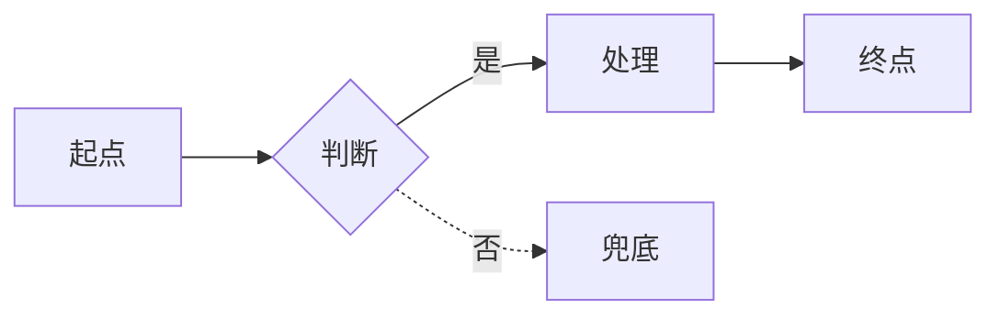
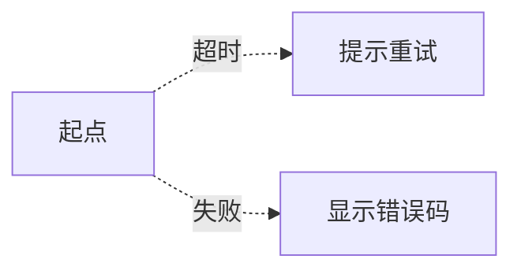
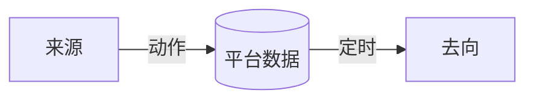

# 12 · R AI 输出：需求基线模板

> **阶段**：R 需求分析
> **谁产出**：AI（需求分析师）
> **何时产出**：用户回完 R 澄清清单后。
> **落盘**：`docs/10-requirements/baseline.md`（如流程图过多可单独抽到 `flows/`）

---

## AI 必须遵守

1. **只读**：R 用户输入 + R-questions-round*-resolved + `01` + `03` + `04` + 本模板。
2. **不许做**：写技术栈、画 UI 草图、定字段、写接口。
3. 仍存疑的写到 §99，不要在正文猜。
4. 流程图全部 mermaid。
5. 每条需求都有唯一 R-ID（格式 `R-<seq3>`）。

---

## 触发提示词

```
我已答完 R 澄清。请按 /prompt/12-R-AI输出-需求基线.md 的格式输出 baseline.md，
落盘 docs/10-requirements/baseline.md。
凡仍存疑的，记入 §99 待确认问题，不要自行猜测。
若流程图章节过长，按需单独拆分到 docs/10-requirements/flows/ 下。
```

---

## 输出文件骨架（严格使用）

```markdown
<!-- TARGET-PATH: docs/10-requirements/baseline.md -->

# 需求基线

> **阶段**：R · 需求分析师
> **上游依赖**：
> - docs/10-requirements/draft.md
> - docs/00-meta/questions/R-questions-round*-resolved.md
> **冻结状态**：未冻结
> **下游影响**：A/P/D/L/X/I/N/V 全阶段都会引用本文件

---

## 0. 摘要

> 5 行讲完："给谁、做什么、本期范围、不做什么、最大风险"。

- 给谁：...
- 做什么：...
- 本期范围：...
- 不做什么：...
- 最大风险：...

---

## 1. 产品定义与目标

### 1.1 一句话定义
<一句话>

### 1.2 业务目标
| ID | 目标 | 度量口径 | 验证时点 |
|----|------|--------|---------|
| O1 | ... | ... | ... |

### 1.3 用户类型
| 类型 ID | 名称 | 画像（≤2 行） | 核心诉求 |
|--------|------|-----------|---------|
| U1 | ... | ... | ... |

---

## 2. 范围与排除

### 2.1 本期范围（白名单）
- ...

### 2.2 显式排除（黑名单）
- ...

### 2.3 暗依赖警示
> 黑名单功能是否被白名单暗用？若有，列出并升级为澄清问题。

---

## 3. 角色与权限（粗）

| 角色 ID | 名称 | 能做（一句话） | 不能做 |
|--------|------|-------------|--------|
| ROLE-USER | 普通用户 | ... | ... |
| ROLE-EDITOR | 内容编辑 | ... | ... |
| ROLE-ADMIN | 超管 | ... | — |

> 细化留给 P 阶段，本表只够后续判断"哪些功能给哪些角色"。

---

## 4. 需求清单（核心交付物）

> 每条都必须可被 D/L/N/V 阶段引用。

| R-ID | 标题 | 描述（≤2 行） | 涉及角色 | 优先级 | 依赖 R-ID | 验收标准 |
|------|------|------------|---------|------|----------|---------|
| R-001 | ... | ... | ROLE-USER | P0 | — | ... |
| R-002 | ... | ... | ... | P0 | R-001 | ... |

> 优先级：P0 必做、P1 应做、P2 时间允许做。

---

## 5. 业务流程（mermaid）

### 5.1 主流程：<名称>


### 5.2 异常流程：<名称>


> 至少 1 张主流程 + 1 张异常路径。如有复杂状态机另加 stateDiagram-v2。

### 5.3 状态机（如有）


---

## 6. 业务规则汇总

| 规则 ID | 描述 | 来源 R-ID | 边界值 |
|--------|------|---------|--------|
| BR-1 | ... | R-010 | ... |

---

## 7. 数据流向（高层，非建模）



---

## 8. 第三方集成清单

| 集成 ID | 名称 | 用途 | 本期模式 | 失败兜底 |
|--------|------|------|---------|---------|
| INT-1 | ... | ... | mock / 真实 | ... |

---

## 9. 非功能性需求（NFR）

| 类型 | 指标 | 验收口径 |
|------|------|---------|
| 性能 | ... | ... |
| 可用性 | ... | ... |
| 国际化 | ... | ... |
| 兼容 | ... | ... |
| 隐私 | ... | ... |

---

## 10. 风险登记

| 风险 ID | 描述 | 影响 | 概率 | 缓解动作 | 责任人 |
|--------|------|------|------|---------|-------|
| RISK-1 | ... | ... | 高 | ... | ... |

---

## 11. 里程碑

| MS-ID | 名称 | 目标日期 | 包含 R-ID |
|-------|------|---------|----------|
| MS-1 | ... | YYYY-MM-DD | R-001~030 |

---

## 99. 待确认问题

- [ ] 编号：<问题>（影响：<R-ID 或下游文件>）

> 本节为空 → 可冻结。非空 → 必须回到澄清协议补答。

---

## 100. 签字

- 用户审核：<姓名> · YYYY-MM-DD · 已审核
```

---

## 报告质量自检（出报告前自查）

- [ ] 每条需求都有唯一 R-ID？
- [ ] 每条需求都能在某条业务目标 / 用户类型下找到归属？
- [ ] 所有澄清结论都被吸收进正文？
- [ ] 主路径 + 异常路径都有？
- [ ] 没有冒出 R 用户输入和 R 澄清都没说的新需求？（若有，必须放 §99）
- [ ] §10 风险与 §6 规则相互呼应？
- [ ] 全文 ≤ 1200 行？

任何一项 No → 重写。
