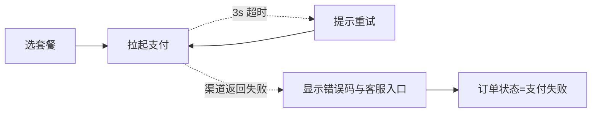
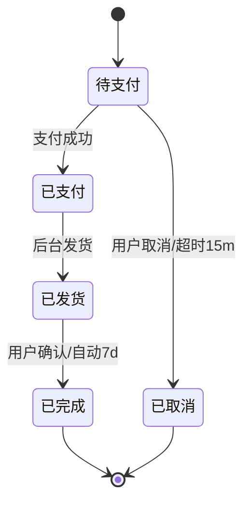
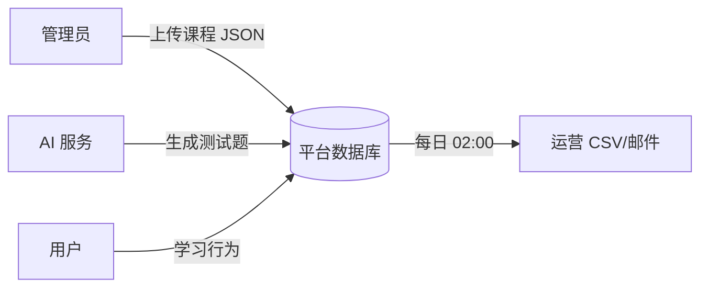

# 13 · R3 AI 输出：需求分析报告模板（baseline.md）

> **谁来产出**：AI（Analyst 角色）
> **何时产出**：用户回完 R2 澄清清单后。
> **落盘位置**：`content/<proj>/requirements/baseline.md`

---

## AI 必须遵守

1. **只读**：R1 + R2-resolved + `00` + `02` + 本模板。
2. **不许做**：不写技术栈、不画 UI 草图、不定字段、不写接口。
3. 凡仍存疑的，写到本文件 §99，不要在正文猜。
4. 流程图全部用 mermaid。
5. 报告中每条需求都有唯一 R-ID（格式 `R-<proj>-<seq3>`）。

---

## 输出文件骨架（严格使用）

```markdown
# 需求基线 · <project> · v<N>

> **阶段**：R · Analyst
> **上游依赖**：
> - content/<proj>/requirements/draft.md
> - content/<proj>/requirements/R-questions-round1-resolved.md
> - （如有）round2-resolved.md
> **生成时间**：YYYY-MM-DD
> **冻结状态**：未冻结
> **下游影响**：P 阶段 IA / 页面清单、G3 角色权限、F 阶段所有功能拆分

---

## 0. 摘要

> 5 行讲完："给谁、做什么、本期范围、不做什么、最大风险"。

- 给谁：...
- 做什么：...
- 本期范围：...
- 不做什么：...
- 最大风险：...

---

## 1. 产品定义与目标

### 1.1 一句话定义
<一句话>

### 1.2 业务目标（来自 R1 §4，已校准）
| ID | 目标 | 度量口径 | 验证时点 |
|----|------|--------|---------|
| O1 | 注册用户 ≥ 1 万 | 后台 unique user_id 计数 | 上线后 90 天 |

### 1.3 用户类型
| 类型 ID | 名称 | 画像（≤2 行）| 核心诉求 |
|--------|------|------------|---------|
| U1 | 越南通勤学习者 | ... | ... |

---

## 2. 范围与排除

### 2.1 本期范围（白名单）
- ...

### 2.2 显式排除（黑名单）
- ...

### 2.3 暗依赖警示
> AI 自查：黑名单里的功能是否被白名单暗用？若有，列在这里并升级为澄清问题。

---

## 3. 角色与权限（粗）

| 角色 ID | 名称 | 能做的事（一句话） | 不能做的事 |
|--------|------|-----------------|----------|
| ROLE-USER | 普通用户 | 学习、看记录 | 改课程内容 |
| ROLE-EDITOR | 内容编辑 | 上下架课程 | 看运营报表 |
| ROLE-ADMIN | 超管 | 全部 | — |

> 细化留给 G3 阶段，本表只够 P 阶段判断"哪些页面给哪些角色看"。

---

## 4. 需求清单（核心交付物）

> 表格中每条需求都必须可被 P/F 阶段引用。

| R-ID | 标题 | 描述（≤2 行） | 涉及角色 | 优先级 | 依赖 R-ID | 验收标准（What done looks like） |
|------|------|------------|---------|------|----------|-------------------------------|
| R-china-001 | 邮箱注册登录 | 用户用 email+密码 注册/登录，发送验证邮件 | ROLE-USER | P0 | — | 用户可以走完注册→收信→点击验证→登录全过程；错误密码 5 次锁 15 分钟 |
| R-china-002 | 母语选择 | 注册时选越南/泰/印尼，影响 UI 语言与课程推荐 | ROLE-USER | P0 | R-china-001 | 选过的语言下次自动应用；可在设置中改 |
| R-china-003 | 入门水平测试 | 5 题选择题，输出 N1-N5 等级 | ROLE-USER | P0 | R-china-002 | 所有新用户首次登录被强制走完测试；中途退出下次重新开始 |
| ... | | | | | | |

> 优先级：P0 = 必做、P1 = 应做、P2 = 时间允许做。

---

## 5. 业务流程（mermaid）

### 5.1 主流程：新用户从注册到首次完成一节课
```mermaid
flowchart LR
  A1[打开网站] --> A2[选母语]
  A2 --> A3[邮箱注册]
  A3 --> A4{收到验证邮件?}
  A4 -->|是| A5[点击验证]
  A4 -.->|否(60s)| A6[重发按钮可点]
  A5 --> A7[登录]
  A7 --> A8{首次?}
  A8 -->|是| B1[水平测试 5 题]
  A8 -->|否| C1[今日课表]
  B1 --> B2[出等级 N1~N5]
  B2 --> C1
  C1 --> C2[选第一节课]
  C2 --> C3[学习]
  C3 --> C4[打卡]
  C4 --> C5[激励文案+徽章]
```

### 5.2 异常流程：支付失败


> 至少 1 张主流程 + 1 张异常路径图。如有复杂状态机，加 stateDiagram-v2。

### 5.3 状态机（如有，例：订单）


---

## 6. 业务规则汇总

| 规则 ID | 描述 | 来源 R-ID | 边界值 |
|--------|------|----------|--------|
| BR-1 | 每用户每天最多 5 节课 | R-china-010 | 第 6 节弹"明日再来"提示 |
| BR-2 | 免费用户只能看 N1 课程 | R-china-020 | N2+ 课程灰显，点击弹付费引导 |

---

## 7. 数据流向（高层）



---

## 8. 第三方集成清单

| 集成 ID | 名称 | 用途 | 本期模式 | 失败兜底 |
|--------|------|------|---------|---------|
| INT-1 | Paddle | 订阅收款 | mock | mock 时直接成功 |
| INT-2 | Resend | 邮件 | mock | mock 时控制台打印 |
| INT-3 | Google OAuth | 第三方登录 | mock | mock 时返回固定测试账号 |

---

## 9. 非功能性需求（NFR）

| 类型 | 指标 | 验收口径 |
|------|------|---------|
| 性能 | 首屏 ≤ 3s（弱网 3G）| Lighthouse 模拟 |
| 可用性 | 月度可用率 ≥ 99.5% | 监控面板 |
| 国际化 | zh/en/vi/th/id 5 语言 | 切换语言所有可见文案变化 |
| 兼容 | iOS/Android 双端 Safari/Chrome 最新 2 版 | 手测 |
| 隐私 | 邮箱、学习记录加密存储 | 数据库字段加密标注 |

---

## 10. 风险登记

| 风险 ID | 描述 | 影响 | 概率 | 缓解动作 | 责任人 |
|--------|------|------|------|---------|-------|
| RISK-1 | 东南亚弱网 | 学习中断 | 高 | P 阶段加 loading/重试设计；课程包预加载策略 | PM |

---

## 11. 里程碑

| MS-ID | 名称 | 目标日期 | 包含 R-ID |
|-------|------|---------|----------|
| MS-1 | MVP 内测 | YYYY-MM-DD | R-china-001~030 |

---

## 99. 待确认问题

- [ ] 编号：<问题>（影响：<R-ID 或下游文件>）

> 本节为空 → 可冻结。非空 → 必须回到 R2 协议补答。

---

## 100. 签字

- AI 生成：<模型名> · YYYY-MM-DD
- PM 审核：<姓名> · YYYY-MM-DD · 已审核
- 冻结版本：v1
```

---

## 报告质量自检（AI 出报告前自查）

- [ ] 每条需求都有 R-ID 且唯一？
- [ ] 每条需求都能在某条业务目标 / 用户类型下找到归属？
- [ ] 所有 R2 已答问题的结论都被吸收进正文？
- [ ] 流程图主路径 + 异常路径都有？
- [ ] 没有冒出 R1 没说、R2 没问的新需求？（若有，必须放到 §99，不要直接塞进 §4）
- [ ] §10 风险与 §6 规则相互呼应（高风险有规则兜底）？
- [ ] 全文 ≤ 1200 行？

任何一项 No → 重写。
