# 50 · V 阶段（开发前校验）AI 模板

> **角色**：SM（Scrum Master） + QA
> **目标**：把 R/P/G/F 全部产物在编码前做一次"装配检验"，避免代码写到一半才发现接口和数据对不上。
> **粒度**：按 feature 跑。一个 feature 跑完才能进编码。

---

## 一、三件套

| 顺序 | 文件 | 谁产出 | 落盘 |
|------|------|--------|------|
| V1 | 一致性校验报告 | AI | function/<proj>/<feat>/_v/V1-一致性校验.md |
| V2 | Story 拆分 | AI | function/<proj>/<feat>/_v/V2-story.md |
| V3 | 编码上下文打包 | AI | function/<proj>/<feat>/_v/V3-coding-context-bundle.md |

> 三步顺序执行，**V1 必须先过**才允许 V2，V2 过了才允许 V3。

---

## 二、V1 一致性校验报告

### 2.1 目的
机械地核对 R3、G1/G2/G3、F1/F2/F3 之间的字段、ID、引用、规则是否一致。问题分级。

### 2.2 触发提示词
```
请你扮演 QA。读取：
- baseline.md（R3 冻结）
- grules/<proj>/G1-架构与技术规范/、G2-视觉与交互风格/、G3-权限与认证规范/
- function/<proj>/<feat>/F1-数据模型规范.md、F2-接口规范.md、F3-页面交互规范.md
按 /prompt/50 §二 模板输出 V1 一致性校验报告。
不允许"看起来还行"——所有断言必须能定位到具体文件:行号或章节号。
```

### 2.3 输出文件骨架

```markdown
# V1 一致性校验 · <feature> · v1

> **阶段**：V · QA
> **上游**：baseline.md, G1/G2/G3, F1/F2/F3
> **生成时间**：YYYY-MM-DD
> **结论**：🟢 通过 / 🟡 有警告可继续 / 🔴 阻断

---

## 0. 摘要
- 红 X 项 / 黄 Y 项 / 绿 Z 项
- 是否阻断：是 / 否

---

## 1. 校验矩阵（机械核对）

### 1.1 R-ID → 实现路径
| R-ID | F1 | F2 | F3 | 状态 |
|------|----|----|----|------|
| R-china-010 | F1 §2.3 用户每日学习计数表 | F2 §3.4 GET /api/today-lessons | F3 §今日课表 | 🟢 |
| R-china-031 | — | — | F3 §测试结果分享 | 🔴 缺 F1/F2 支撑 |

### 1.2 F1 字段 → F2 接口
| F1 字段 | 出现在哪些 F2 接口 | 类型一致? |
|--------|----------------|----------|
| user_id uuid | POST /login resp; GET /today-lessons query | 🟢 |
| lesson.duration_sec int | GET /today-lessons resp | 🟢 |
| lesson.status enum | （缺）| 🔴 F2 未暴露而 F3 §卡片状态色 引用了 |

### 1.3 F2 接口 → F3 调用
| F2 接口 | 出现在哪些 F3 页面/动作 | 入参一致? |
|--------|---------------------|----------|
| POST /api/auth/login | F3 §登录页 主按钮 | 🟢 |
| GET /api/today-lessons | F3 §今日课表 加载 | 🟡 F3 多传了 lang 字段，F2 未定义 |

### 1.4 F3 角色判断 → G3 角色矩阵
| F3 位置 | 角色判断 | G3 是否存在该角色 | 权限是否匹配 |
|--------|---------|-----------------|-------------|
| F3 §课程管理.编辑按钮 | ROLE-EDITOR | 🟢 存在 | 🟢 G3 §6 矩阵允许 |

### 1.5 G2 设计 Token → F3 引用
| F3 引用的 Token | G2 是否定义 |
|---------------|-----------|
| color.brand.primary | 🟢 |
| color.state.warning | 🔴 G2 中只定义了 success/error，缺 warning |

### 1.6 NFR 校验
| NFR (R3 §9) | 与 F1/F2/F3 的关系 | 是否被支撑 |
|------------|------------------|----------|
| 首屏 ≤ 3s | F2 接口数量 / F3 首屏调用次数 | 🟡 首屏调 4 次接口，建议合并 |
| 5 语言 i18n | F3 §文案表 / G1 §i18n | 🟢 |

---

## 2. 问题清单（按级别）

### 🔴 阻断（必须修复才能进 V2）
- B1. F1 缺少 lesson.status 枚举（F3 §卡片 引用）
  - 修复建议：在 F1 §状态定义 增加 lesson.status: draft|published|archived
  - 责任：补 F1 → 重跑 V1
- B2. F3 §测试结果分享 无 F1/F2 支撑
  - 修复建议：补 F1 表 share_records + F2 接口 POST /api/share

### 🟡 警告（可继续，但记录待处理）
- W1. GET /api/today-lessons 入参 lang 未在 F2 定义
- W2. 首屏 4 次接口

### 🟢 通过
- 共 N 项

---

## 3. 闸门结论
- 阻断项 = 0 → 🟢 进入 V2
- 阻断项 > 0 → 🔴 退回对应 F 阶段修复后重跑 V1
```

### 2.4 自检
- [ ] 每个断言都有"文件:位置"？
- [ ] 没有"主观判断"项？（如有，归入 §备注，不计入红黄绿）
- [ ] 矩阵 1.1-1.6 全部覆盖？

---

## 三、V2 Story 拆分

### 3.1 目的
把 F1+F2+F3 切成可独立完成的 Story，每个 Story ≤ 半天工作量，附"完成定义 DoD"。

### 3.2 触发提示词
```
V1 已通过。请按 /prompt/50 §三 模板把 <feature> 拆 Story。
原则：每个 Story 自包含、可独立 PR、可独立验收。
```

### 3.3 输出骨架

```markdown
# V2 Story 拆分 · <feature> · v1

> **上游**：F1/F2/F3 已冻结、V1 已通过

---

## 0. 摘要
- Story 总数：N
- 估时合计：M 人时
- 关键路径：S-001 → S-003 → S-007（其余可并行）

---

## 1. Story 列表

| Story ID | 标题 | 类型 | 估时 | 依赖 | DoD 要点 |
|---------|------|------|------|------|---------|
| S-china-order-001 | 建表与迁移 | DB | 2h | — | 迁移可前进/回滚；样例数据脚本 |
| S-china-order-002 | RLS 与角色策略 | DB | 1h | 001 | 三角色读写测试通过 |
| S-china-order-003 | 列表接口 GET /api/orders | API | 3h | 001,002 | 通过 F2 §3.1 全部用例 |
| S-china-order-004 | 详情接口 GET /api/orders/:id | API | 2h | 001,002 | … |
| S-china-order-005 | 列表页 + 4 态 | UI | 4h | 003 | 对照 F3 §订单列表，全 4 态 |
| S-china-order-006 | 详情页 | UI | 3h | 004 | … |
| S-china-order-007 | E2E：下单→列表→详情 | E2E | 2h | 003,004,005,006 | 场景脚本通过 |

---

## 2. 单 Story 详情模板（每个 Story 一节）

### Story S-china-order-003 · 列表接口

- **类型**：API
- **估时**：3h
- **依赖**：S-001, S-002
- **上游契约**：F2 §3.1 GET /api/orders
- **输入文件包**（V3 会真正打包）：
  - F1 §订单表
  - F2 §3.1 GET /api/orders（仅这一节）
  - G1 §API 规范
- **任务清单**：
  - [ ] 路由注册
  - [ ] 入参校验（用 G1 推荐的校验库）
  - [ ] 业务实现
  - [ ] 错误码映射
  - [ ] 单元测试 ≥ 3 用例（正常 / 边界 / 错误）
  - [ ] 集成测试覆盖 RLS
- **DoD（完成定义）**：
  - [ ] 所有任务 √
  - [ ] CI 通过
  - [ ] 自测对照 F2 §3.1 全部场景
  - [ ] PR 描述链接到本 Story

---

## 3. 并行性视图

```mermaid
gantt
  title <feature> 关键路径
  dateFormat HH
  section DB
  建表           :a1, 00, 2h
  RLS            :a2, after a1, 1h
  section API
  列表接口        :b1, after a2, 3h
  详情接口        :b2, after a2, 2h
  section UI
  列表页          :c1, after b1, 4h
  详情页          :c2, after b2, 3h
  section E2E
  端到端          :d1, after c1 c2, 2h
```



---

## 4. 风险与缓解
- 风险：S-005 列表页 4 态实现时，可能发现 F3 §空态文案缺失 → 缓解：在动手前 grep F3 是否含全 4 态。
```

### 3.4 自检
- [ ] 每个 Story ≤ 半天？超出必拆。
- [ ] DoD 是可验证的？（不能写"完成"两个字）
- [ ] 依赖图无环？
- [ ] 关键路径标出？

---

## 四、V3 编码上下文打包

### 4.1 目的
为每个 Story 生成"喂给编码 AI 的最小文件包"清单。一个 Story 一个包，包内文件总行数 ≤ 1200 行。

### 4.2 触发提示词
```
V2 已通过。请按 /prompt/50 §四 为每个 Story 打编码上下文包。
包内文件不得超过 1200 行总和。超出请进一步拆 Story。
```

### 4.3 输出骨架

```markdown
# V3 编码上下文包 · <feature> · v1

> **上游**：V2 Story 拆分

---

## 包 P-S-china-order-003 · 列表接口

- **目标 Story**：S-china-order-003
- **总行数预算**：1200 行
- **包内文件清单**：
  | 文件 | 取哪一节 | 行数 |
  |------|---------|-----|
  | grules/<proj>/G1-架构与技术规范/04-API接口规范.md | 全文 | 280 |
  | grules/<proj>/G1-架构与技术规范/03-数据库规范.md | §通用字段 + §命名 | 80 |
  | function/<proj>/order/F1-数据模型规范.md | §订单表 + §订单商品表 | 220 |
  | function/<proj>/order/F2-接口规范.md | §3.1 GET /api/orders 仅此节 | 180 |
  | grules/<proj>/G3-权限与认证规范/03-权限校验机制.md | §RLS 部分 | 140 |
  | content/<proj>/requirements/baseline.md | §R-china-010 引用条 | 30 |
  | （合计） | | 930 ✅ |

- **喂养顺序**（系统消息塞这些，用户消息只说"按 Story DoD 实现"）：
  1. G1 §API 规范
  2. G1 §通用字段
  3. F1 §订单表 + §订单商品表
  4. G3 §RLS
  5. F2 §3.1
  6. baseline §R-china-010

- **明确禁止喂的内容**（避免污染）：
  - F3 任何内容（这是 API Story，不需要 UI）
  - G2 任何内容
  - 其他 feature 的 F1/F2/F3

- **完成判定**：
  - 编码 AI 输出的代码与 F2 §3.1 字段、错误码、URL 完全一致
  - 测试覆盖 F2 §3.1 全部场景
  - 通过 G1 编码规范 lint

---

## 包 P-S-china-order-005 · 列表页
（同上模板）

---

## 全局自检
- [ ] 每个包 ≤ 1200 行？
- [ ] 每个包都明确"禁止喂"清单？
- [ ] 每个包都有"完成判定"？
- [ ] Story 与包 一对一无遗漏？
```

### 4.4 自检
- [ ] 包内行数实测在 1200 内？（AI 必须粗略估算并写出）
- [ ] 喂养顺序合理（先规范、后细节、最后业务条目）？
- [ ] 禁止喂清单显式列出？

---

## 五、闸门 G-V

- V1 阻断项 = 0
- V2 每个 Story ≤ 半天 + 有 DoD
- V3 每个包 ≤ 1200 行总和 + 有禁止喂清单
- 三份文件签字 `已冻结 v1`

> 通过 → 该 feature 进入编码。否则按红色项回到对应阶段修复。

---

## 六、编码阶段的"小盒子"原则（提醒）

V3 打完包后，开"编码 AI"的对话时：

1. 一次只开一个 Story 的对话
2. 系统消息塞 V3 中该 Story 包的全部上游文件 + V2 中该 Story 详情节
3. 用户消息只说："按 DoD 实现 S-xxx-yyy。完成后输出：① 代码 ② 自测对照表 ③ 偏离说明（若有）"
4. PR 描述必须链 V2 Story ID + V3 包 ID

> 这就是"丢一份小文档、AI 不会忘"的最终落地姿势。
