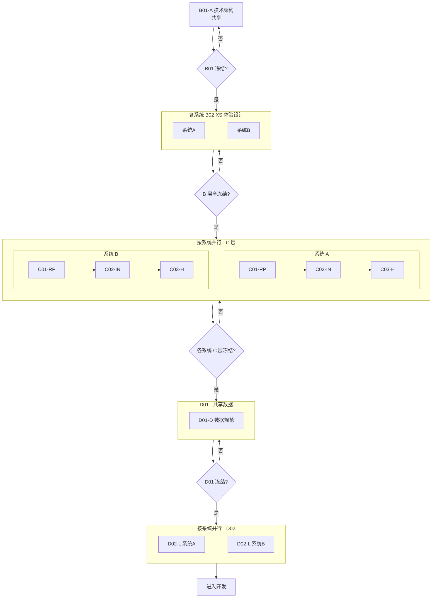

# A00-02 · 工作流

---

## 流程图



---

## 上下游契约

| 阶段 | 归属 | 输出 | 需要的上游 |
|------|------|------|-----------|
| B01·A | 共享 | 技术栈、目录、DB/API 规范、系统清单、鉴权 | — |
| B02·XS | 按系统 | 调性、设计 Token、组件 6 态+异常态、布局、样式包 | B01 |
| C01·RP | 按系统 | 需求清单、用户故事、验收标准、权限矩阵 | B01 + B02(同系统) |
| C02·IN | 按系统 | 功能清单、流程图、状态机、页面清单、布局行为 | B02(同系统) + C01(同系统) |
| C03·H | 按系统 | 可交互系统级闭环 HTML 原型 | B02(同系统样式包) + C02(同系统) |
| D01·D | 共享 | 表结构、枚举、校验、索引 | B01(DB规范) + 各系统 C01/C02/C03 |
| D02·L | 按系统 | 路由表、接口契约、错误码 | B01(API规范) + C01(同系统) + D01 + C02/C03(同系统) |

---

## 系统消息上下文装载

> 基线：所有阶段均载入 `A00-01` + `A00-03`。下表为额外上下文。

| 阶段 | 额外上下文 |
|------|-----------|
| B01 | B01 模板 + 用户输入 |
| B02 | B02 模板 + B01 输出 + 用户输入 |
| C01 | C01 模板 + B01 + B02(同系统) + 用户输入 |
| C02 | C02 模板 + C01(同系统) + B02(同系统) + 用户输入 |
| C03 | C03 模板 + B02(同系统样式包) + C02(同系统) |
| D01 | D01 模板 + B01(DB规范) + 各系统 C01/C02/C03 |
| D02 | D02 模板 + B01(API规范) + C01(同系统) + D01 + C02/C03(同系统) |

> 按系统阶段不跨系统读取。

---

## Gate 验收

| Gate | 通过条件 |
|------|---------|
| G-A | 技术栈+目录+DB/API 规范+系统清单完整；无 `[待确认]` |
| G-XS | 参照≥3 反例≥3；Token 完备；组件 6 态+异常态；样式包可运行 |
| G-RP | 需求+故事+验收齐全；权限矩阵闭合 |
| G-IN | 功能清单+流程图+状态机+页面清单与需求互覆；状态机闭合 |
| G-H | 原型可交互；同系统内页面连通闭环；风格与设计系统一致 |
| G-D | 表结构覆盖所有数据形态；校验完整 |
| G-L | 路由与页面清单对齐；接口覆盖所有行为+状态转移 |

不通过 → 回本阶段重做。

---

## 冻结定义

- `冻结状态: 已冻结` = 内容稳定，下游可引用
- 前提：§99 待确认问题为空
- 冻结后仅可增量追加（标注 `[本轮新增]` / `[本轮变更]`）
- B01 冻结 → B02 可并行；B 全冻结 → C；D01 冻结 → D02 可并行

---

## 功能级循环

```
B 层冻结
  └─ 功能 A:
       ├─ 系统1: C01 → C02 → C03
       ├─ 系统2: C01 → C02 → C03
       ├─ D01(共享)
       ├─ 系统1: D02
       └─ 系统2: D02
       → 开发

  └─ 功能 B:
       ├─ 系统1: C01 → C02 → C03
       ├─ D01(共享)
       └─ 系统1: D02
       → 开发
```

- 功能不一定涉及所有系统
- 新产出增量融合到全局文档
- 各系统链路可并行
