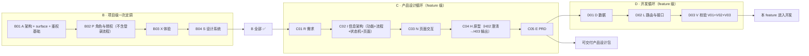

# 02 · G02 · 端到端工作流

> 串起 12 个阶段的总指挥手册。每一步告诉你：用哪份模板、给 AI 喂什么、产物落到哪、过什么 Gate。

---

## 一、阶段总线

> **一次性 vs 循环**：
> - B01~B04 一次性，全局产物，所有 feature 共用。
> - C01~C05 产品设计循环，D01~D03 开发循环，按 feature 走，多 feature 可并行。
> - **可只走 C 循环**：只需交付产品设计包（原型 + PRD）时，C05 E 交付后可不走 D 循环。
> - **B04 双产出**：B04 同时落 `docs/B04-design/design-system/`（markdown 规范，给前端工程实现）与 `docs/B04-design/prototype-style/`（可运行 CSS / JS 资产，给 C04 HTML 原型 vendor 引用）。
> - V 阶段三份报告：V01（feature 内上游链 R/I/N/H/E + 引用全局 B 规范）、V02（feature 内 D/L/N/H 闭环）、V03（feature PRD 回链）。三颗全 ✅ 才进开发。

---

## 二、阶段闸门一览

| Gate | 名称 | 检查项（要点） |
|------|------|--------------|
| G-A | 架构闸门（B01）| 技术栈、目录、DB/API/编码规范、surface 清单、鉴权基础设施全部锁死；无遗留问题 |
| G-P | 权限闸门（B02）| 角色枚举 + 角色×surface 矩阵闭合；未输出任何登录/注册/忘密页交互；04-auth-feature-guideline.md 指明后续 `<surface>-auth` feature 路径 |
| G-X | 体验闸门（B03）| 有 ≥3 参照、≥3 反例、≥5 个可验证形容词 |
| G-S | 设计闸门（B04）| Token 完备、组件 4 态齐、调性与 X 吻合 |
| G-R | 需求闸门（C01）| feature 无未决问题；需求清单 R-ID 唯一、有验收标准 |
| G-I | IA 闸门（C02）| 每个 R-ID 至少一个页面/功能承载；主/异常流程齐；状态机闭合 |
| G-N | 交互闸门（C03）| 单页元素齐、4 态齐、与 B04 / B02 引用对齐 |
| G-H | 原型闸门（C04）| 可点通；空/错/loading/无权限 4 态；三轮内稳定 |
| G-E | PRD 闸门（C05）| feature 级 PRD 多文件齐；每句话可回链上游 ID；术语统一；99 节为空 |
| G-D | 数据闸门（D01）| 字段齐、校验完整、引用 B01 数据库规范、覆盖 C05 PRD 所有数据形态；不重定义 C02 状态机 |
| G-L | 路由与接口闸门（D02）| 全局路由表 vs C02 页面清单 一一对齐；覆盖所有 C03/D01 中的操作与状态转移；错误码完备；与 D 字段一一对齐 |
| G-V | 最终闸门（D03）| V01/V02/V03 三份报告皆无红色项；所有 99 节为空 |

---

## 三、AI 上下文最小喂养表

> 开每一步对话时，**只**把下表列出的文件作为系统消息上传，禁止「以防万一全塞」。

### F · 一次性定调

| 步骤 | 系统消息（上文） | 用户消息（本轮输入） |
|------|----------------|-------------------|
| A 提问 | A00-01, A00-03, B01-A02 | A 用户输入 |
| A 输出 | A00-01, A00-03, B01-A03, A 提问已答 | 按 B01-A03 出架构规范 |
| P 提问 | A00-01, A00-03, B02-P02, A 输出 | P 用户输入 |
| P 输出 | A00-01, A00-03, B02-P03, A 输出, P 提问已答 | 按 B02-P03 出权限规范 |
| X 提问 | A00-01, A00-03, B03-X02 | X 用户输入 |
| X 输出 | A00-01, A00-03, B03-X03, X 提问已答 | 按 B03-X03 出体验定调 |
| S 提问 | A00-01, A00-03, B04-S02, A 输出（前端栈）, X 输出 | S 用户输入 |
| S 输出 | 同上 + B04-S03 模板 + S 提问已答 | 按 B04-S03 出设计系统 |

### C · 按 feature 循环（以 `<feature>` 表示当前 feature）

| 步骤 | 系统消息（上文） | 用户消息（本轮输入） |
|------|----------------|-------------------|
| R 提问 | A00-01, A00-03, C01-R02, B02 权限输出 | R 用户输入 |
| R 输出 | A00-01, A00-03, C01-R03, B02 权限输出, R 提问已答 | 按 C01-R03 出 feature 需求基线 |
| I 提问 | A00-01, A00-03, C02-I02, R 输出, B02 权限输出 | I 用户输入 |
| I 输出 | 同上 + C02-I03 模板 + I 提问已答 | 按 C02-I03 出本 feature 的功能清单/流程图/状态机/页面清单/导航 |
| N 提问 | A00-01, A00-03, C03-N02, B04 输出, B02 输出, I 输出 | N 用户输入（按页） |
| N 输出 | 同上 + C03-N03 模板 + N 提问已答 | 按 C03-N03 出页面交互规范并做场景验证 |
| H 提问 | A00-01, A00-03, C04-H02, B02/B03/B04 输出, 本 feature C01-R/C02-I/C03-N 全部冻结产物 + H01 用户输入 | 按 C04-H02 出澄清清单 |
| H 输出 | 同上 + C04-H03 模板 + H 提问已答 | 按 C04-H03 一次性出齐本 feature 所有 page-id 的 HTML 原型 + changelog |
| E 提问 | A00-01, A00-03, C05-E02, R/I/N/H 全部冻结产物 + F 全部输出 | E 用户输入（产品背景） |
| E 输出 | 同上 + C05-E03 模板 + E 提问已答 | 按 C05-E03 出 feature 级 PRD 多文件包 |
| D 提问 | A00-01, A00-03, D01-D02, R 输出, A 输出（DB 规范节）, P 输出, C02 输出（状态机节）, E 输出（数据形态节）| D 用户输入 |
| D 输出 | 同上 + D 提问已答 + D01-D03 模板 | 按 D01-D03 出数据规范 |
| L 提问 | A00-01, A00-03, D02-L02, R 输出, A 输出（API 规范节）, P 输出, C02 输出（页面清单/状态机）, D 输出, N 输出（行为节）| L 用户输入 |
| L 输出 | 同上 + L 提问已答 + D02-L03 模板 | 按 D02-L03 出路由表 + 接口规范 |
| V01 上游链 | A00-01, A00-03, D03-V01, 本 feature R/I/N/H/E + F 全部输出 | 按 D03-V01 出 `<feature>/01-upstream-chain.md` |
| V02 模块闭环 | A00-01, A00-03, D03-V02, 本 feature D/L/N/H/scenarios 冻结产物 | 按 D03-V02 出 `<feature>/02-module-closure.md` |
| V03 PRD 回链 | A00-01, A00-03, D03-V03, 本 feature 全部 C 阶段产物 + V01/V02 报告 | 按 D03-V03 出 `<feature>/03-prd-traceability.md` |

> 反例：在 D01 D 阶段塑 X/S 输出 → 污染数据建模。D 阶段只关心「数据本身 + PRD 数据形态 + C02 状态机」。
> 反例：在 C05 E 阶段塑完整代码库 → PRD 会被实现细节带偏。E 阶段的事实来源是上游冻结文档，不是代码。
> 反例：在 C02 I 阶段出 URL / 路由 → 越界。C02 只输出 **页面 ID + 逻辑导航**；路由与 URL 在 D02 L 阶段定义。

---

## 四、人机分工速查

| 动作 | 人 | AI |
|------|----|-----|
| 把模糊业务说成话 | ✅ |  |
| 把话整理成结构化需求 |  | ✅ |
| 决定要不要做某需求 | ✅ |  |
| 画流程/状态图（mermaid）|  | ✅（C02） |
| 画 ER 图（mermaid）|  | ✅（D01） |
| 选技术栈 | 给约束 | 出方案 |
| 写表结构字段 |  | ✅ |
| 决定字段是否合理 | ✅ |  |
| 写接口契约 |  | ✅ |
| 决定接口是否够用 | ✅ |  |
| 定产品调性与参照 | ✅ | 协助归纳 |
| 出设计 Token / 组件 |  | ✅ |
| 决定 Token 是否合调 | ✅ |  |
| 写 HTML 原型 |  | ✅ |
| 验收原型 | ✅ |  |
| 写代码 |  | ✅（D03 V 全绿后） |

---

## 五、新项目启动 Checklist

### 一次性（项目启动）

- [ ] 在仓库根创建 `docs/` 目录（按 A00-04 文档目录规划）
- [ ] 跑 B01 A 三件套（含 08-surfaces；09-auth-infra 仅当项目有登录类需求时填实，否则 "N/A"），过 G-A
- [ ] **判定是否多端**：B01 08-surfaces 中 surface 数 = 1 走单端形态；≥ 2 启用 `<feature>/<surface>/` 子目录变体（详 A00-04）
- [ ] 跑 B02 P 三件套（角色 + 授权机制 + 数据可见范围；不写登录/注册/忘密流程），过 G-P
- [ ] 跑 B03 X 三件套，过 G-X
- [ ] 跑 B04 S 三件套，过 G-S（同时产出 `docs/B04-design/design-system/` 与 `docs/B04-design/prototype-style/`）
- [ ] 列出项目全部 feature ID（按业务语义 kebab-case 命名；包括但不限于业务、内容、登录、设置等。所有 feature 平等对待，无特殊命名约定）
- [ ] 在 `docs/C05-prd/_global-index.md` 建立全局 PRD 索引（feature 列表 + 状态 + 所属 surface）

### 每 feature 一次

- [ ] 创建 `docs/{C0[1-5],D0[1-3]}-*/<feature>/` 子目录
- [ ] 跑 C01 R，过 G-R
- [ ] 跑 C02 I（功能清单 / 流程图 / 状态机 / 页面清单），过 G-I
- [ ] 逐页跑 C03 N，过 G-N
- [ ] 跑 C04 H 一次性出齐本 feature 全部 page-id 的原型，过 G-H
- [ ] 跑 C05 E 出 feature 级 PRD 多文件包，过 G-E
- [ ] 跑 D01 D，过 G-D
- [ ] 跑 D02 L（路由表 + 接口规范），过 G-L
- [ ] 跑 D03 V 三份报告（V01 上游链 · V02 模块闭环 · V03 PRD 回链），过 G-V
- [ ] 进入本 feature 编码
- [ ] feature PRD 入仓并冻结 v1.0；后续每次产品形态变更走 PRD changelog

---

## 六、变更管理

任何已冻结文件需要修改：
1. 在原文件头「冻结状态」改为「变更中」
2. 新开一轮对话，让 AI **先生成 diff 报告**（影响哪些下游文件）再改
3. 受影响的下游文件全部需要重跑对应阶段验证
4. 重新签字冻结

> 冻结后偷偷改 → 下游所有引用断裂，调试地狱。

> **F 层的特殊性**：B01~B04 是项目级冻结产物，一旦修改影响所有已开工 feature。
> 正确流程：在 `docs/A00-meta/changelog.md` 记录 F 变更 + 列出所有需重跑 D03 V 的 feature。
