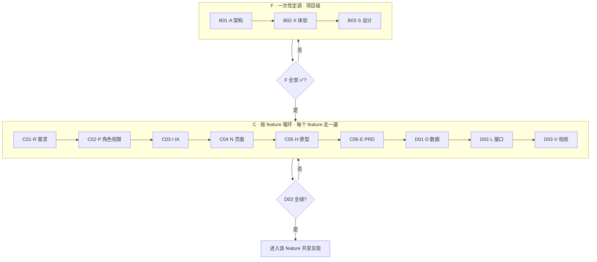

# 02 · G02 · 端到端工作流

> 12 阶段串成一根链。本文件是「**怎么跑**」——给项目经理 / 团队负责人。

---

## 全链路 Mermaid 图



---

## 阶段间「上下游契约」一句话总结

| 阶段 | 给下游什么 | 收下游 / 横向 什么 |
|------|-----------|------------------|
| B01 · A | 技术栈 / 目录 / DB/API 规范 / surface 清单 / 鉴权基础设施 | — |
| B02 · X | 体验调性形容词、参照、反例 | B01 surface（决定端属性） |
| B03 · S | 设计 Token、组件 4 态、布局栅格、可运行 `prototype-style/` | B02 体验调性 |
| C01 · R | 本 feature 需求清单 R-ID、用户故事、验收标准 | B01 surface（决定本 feature 出现在哪几端） |
| C02 · P | 本 feature 新角色 / 权限矩阵 / 数据可见范围 / 审计；**增量并入** `docs/C02-permissions/` | C01 R 清单 + B01 鉴权基础设施 + B02 体验（可选） |
| C03 · I | 功能清单 / 流程图 / 状态机 / 页面清单 / 导航 | C01 R + C02 P + B01 surface |
| C04 · N | 单页布局 / 元素 / 行为 / 4 态 | C03 I 页面清单 + B03 S 设计系统 |
| C05 · H | 可点通 HTML + 三级引导页（global / feature / surface） | C04 N + B03 `prototype-style/` |
| C06 · E | feature 级 PRD（多文件，回链全上游 ID） | C01~C05 全部 |
| D01 · D | 表结构 / 校验 / 索引 | C06 PRD + C03 状态机 |
| D02 · L | 全局路由表 / 接口契约 / 错误码 | D01 数据 + C04 页面行为 |
| D03 · V | V01 上游链 + V02 模块内闭环 + V03 PRD 回链 | C01~D02 全部冻结产物 |

> **横向一致性**：多 feature 并行时，C02 / C06 / D02 共享全局表（`docs/C02-permissions/`、`docs/C06-prd/_global-index.md`、`docs/D02-api/_global-routes.md`），每个 feature 的对应阶段都对这三份表「增量并入」。

---

## 三件套铁律（每阶段都遵守）

```
① 用户输入模板  →  ② AI 澄清提问模板  →  ③ AI 输出模板
   你填表           AI 必须先问           AI 才允许出报告
```

AI 跳过 ② 直接出 ③ → 立刻打回重做。**唯一例外**：D03 V 阶段不需澄清，按 V01/V02/V03 顺序串跑。

---

## 每个 Gate 的最小验收清单

| Gate | 必须 ✅ 的检查项（节选） |
|------|----------------------|
| G-A | 技术栈 + 目录 + DB/API/编码规范 + surface 清单 + 鉴权基础设施 5 块完整；无 `[待确认]` |
| G-X | ≥3 参照 + ≥3 反例 + ≥5 形容词；与 B01 不冲突 |
| G-S | Token 完备、所有组件 4 态、`prototype-style/` 在裸 HTML 下可运行 |
| G-R | 本 feature 用户故事 + 验收标准齐；R-ID 唯一；surface 归属明确 |
| G-P | 本 feature 角色 × surface 矩阵闭合；已增量并入 `docs/C02-permissions/{01,02,03}`；与 B01 `09-auth-infra.md` 一致 |
| G-I | 功能清单、流程图、状态机、页面清单与 R-ID 全互覆；状态机闭合 |
| G-N | 单页元素齐、4 态齐、引用 B03 Token；与 C03 页面清单一一对齐 |
| G-H | 全部 page-id 一次性产出；引导页三级齐（global / feature / surface），风格与设计系统一致 |
| G-E | 多文件 PRD 齐；术语统一；每句可回链上游 ID；99 节为空 |
| G-D | 表结构覆盖 PRD 所有数据形态；校验完整；不重定义 C03 状态机 |
| G-L | 全局路由表与 C03 页面清单一一对齐；接口覆盖所有页面行为 + 状态转移；错误码完备 |
| G-V | V01/V02/V03 三份报告皆无红色项；所有 99 节为空 |

---

## 系统消息「装什么」（上下文最小化）

| 阶段输出步 | 系统消息只塞 | 给 AI 看的用户消息 |
|-----------|-------------|------------------|
| A 提问 | A00-01, A00-03, B01-A02 | A 用户输入 |
| A 输出 | A00-01, A00-03, B01-A03, A 提问已答 | 按 B01-A03 出架构规范 |
| X 提问 | A00-01, A00-03, B02-X02, A 输出 | X 用户输入 |
| X 输出 | A00-01, A00-03, B02-X03, A 输出, X 提问已答 | 按 B02-X03 出体验定调 |
| S 提问 | A00-01, A00-03, B03-S02, A+X 输出 | S 用户输入 |
| S 输出 | A00-01, A00-03, B03-S03, A+X 输出, S 提问已答 | 按 B03-S03 出设计系统 |
| R 提问 | A00-01, A00-03, C01-R02, A+X+S 输出 | R 用户输入 |
| R 输出 | A00-01, A00-03, C01-R03, A+X+S 输出, R 提问已答 | 按 C01-R03 出需求基线 |
| P 提问 | A00-01, A00-03, C02-P02, A 输出, R 输出, 现有 docs/C02-permissions/ | P 用户输入 |
| P 输出 | A00-01, A00-03, C02-P03, A 输出, R 输出, P 提问已答, 现有 docs/C02-permissions/ | 按 C02-P03 出本 feature 权限增量并入全局 |
| I 提问 | A00-01, A00-03, C03-I02, R+P 输出 | I 用户输入 |
| I 输出 | A00-01, A00-03, C03-I03, R+P 输出, I 提问已答 | 按 C03-I03 出 IA |
| N 提问 | A00-01, A00-03, C04-N02, S+I 输出 | N 用户输入 |
| N 输出 | A00-01, A00-03, C04-N03, S+I 输出, N 提问已答 | 按 C04-N03 出页面交互 |
| H 提问 | A00-01, A00-03, C05-H02, S+I+N 输出 | H 用户输入 |
| H 输出 | A00-01, A00-03, C05-H03, S+I+N 输出, H 提问已答 | 按 C05-H03 出 HTML 原型 + 三级引导页 |
| E 提问 | A00-01, A00-03, C06-E02, R+P+I+N+H 输出 | E 用户输入 |
| E 输出 | A00-01, A00-03, C06-E03, R+P+I+N+H 输出, E 提问已答 | 按 C06-E03 出 PRD |
| D 提问 | A00-01, A00-03, D01-D02, E 输出, I 状态机 | D 用户输入 |
| D 输出 | A00-01, A00-03, D01-D03, E 输出, I 状态机, D 提问已答 | 按 D01-D03 出数据规范 |
| L 提问 | A00-01, A00-03, D02-L02, D 输出, N 页面行为 | L 用户输入 |
| L 输出 | A00-01, A00-03, D02-L03, D 输出, N 页面行为, L 提问已答 | 按 D02-L03 出接口规范 |
| V 全 3 步 | A00-01, A00-03, D03-V01/V02/V03, C01~D02 全部冻结产物 | — |

> **原则**：不允许给 AI 看「上游产物之外的」材料；不允许跳跃上游（如 H 阶段塞 D 接口规范）。

---

## 多 feature 并行调度

```
项目启动
  └─ F · 跑一次（B01 → B02 → B03 → 全部 G ✅）
       └─ Sprint #1 启动多个 feature 并行：
            ├─ feature-A · C01 → C02 → C03 → ...（独立窗口）
            ├─ feature-B · C01 → C02 → C03 → ...（独立窗口）
            └─ feature-C · C01 → C02 → C03 → ...（独立窗口）
       └─ 共享物（每个 feature 的 C02/C06/D02 都增量并入）：
            · docs/C02-permissions/                 ← 全局权限事实
            · docs/C06-prd/_global-index.md         ← 全局 PRD 索引
            · docs/D02-api/_global-routes.md        ← 全局路由表
```

每周一次「共享物对齐会」：所有 feature 负责人核对三份共享物是否冲突，冲突即回到对应 feature 的对应阶段修正。
