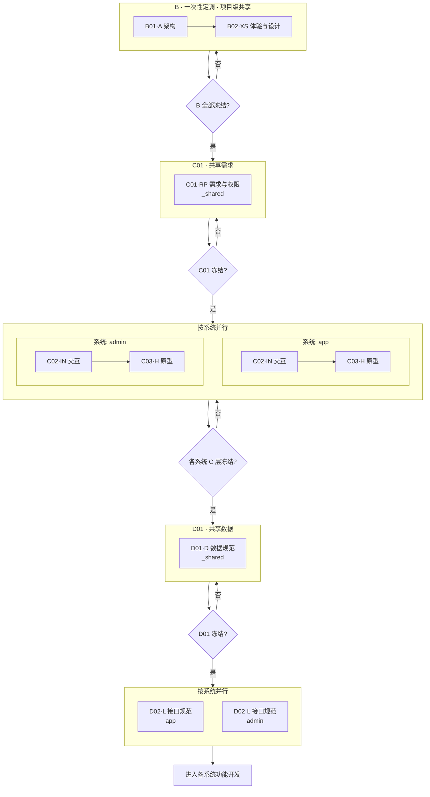

# A00-02 · 端到端工作流

> 7 阶段串成一根链。本文件说明「怎么跑」。

---

## 全链路 Mermaid 图



B 层跑一次；C01 共享需求跑一次；C02/C03 按系统并行；D01 共享数据跑一次；D02 按系统并行。

---

## 阶段间上下游契约

| 阶段 | 归属 | 给下游什么 | 需要的上游 |
|------|------|-----------|-----------|
| B01·A | 共享 | 技术栈、目录、DB/API 规范、surface 清单、鉴权基础设施 | -- |
| B02·XS | 共享 | 体验调性、设计 Token、组件 6 态 + 异常态、布局、原型样式包 | B01 |
| C01·RP | **共享** | 需求清单 R-ID、用户故事、验收标准、角色权限矩阵 | B01 + B02 |
| C02·IN | **按系统** | 该系统的功能清单、流程图、状态机、页面清单、单页布局与行为 | B02 + C01 |
| C03·H | **按系统** | 该系统的可交互连通 HTML 原型 | B02(样式包) + C02(同系统) |
| D01·D | **共享** | 表结构、枚举、校验、索引 | B01(DB规范) + C01(需求) + C02(各系统状态机) + C03(各系统原型) |
| D02·L | **按系统** | 该系统的路由表、接口契约、错误码 | B01(API规范) + C01(权限) + D01 + C02(同系统) + C03(同系统) |

---

## 系统消息「装什么」

> 通用基线：所有阶段均把 `A00-01` + `A00-03` 塞入系统消息。下表只列额外上下文。

| 阶段 | AI 额外需要读的上下文 |
|------|---------------------|
| B01·A 输出 | B01 模板 + 用户输入 |
| B02·XS 输出 | B02 模板 + B01 输出 + 用户输入 |
| C01·RP 输出 | C01 模板 + B01 + B02 输出 + 用户输入 + 已有全局权限文档 |
| C02·IN 输出 | C02 模板 + C01 输出 + B02 输出 + 用户输入（**仅读同系统的已有 C02 产出**） |
| C03·H 输出 | C03 模板 + B02(样式包) + C02 输出（**仅同系统**） |
| D01·D 输出 | D01 模板 + B01(DB规范) + C01 + C02(各系统) + C03(各系统) 输出 |
| D02·L 输出 | D02 模板 + B01(API规范) + C01(权限) + D01 + C02(同系统) + C03(同系统) 输出 |

> 原则：不给 AI 看上游产物之外的材料；按系统隔离阶段不跨系统读取。

---

## 闸门（Gate）最小验收清单

| Gate | 通过条件 |
|------|---------|
| G-A | 技术栈 + 目录 + DB/API 规范 + surface 清单完整；无 `[待确认]` |
| G-XS | 体验调性有参照(≥3)与反例(≥3)；设计 Token 完备；组件有 6 态 + 异常态；原型样式包可独立运行 |
| G-RP | 需求清单 R-ID 唯一；用户故事 + 验收标准齐全；角色权限矩阵闭合；共享产出路径正确 |
| G-IN | 功能清单 + 流程图 + 状态机 + 页面清单与 R-ID 互覆；状态机闭合；产出在正确的系统目录下 |
| G-H | 原型可交互跳转；**同系统内**所有页面连通；风格与设计系统一致；原型在 `C03-prototype/<surface>/` 下 |
| G-D | 表结构覆盖所有数据形态；校验完整；产出在 `_shared/D01-data/` 下 |
| G-L | 路由表与**该系统**页面清单对齐；接口覆盖所有页面行为 + 状态转移；产出在 `<surface>/D02-api/` 下 |

任何 Gate 不通过 → 回到本阶段重做，严禁强行往下推。

---

## 功能级循环与增量融合

```
B 层冻结
  └─ 功能 A:
       C01·RP（共享）
       ├─ app:  C02·IN → C03·H ─→ D02·L
       ├─ admin: C02·IN → C03·H ─→ D02·L
       └─ D01·D（共享，读取各系统 C02/C03）
       → 进入开发

  └─ 功能 B:
       C01·RP（共享）
       ├─ app:  C02·IN → C03·H ─→ D02·L
       └─ D01·D（共享）
       → 进入开发
```

- 每轮循环围绕**一个功能**，产出该功能的完整设计+开发规范
- 同一功能不一定涉及所有系统——仅在涉及的系统下产出 C02/C03/D02
- 新功能的权限、路由表等**增量融合**到全局文档，不覆盖已有内容
- 各系统的 C02/C03 可并行推进，通过 C01 共享需求协调一致性
- 出现跨系统冲突时，回到 C01 修正共享需求
