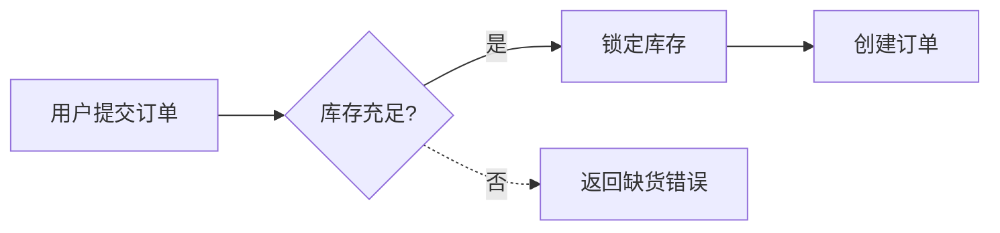

# 03 · G03 · 通用约定

> 所有阶段、所有模板共用。AI 在任何阶段开口前必须先读本文件。

---

## 一、澄清协议（强制）

### 1.1 触发时机
当 AI 收到一份「用户输入模板」的填写结果，**第一轮回复必须且只能**是按本节格式生成的「澄清提问清单」，不允许：
- 直接给最终输出
- 自己脑补默认值
- 说「我先按理解写一版你看看」

### 1.2 澄清问题的格式

输出文件命名：
- F 阶段：`<阶段字母>-questions-round<N>.md`，例：`A-questions-round1.md`
- C 阶段：`<阶段字母>-<feature-id>-questions-round<N>.md`，例：`R-order-mgmt-questions-round1.md`

落盘到 `docs/A00-meta/questions/`。

文件结构强制如下：

```markdown
# <阶段名> 澄清提问 · 第 <N> 轮

> 本轮共 <X> 个问题。请按编号回答；若某问题选「采纳推荐」，写 `Q3 = 推荐` 即可。
> 未回答的问题视为「采纳推荐」，AI 出报告时以推荐项执行并在脚注标记。

---

## A. 阻断级（必答）

### Q1. <一句话问题>
- **背景**：<为什么问这个，影响什么>
- **可选项**：
  - A. <选项 A>
  - B. <选项 B>
  - C. 其他（请说明）
- **推荐**：<A>
- **理由**：<一句话>
- **影响范围**：<会决定哪份下游文件的哪一节>

### Q2. ...

---

## B. 优化级（可不答，AI 走推荐）

### Q11. ...

---

## C. AI 主动声明（不是问题，是要求知情）

> 这一节列 AI 已自行做出的、不可逆的解读。如果不接受，请把对应条目变成 Q。

- D1. ...
```

### 1.3 问题数量与质量约束
- 阻断级 ≤ 10 个，优化级 ≤ 20 个
- 每个问题必须有：可选项、推荐、推荐理由、影响范围
- 禁止「开放式问题」（如「你还想要什么？」）
- 一题只问一件事

### 1.4 用户回答方式
用户在原 questions 文件每问下追加 `**答**：...`，另存为 `*-resolved.md`。AI 必须把「问题 + 回答」合并写入 `*-resolved.md` 后才进入下游产出。

### 1.5 多轮澄清
最多 3 轮，每轮新问题 ≤ 5 个。3 轮仍未收敛 → 退回上一阶段重写用户输入。

---

## 二、AI 输出文件的通用骨架

每份 AI 输出文件必须以这个头开始：

```markdown
# <文件名>

> **阶段**：<B01-A / B02-P / B03-X / B04-S / C01-R / C02-I / C03-N / C04-H / C05-E / D01-D / D02-L / D03-V>
> **角色**：<阶段对应角色>
> **feature**：<feature-id>（仅 C 阶段；F 阶段写「全局」）
> **上游依赖**：<列出本次实际读取的上游文件路径>
> **冻结状态**：未冻结 / 已冻结
> **下游影响**：<本文件冻结后会被哪些后续步骤引用>

---

## 0. 摘要（≤ 5 行）
<本文件最关键的 3-5 条结论>

## 1. 正文 ...

## 99. 待确认问题
- [ ] 编号：<问题>（影响：<下游文件>）
```

> 99 节为空 = 可冻结；非空 = 必须回到澄清协议补答。

---

## 三、Mermaid 规范

- 一律用 `mermaid` 代码块，禁止上传图片
- 主路径用 `flowchart LR`；状态机用 `stateDiagram-v2`；时序用 `sequenceDiagram`；ER 用 `erDiagram`
- 节点 ID 用大写字母+数字（A1/B2），可读名称写 `[]` 内
- 异常路径用 `-.->`，正常路径用 `-->`
- 每张图后补一段普通文字说明，确保不依赖颜色也能读懂
- 确保输出结果兼容 Excalidraw 的 Mermaid 的 flowchart TD/LR/... ；因为Excalidraw对格式要求严格容易报错，所以你做好兼容处理，我会手动把你的 Mermaid 导入 Excalidraw，这个不用你处理

样例：



---

## 四、命名约定

| 对象 | 规则 | 示例 |
|------|------|------|
| 项目 ID | 全小写，短横分隔 | `project-x` |
| feature ID | 全小写，短横分隔；按业务语义命名，**所有 feature 平等**（业务/内容/登录/设置/支付……命名规则一致，无任何前缀强制） | `order-mgmt`、`user-profile`、`auth`、`payment` |
| **surface ID** | 全小写单词，**项目内全局唯一** | `app`、`admin`、`merchant`、`open` |
| 文件名 | 中文+短横+用途 | `D01-D03-AI输出-数据规范.md` |
| 需求 ID | `R-<feature>-<seq3>` | `R-order-007` |
| 角色 ID | `ROLE-<NAME>` | `ROLE-USER`、`ROLE-ADMIN` |
| 表名 / 字段 | 按架构规范定义 | `snake_case` 或 `camelCase` |
| 接口 ID | `API-<feature>-<verb>-<noun>` | `API-order-list-orders` |
| 接口路由前缀 | `/api/<surface>/*`（多端项目强制） | `/api/admin/orders` |
| 页面 ID | `P-<feature>-<seq3>`（单端） / `P-<surface>-<feature>-<seq3>`（多端） | `P-order-012` / `P-admin-order-012` |
| Story ID | `S-<feature>-<seq3>` | `S-order-005` |
| 编码包 ID | `B-<feature>-<storyId>` | `B-order-005` |

> **feature 级唯一性**：R-ID / P-ID / API-ID 等都带 `<feature>` 前缀，避免跨 feature 撞号。
> **多端项目附加**：P-ID 与路由必须带 `<surface>` 前缀；同名 feature 可在多个 surface 下各自存在（`order-mgmt` 在 `admin` 与 `merchant` 各跑一份 C 循环）。

---

## 五、引用别处文件

- 仓内文件：用相对路径 markdown 链接，例 `[数据规范](../../D01-data/order-mgmt/01-tables.md)`
- 同文件内章节：`见本文 §3.2`
- 上游冻结文件：必须出现在本文件头 `上游依赖`
- **跨 feature 引用**：原则上不允许；如确需，必须先把被引用内容沉淀进 F 层（例如把订单结算规则提取为 B02 的全局策略），再由两 feature 同时引用 F 层

---

## 五.5、多端（multi-surface）项目约定

> 仅当 B01 `08-surfaces.md` 中 surface ≥ 2 时启用以下规则；单端项目跳过。

1. **目录形态**：C01-C05 与 D01-D02 的 feature 子目录下再开 `<surface>/` 子目录（详见 A00-04）。
2. **共享层**：每个 feature 目录下额外允许 `_shared/` 子目录，用于放跨 surface 共用的产物：
   - C01-R 的 `baseline.md`（feature 级业务意图整体保持单份，多个 surface 共用）
   - C02-I 的 `state-machines.md`、`flows-shared.md`（状态机是业务真相，跨端必须一致）
   - D01-D 的 `tables.md`（数据模型是单一真相）
3. **per-surface**：导航/页面清单（C02 的 navigation.md、pages.md）、单页交互（C03）、原型（C04）、PRD（C05）、路由（D02）必须按 `<surface>/` 拆分。
4. **跨端引用**：同 feature 内 surface A 引用 surface B 的产物 → 必须先沉淀到 `_shared/`。例：admin 改价同步 app，必须由 `_shared/state-machines.md` 中 SM-product 状态机承担真相。
5. **跨 feature 跨 surface**：仍然走第五节"跨 feature 引用"规则——必须先沉淀进 F 层。
6. **auth feature 的命名**：auth 与其他 feature 一律平等，按通用多端形态 `auth/<surface>/` 组织（A00-04 §四.5）；**严禁** 把多个 surface 的 auth 各自拆成独立 feature（如 `app-auth` / `admin-auth`），否则违反「所有 feature 平等对待」原则、造成 R-ID 跨端撞号、`_shared/` 失去作用。

---

## 六、AI 自检 Checklist（每次输出前内部跑一遍）

- [ ] 我是否先读了 `A00-01 框架总览` 和 `A00-03 通用约定`？
- [ ] 我是否只读了「系统消息列出的」上下文？
- [ ] 我是否跳过澄清直接出了报告？
- [ ] 我的输出文件头部元信息是否齐全（含 feature 字段，C 阶段必填）？
- [ ] 我是否有 `99 待确认问题` 一节？
- [ ] 文件 ≤ 1200 行吗？超了我有没有拆？
- [ ] 我是否塞入了用户没要求的东西？
- [ ] 我有没有按 `A00-04 文档目录规划` 把文件落到正确路径（含 `<feature>` 子目录）？

任何一项 No → 重写，不许提交。

---

## 七、严禁项

1. ❌ 跳过澄清直接出最终报告
2. ❌ 在用户没说的地方做技术决策（要写进澄清问题）
3. ❌ 一次输出多份不同阶段的文件
4. ❌ 把上下文窗口塞满整个仓库
5. ❌ 用图片代替 mermaid
6. ❌ 越界（R 写表、D 写接口、N 写代码……）
7. ❌ 修改已冻结文件而不写 diff 说明
8. ❌ 在 F 层未全部冻结时启动任何 feature 的 C 循环
9. ❌ 在 C04 H 原型尚未稳定时启动 D01 D / D02 L（违反「设计先行」核心原则）

---

## 八、形容词具象化原则

任何「风格 / 体验 / 感觉」类形容词都必须配套：

- ≥1 个参照（产品名 + 截图链接 + 借鉴点）
- ≥1 个反例（「不要像 X 那样」）
- ≥1 个可验证维度（如：圆角 ≤ 6px、动效 < 200ms、留白比例 ≥ 30%）

否则该形容词视为无效，必须澄清。
