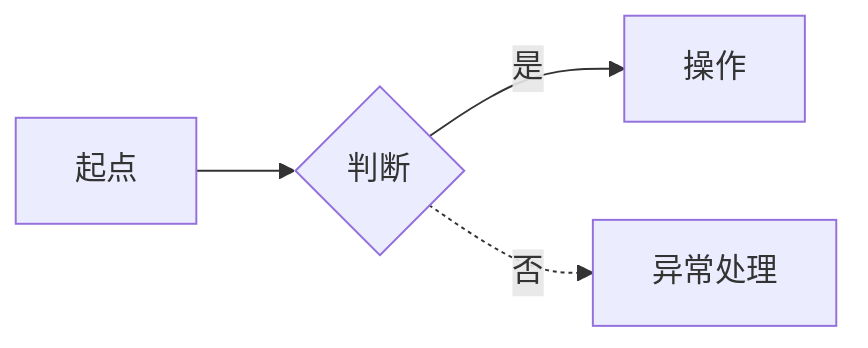
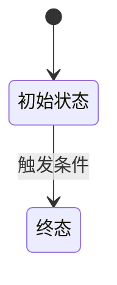

# C02-02 AI 输出：信息架构与交互规范

> **阶段**：C02·IN 交互（按系统）
> **输入**：`C02-01(同系统)` + `C01(同系统已冻结)` + `B02(同系统)`
> **落盘**：`docs/C02-ia-interaction/<system-id>/<module-id>/<feature-id>/`

---

## AI 必须遵守

1. **只读**：C02-01 输入 + C01(同系统) + B02(同系统) + 同系统已有 C02 + 本模板
2. **不许做**：URL/路由/API/表字段/HTML/视觉设计
3. **不跨系统引用**
4. 存疑写 §99
5. 流程图/状态机一律 mermaid
6. ID：页面 `P-<system>-<module>-<seq3>`、模块 `M-<module>-<seq3>`、状态机 `SM-<module>-<seq3>`
7. 每轮一个系统一个功能，00-index.md 末尾增量融合报告列融合点/冲突点，标注 `[本轮新增]`/`[本轮变更]`
8. 严格遵守 A00-03「输出效率」：表格优先、零废话、场景 GIVEN/WHEN/THEN 各一句、空则写"无"

---

## 触发提示词

```
按 /prompt/C-product/C02-02-AI输出-信息架构与交互规范.md 输出。
落盘 docs/C02-ia-interaction/<system-id>/<module-id>/<feature-id>/。
本轮：系统「<system-id>」模块「<module-id>」功能「<feature-id>」。
需求来源：docs/C01-requirements/<system-id>/<module-id>/<feature-id>/。
R-ID 必须在覆盖矩阵落点。严禁 URL/路由/API/表字段。
```

---

## 输出文件清单

```
docs/C02-ia-interaction/<system-id>/<module-id>/<feature-id>/
  00-index.md
  01-feature-catalog.md
  02-flows.md
  03-state-machines.md
  04-page-supplement.md          # 仅补充原型无法表达的规范
  05-coverage-matrix.md
  06-error-pages.md
  99-open-questions.md
```

> **已移除 navigation**：导航结构由 C03 原型的导航目录页和 proto-nav 完整承载，C02 不再重复产出。

---

## 01-feature-catalog.md

```markdown
# 功能模块清单

| M-ID | 模块名 | 功能 | 职责 | 主要角色 | 关联 R-ID | 增量标记 |

## 模块×角色矩阵
```

---

## 02-flows.md

```markdown
# 业务流程图

## FL-<module>-001 <功能名>：<主流程名>

涉及模块：M-XXX / 涉及状态机：SM-XXX



## 流程清单
| FL-ID | 名称 | 类型 | 涉及模块 | 涉及 SM | 增量标记 |
```

---

## 03-state-machines.md

```markdown
# 状态机

## SM-<module>-001 <对象>状态



| 转移 ID | 起态 | 终态 | 触发者 | 条件 | 前置校验 | 后置动作 | R-ID | 增量标记 |

终态/不可回退声明

## 覆盖检查
- [ ] 每状态有出/入边或为终态
- [ ] 每转移标了触发者
- [ ] 无不可达/死循环
```

---

## 04-page-supplement.md（精简版）

> **设计原则**：布局、操作、场景、文案由 C03 原型承载。本文件仅补充原型无法表达的规范：表单校验规则、a11y/键盘、角色差异、后端校验文案。

```markdown
# 页面补充规范

> 页面 ID：`P-<system>-<module>-<seq3>`。布局/操作/场景/文案由 C03 原型体现，本文件仅补充原型无法表达的规范。

## 页面总览
| page-id | 名称 | 类型 | 角色 | M-ID | 关键 R-ID | SM-ID | 增量标记 |

---

## P-XXX 页面名

### 表单校验规则（如有表单）
| 字段 | 必填 | 校验规则 | 错误文案 |

### 后端校验（如有服务端错误场景）
| 场景 | 错误文案 |

### 角色差异（如角色影响可见性/操作）
| 条件 | 表现 |

### 键盘/a11y
- Tab 顺序 / Enter 提交 / Escape 关闭 / 焦点循环
```

> **不再产出的内容**（由 C03 原型覆盖）：ASCII 布局、区块表、操作清单、状态四件套、场景验证（GIVEN/WHEN/THEN）、文案表、移动端说明。

---

## 05-coverage-matrix.md

```markdown
# R-ID 覆盖矩阵

| R-ID | 描述 | M-ID | page-id | FL-ID | SM-ID | 增量标记 |

## 未覆盖检查
- [ ] 所有 R-ID 落点？
- [ ] 所有 M-ID 承接≥1 个 R-ID？
- [ ] 所有 page-id 有≥1 条场景验证？
```

---

## 06-error-pages.md

```markdown
# 系统兜底页

| page-id | 类型 | 触发条件 | 文案 | 主操作 |
|---------|------|---------|------|-------|
| P-<system>-error-001 | 401 | 未登录 | … | 去登录 |
| P-<system>-error-002 | 403 | 无权限 | … | 返回首页 |
| P-<system>-error-003 | 404 | 找不到 | … | 返回首页 |
| P-<system>-error-004 | 500 | 服务器错误 | … | 重试 |
```

---

## 增量融合报告（写在 00-index.md 末尾）

```markdown
## 增量融合 · 第 N 轮 · 功能「<功能名>」

### 本轮新增
| 类型 | ID | 说明 |

### 融合点 / 冲突点 / 已有变更 / 导航更新
```

---

## 质量自检

- [ ] 落盘在 `docs/C02-ia-interaction/<system-id>/`？
- [ ] 05-coverage-matrix 所有 R-ID 落点？
- [ ] 状态机封闭？
- [ ] 04-page-supplement 仅含校验规则/a11y/角色差异？无布局/操作/场景/文案？
- [ ] 无 URL/路由/API/表字段？不跨系统？
- [ ] 页面 ID 带 system 前缀？单文件<=1200 行？
