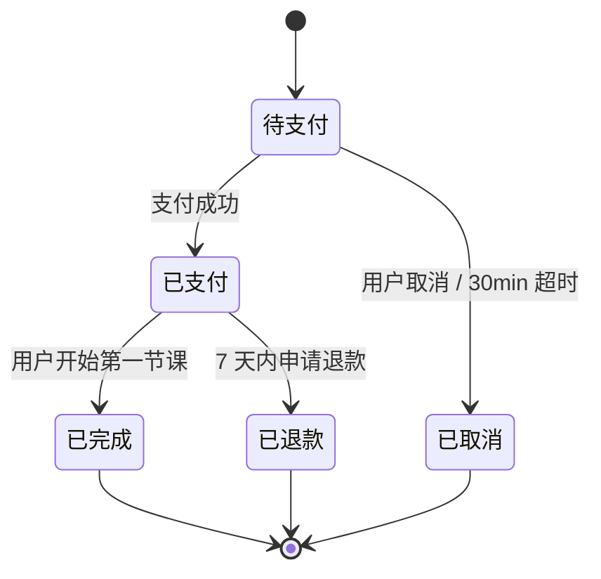

# 22 · I03 AI 输出：信息架构（功能·流程·状态机·页面·导航）模板

> **阶段**：I 信息架构
> **谁产出**：AI（信息架构师）
> **落盘**：`docs/C02-ia/<feature-id>/`

---

## AI 必须遵守

1. **只读**：I 用户输入 + 本 feature R 基线 + B02 全部 + B03 / B04 索引 + I-questions-round*-resolved + `A00-01` + `A00-03` + `A00-04` + 本模板。
   > **严禁读**：docs/B01-architecture/ 与任何开发阶段（数据 / 接口 / 校验）产出（C 与 D 隔离；I 阶段不依赖 B01 架构与任何开发阶段产物）。
2. **不许做**：写 URL / 路由 / API / 表字段 / 单页 HTML 元素 / 视觉设计。以上均属于后续阶段职责。
3. 仍存疑的写到 `99-open-questions.md`。
4. 流程图、状态机一律 mermaid。
5. 页面 ID 用 `P-<feature>-<seq3>`；功能模块 ID 用 `M-<feature>-<seq3>`；状态机 ID 用 `SM-<feature>-<seq2>`。

---

## 触发提示词

```
我已答完 I 澄清。请按 /prompt/C-product/C02-I03-AI输出-信息架构.md 多文件结构输出，
落盘到 docs/C02-ia/<feature-id>/。
菜单 / 角色映射必须引用 docs/B02-permissions/01-roles.md。
每个 R-ID 必须在 06-coverage-matrix 中至少落点 1 个 M-ID 或 page-id。
未决项写入 99-open-questions.md。
**严禁输出 URL / 路由 / API / 表字段**——这些由后续开发阶段产出。
```

---

## 输出多文件清单

```
docs/C02-ia/<feature-id>/
  00-index.md
  01-feature-catalog.md   # 功能模块清单（M-ID 树 + 角色 + 关联 R-ID）
  02-flows.md             # 业务流程图（主+异常）；超量拆 flows/
  flows/                  # 子流程拆分（可选）
    <flow-name>.md
  03-state-machines.md    # 所有有状态业务对象的状态机
  04-pages.md             # 页面清单（page-id, 名称, 类型, 角色, 关联 R-ID, 关联 M-ID）【不含 URL】
  05-navigation.md        # 菜单结构 + 角色可见性（链接以 page-id 表达）
  06-coverage-matrix.md   # R-ID × （功能 / 流程 / 状态机 / 页面）覆盖矩阵
  07-error-pages.md       # 系统兜底页清单（401/403/404/500/maintenance，类型，不含路径）
  99-open-questions.md
```

---

## 文件 1：`00-index.md`

```markdown
<!-- TARGET-PATH: docs/C02-ia/<feature-id>/00-index.md -->

# 信息架构 · 索引

> **阶段**：I · 信息架构师
> **上游**：本 feature R 基线、B02、B03、B04、I-<feature-id>-questions-resolved
> **下游**：
> - C03 N：每页一份文件，page-id 来自本目录 04-pages.md
> - 后续开发阶段（数据 / 接口）会反向消费本目录产物，但本阶段不需预设任何下游接口与表结构
> **本阶段铁律**：不出 URL / 路由 / API / 表字段。

## 子文件

| 文件 | 一句话职责 |
|------|----------|
| 01-feature-catalog.md | 功能模块清单（M-ID） |
| 02-flows.md | 业务流程图 |
| 03-state-machines.md | 业务对象状态机 |
| 04-pages.md | 页面清单（无 URL） |
| 05-navigation.md | 导航结构与角色可见性 |
| 06-coverage-matrix.md | R-ID 覆盖矩阵 |
| 07-error-pages.md | 系统兜底页类型清单 |
```

---

## 文件 2：`01-feature-catalog.md`

```markdown
<!-- TARGET-PATH: docs/C02-ia/<feature-id>/01-feature-catalog.md -->

# 功能模块清单

> 用户能感知的功能块。模块 ID 命名：`M-<feature>-<seq3>`。

| M-ID | 模块名 | 一句话职责 | 主要角色 | 关联 R-ID | 父模块 |
|------|-------|----------|---------|----------|--------|
| M-001 | 课程浏览 | 用户找到并查看课程 | ROLE-USER | R-005, R-006 | — |
| M-002 | 订单与支付 | 把课程"装进我的" | ROLE-USER | R-010, R-011 | — |
| M-003 | 学习进度 | 记录每用户每节课进度 | ROLE-USER | R-020 | — |
| M-004 | 课程管理 | 内容编辑维护课程 | ROLE-EDITOR | R-040 | — |

## 模块 × 角色 矩阵（粗）

| M-ID | ROLE-USER | ROLE-EDITOR | ROLE-ADMIN |
|------|-----------|-------------|------------|
| M-001 | ✅ 看 | ✅ 看 | ✅ 看 |
| M-002 | ✅ 用 | — | ✅ 看 |
| M-003 | ✅ 写 | — | ✅ 看 |
| M-004 | — | ✅ 写 | ✅ 写 |
```

---

## 文件 3：`02-flows.md`

```markdown
<!-- TARGET-PATH: docs/C02-ia/<feature-id>/02-flows.md -->

# 业务流程图

> 主流程 + 异常路径。子流程多于 3 个时拆到 `flows/<flow-name>.md`，本文件保留索引。

## FL-1 主流程：用户购买并开始学习

涉及模块：M-002（订单与支付）、M-003（学习进度）
涉及状态机：SM-01（订单状态）

```mermaid
flowchart LR
  A1[课程详情点"加入课程"] --> B1{已登录?}
  B1 -.->|否| L1[跳登录页] --> A1
  B1 -->|是| C1[订单确认页]
  C1 --> D1[选择支付方式 → 调用支付]
  D1 --> E1{支付结果}
  E1 -->|成功| F1[订单状态: 已支付] --> G1[写入"我的课程"] --> H1[跳学习页第一节]
  E1 -.->|失败| I1[显示错误 + 重试]
  E1 -.->|超时 30min| J1[订单状态: 已取消]
```

## FL-2 异常流程：支付回调延迟


## 流程清单

| FL-ID | 名称 | 类型 | 涉及模块 | 涉及状态机 | 文件 |
|-------|------|------|---------|----------|------|
| FL-1 | 用户购买并开始学习 | 主流程 | M-002, M-003 | SM-01 | 本文件 §FL-1 |
| FL-2 | 支付回调延迟 | 异常 | M-002 | SM-01 | 本文件 §FL-2 |
| FL-3 | 课程上下架 | 主流程 | M-004 | SM-02 | flows/course-publish.md |
```

---

## 文件 4：`03-state-machines.md`

```markdown
<!-- TARGET-PATH: docs/C02-ia/<feature-id>/03-state-machines.md -->

# 状态机

> 列出本 feature 所有有状态的业务对象。状态机 ID：`SM-<feature>-<seq2>`。
> 本文件是状态字段枚举与状态转移覆盖检查的事实来源，由后续开发阶段消费。

## SM-01 订单状态

涉及模块：M-002
关联 R-ID：R-010, R-011



| 转移 ID | 起态 | 终态 | 触发者 | 触发条件 | 前置校验 | 后置动作 | 关联 R-ID |
|--------|------|------|-------|---------|---------|---------|----------|
| T-01-1 | 待支付 | 已支付 | 系统（支付回调）| 第三方支付成功 | 订单未过期 | 写入"我的课程" + 通知 | R-010 |
| T-01-2 | 待支付 | 已取消 | 用户 / 系统 | 用户点取消 或 30min 超时 | — | 释放占用 | R-010 |
| T-01-3 | 已支付 | 已完成 | 系统（业务事件）| 用户进入第一节学习页 | — | 计入成单率 | R-011 |
| T-01-4 | 已支付 | 已退款 | 用户 | 7 天内申请退款 | 未消费课时 ≤ 阈值 | 退款 + 移出"我的课程" | R-012 |

终态：已完成 / 已退款 / 已取消
不可回退：已支付 → 待支付（不允许）

## SM-02 课程状态

…（同上结构）

## 状态机覆盖检查

- [ ] 每个状态都有出/入边或为终态
- [ ] 每条转移都标了触发者
- [ ] 没有不可达状态
- [ ] 没有死循环
```

---

## 文件 5：`04-pages.md`

```markdown
<!-- TARGET-PATH: docs/C02-ia/<feature-id>/04-pages.md -->

# 页面清单（不含 URL）

> 本文件只描述“有哪些页面、谁能看、为什么需要”。**URL 路径不在本阶段产出**（属后续开发阶段）。
> 页面 ID：`P-<feature>-<seq3>`。

| page-id | 名称 | 类型 | 主要角色 | 所属模块 M-ID | 关联 R-ID | 涉及状态机 SM-ID | 备注 |
|---------|------|------|---------|--------------|----------|----------------|------|
| P-001 | 首页 | landing | * | M-001 | R-001 | — | 公开 |
| P-002 | 课程列表 | list | * | M-001 | R-005 | — | 公开 |
| P-003 | 课程详情 | detail | * | M-001 | R-006 | — | 公开 |
| P-010 | 订单确认 | form | ROLE-USER | M-002 | R-010 | SM-01 | 必须登录 |
| P-011 | 支付结果 | result | ROLE-USER | M-002 | R-010 | SM-01 | 必须登录 |
| P-020 | 我的课程 | dashboard | ROLE-USER | M-003 | R-020 | — | 必须登录 |
| P-021 | 学习页 | detail | ROLE-USER | M-003 | R-020 | — | 必须登录 |
| P-040 | 课程管理列表 | list | ROLE-EDITOR | M-004 | R-040 | SM-02 | 必须登录 |
| P-041 | 课程编辑 | form | ROLE-EDITOR | M-004 | R-040 | SM-02 | 必须登录 |

## 类型枚举
landing / list / detail / form / dashboard / wizard / settings / auth / result / error
```

---

## 文件 6：`05-navigation.md`

```markdown
<!-- TARGET-PATH: docs/C02-ia/<feature-id>/05-navigation.md -->

# 导航结构与角色可见性

> 链接一律用 page-id 表达；URL 不在本阶段产出。

## 前台 TopBar

| 项 | 链接（page-id）| 可见角色 | 排序 |
|----|--------------|---------|------|
| 首页 | P-001 | * | 1 |
| 课程 | P-002 | * | 2 |
| 我的课程 | P-020 | ROLE-USER | 99 |

## 用户菜单（头像下拉）

| 项 | 链接（page-id）| 可见角色 |
|----|--------------|---------|
| 我的课程 | P-020 | ROLE-USER |
| 退出 | (auth-logout) | ROLE-USER |

## 后台 Sidebar

| 一级 | 二级 | 链接（page-id）| 可见角色 |
|------|------|--------------|---------|
| 内容 | 课程 | P-040 | ROLE-EDITOR, ROLE-ADMIN |

## 移动端导航
- 折叠形态、底部 tabbar 与否、关键改变
```

---

## 文件 7：`06-coverage-matrix.md`

```markdown
<!-- TARGET-PATH: docs/C02-ia/<feature-id>/06-coverage-matrix.md -->

# 需求 × 信息架构 覆盖矩阵

| R-ID | 描述 | 落地 M-ID | 落地 page-id | 涉及流程 FL-ID | 涉及状态机 SM-ID |
|------|------|-----------|--------------|----------------|------------------|
| R-001 | 注册 | M-001 | P-001 | — | — |
| R-005 | 浏览课程 | M-001 | P-002, P-003 | — | — |
| R-010 | 购买课程 | M-002 | P-010, P-011 | FL-1 | SM-01 |
| R-020 | 学习课程 | M-003 | P-020, P-021 | FL-1 | — |
| R-040 | 内容管理 | M-004 | P-040, P-041 | FL-3 | SM-02 |

## 未覆盖检查
- [ ] 所有 R-ID 都已落点（M-ID 或 page-id 或 FL-ID 至少一处）？
- [ ] 所有 M-ID 都至少承接 1 个 R-ID？
- [ ] 所有 SM-ID 都至少有 1 个页面承载状态变更？

## 系统页豁免
- 401/403/404/500 等无需 R-ID
```

---

## 文件 8：`07-error-pages.md`

```markdown
<!-- TARGET-PATH: docs/C02-ia/<feature-id>/07-error-pages.md -->

# 系统兜底页清单

> 仅声明类型与文案，不指定路径。路径不在本阶段产出。

| page-id | 类型 | 触发条件 | 文案 | 主操作 |
|---------|------|---------|------|-------|
| P-E401 | 401 | 未登录 | … | 去登录 |
| P-E403 | 403 | 无权限 | … | 返回首页 |
| P-E404 | 404 | 找不到 | … | 返回首页 |
| P-E500 | 500 | 服务器错误 | … | 重试 / 反馈 |
| P-EMNT | maintenance | 维护中 | … | — |
```

---

## 文件 9：`99-open-questions.md`

```markdown
<!-- TARGET-PATH: docs/C02-ia/<feature-id>/99-open-questions.md -->

# 待确认问题
```

---

## 输出质量自检
- [ ] 9 文件全出？
- [ ] 06-coverage-matrix 中所有 R-ID 都有落点？
- [ ] 03-state-machines 每个状态机都封闭（每个状态都有出/入边或为终态）？
- [ ] 05-navigation 的角色都能在 docs/B02-permissions/01-roles.md 找到？
- [ ] **未出现 URL / 路由 / API / 表字段**？（违规 → 删除并放 §99 标注“应在后续开发阶段定义”）
- [ ] 系统兜底页齐？
