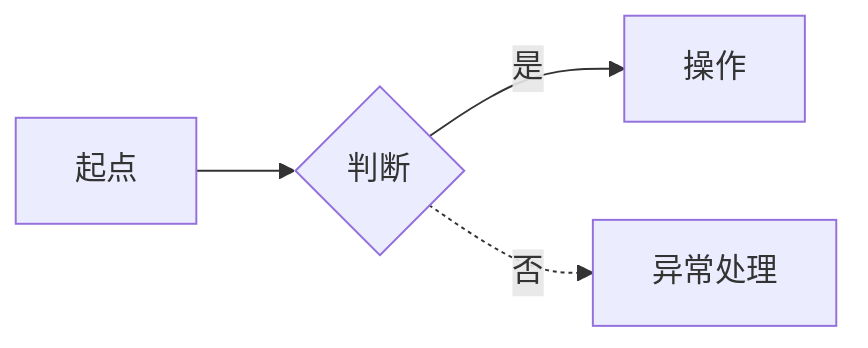
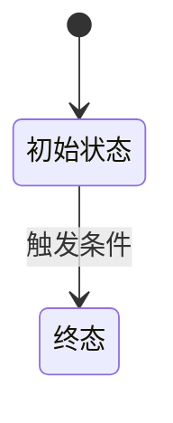

# C02-02 AI 输出：信息架构与交互规范

> **阶段**：C02 架构与交互
> **归属**：**按系统独立（_surface）**——每个系统有独立的信息架构与交互
> **步骤**：第 2 步（共 2 步）—— AI 输出
> **谁产出**：AI（信息架构师 + 交互设计师）
> **何时产出**：收到 C02-01 用户输入后直接输出。
> **落盘**：`docs/<surface-id>/C02-ia-interaction/<module-id>/<feature-id>/`

---

## AI 必须遵守

1. **只读**：C02-01 用户输入 + C01 共享需求基线（`docs/_shared/C01-requirements/`，已冻结）+ B02 体验规范（含设计系统）+ **同系统**已有 C02 产出（如有）+ 本模板。
2. **不许做**：写 URL / 路由 / API / 表字段 / 单页 HTML 元素 / 视觉设计。
3. **不跨系统引用**：禁止引用其他系统的 C02 产出（如 app 的 C02 不看 admin 的 C02）。跨系统共享数据通过 C01 共享需求协调。
4. 仍存疑的写到 `§99`。
5. 流程图、状态机一律 mermaid。
6. ID 规范：页面 `P-<surface>-<module>-<seq3>`、模块 `M-<module>-<seq3>`、状态机 `SM-<module>-<seq2>`、操作 `OP-<page-id>-<seq>`。**页面 ID 必须带 surface 前缀。**
7. **输出结构**：按「系统 → 模块 → 功能」三级组织。每轮产出一个系统的一个功能。
8. **增量融合**：每轮产出一个功能的内容。必须在 §10 主动列出与已有内容的融合点和冲突点。新增内容标注 `[本轮新增]`，变更内容标注 `[本轮变更]`。

---

## 触发提示词

```
请按 /prompt/C-product/_surface/C02-02-AI输出-信息架构与交互规范.md 输出，
落盘到 docs/<surface-id>/C02-ia-interaction/<module-id>/<feature-id>/。
本轮围绕系统「<surface-id>」下模块「<module-id>」的功能「<feature-id>」产出。
共享需求引用：docs/_shared/C01-requirements/<module-id>/<feature-id>/
菜单/角色映射必须引用 C01 共享基线。
每个 R-ID 必须在覆盖矩阵中至少落点 1 个 M-ID 或 page-id。
必须主动指出与同系统已有内容的融合点和冲突点。
严禁输出 URL / 路由 / API / 表字段。严禁跨系统引用其他系统的 C02 产出。
```

---

## 输出文件清单

```
docs/<surface-id>/C02-ia-interaction/<module-id>/<feature-id>/
  00-index.md
  01-feature-catalog.md     # 功能模块清单（M-ID 树 + 角色 + R-ID）
  02-flows.md               # 业务流程图（主+异常）
  03-state-machines.md      # 状态机
  04-pages.md               # 页面清单 + 每页交互规范
  05-navigation.md          # 导航结构 + 角色可见性
  06-coverage-matrix.md     # R-ID 覆盖矩阵
  07-error-pages.md         # 系统兜底页
  99-open-questions.md
```

---

## 文件 1：`00-index.md`

```markdown
<!-- TARGET-PATH: docs/<surface-id>/C02-ia-interaction/<module-id>/<feature-id>/00-index.md -->

# 信息架构与交互规范 · 索引

> **阶段**：C02 · 信息架构师 + 交互设计师
> **归属**：按系统独立
> **系统**：<surface-id>
> **上游**：C01 共享需求基线（`docs/_shared/C01-requirements/`）、B02（体验规范与设计系统）
> **下游**：C03 HTML 原型（同系统）
> **本轮聚焦功能**：<功能名>
> **输出结构**：系统 → 模块 → 功能
> **本阶段铁律**：不出 URL / 路由 / API / 表字段；不跨系统引用

## 子文件

| 文件 | 一句话职责 |
|------|----------|
| 01-feature-catalog.md | 功能模块清单 |
| 02-flows.md | 业务流程图 |
| 03-state-machines.md | 状态机 |
| 04-pages.md | 页面清单 + 每页交互规范 |
| 05-navigation.md | 导航结构 |
| 06-coverage-matrix.md | R-ID 覆盖矩阵 |
| 07-error-pages.md | 系统兜底页 |
```

---

## 文件 2：`01-feature-catalog.md`

```markdown
<!-- TARGET-PATH: docs/<surface-id>/C02-ia-interaction/<module-id>/<feature-id>/01-feature-catalog.md -->

# 功能模块清单

> 按「系统 → 模块 → 功能」组织。本文件仅包含当前系统（<surface-id>）的模块。增量轮次标注 `[本轮新增]`。

## 模块树

| M-ID | 模块名 | 功能 | 一句话职责 | 主要角色 | 关联 R-ID | 增量标记 |
|------|-------|------|----------|---------|----------|---------|
| M-001 | 课程浏览 | 课程搜索 | 用户搜索课程 | ROLE-USER | R-005 | |
| M-001 | 课程浏览 | 课程详情 | 查看单课信息 | ROLE-USER | R-006 | |
| M-002 | 订单与支付 | 下单 | 创建订单 | ROLE-USER | R-010 | [本轮新增] |

## 模块 × 角色 矩阵

| M-ID | ROLE-USER | ROLE-EDITOR | ROLE-ADMIN |
|------|-----------|-------------|------------|
| M-001 | ✅ 看 | ✅ 看 | ✅ 看 |
```

---

## 文件 3：`02-flows.md`

```markdown
<!-- TARGET-PATH: docs/<surface-id>/C02-ia-interaction/<module-id>/<feature-id>/02-flows.md -->

# 业务流程图

> 按功能组织。增量轮次标注新增流程。

## FL-1 <功能名>：<主流程名>

涉及模块：M-XXX
涉及状态机：SM-XX



## 流程清单

| FL-ID | 名称 | 类型 | 涉及模块 | 涉及状态机 | 增量标记 |
|-------|------|------|---------|----------|---------|
| FL-1 | ... | 主流程 | M-001 | SM-01 | [本轮新增] |
```

---

## 文件 4：`03-state-machines.md`

```markdown
<!-- TARGET-PATH: docs/<surface-id>/C02-ia-interaction/<module-id>/<feature-id>/03-state-machines.md -->

# 状态机

> 增量轮次：新增的状态机标注 `[本轮新增]`；已有状态机的新增转移标注 `[本轮新增转移]`。

## SM-01 <对象>状态

涉及模块：M-XXX
关联 R-ID：R-XXX



| 转移 ID | 起态 | 终态 | 触发者 | 触发条件 | 前置校验 | 后置动作 | 关联 R-ID | 增量标记 |
|--------|------|------|-------|---------|---------|---------|----------|---------|
| T-01-1 | ... | ... | ... | ... | ... | ... | R-XXX | |

终态：...
不可回退：...

## 状态机覆盖检查
- [ ] 每个状态都有出/入边或为终态
- [ ] 每条转移都标了触发者
- [ ] 没有不可达状态
- [ ] 没有死循环
```

---

## 文件 5：`04-pages.md`（核心文件——页面清单 + 交互规范）

> 本文件包含页面清单与页面交互规范，每个页面在清单表之后紧跟交互详情。

```markdown
<!-- TARGET-PATH: docs/<surface-id>/C02-ia-interaction/<module-id>/<feature-id>/04-pages.md -->

# 页面清单与交互规范

> 按「模块 → 功能」组织。本文件仅包含当前系统（<surface-id>）的页面。
> 页面 ID：`P-<surface>-<module>-<seq3>`（必须带 surface 前缀）。增量轮次标注 `[本轮新增]`。
> 本文件铁律：禁止出现接口 / 路由 / 字段 / 数据库等任何开发侧概念。

## 页面总览

| page-id | 功能 | 名称 | 类型 | 主要角色 | 所属 M-ID | 关联 R-ID | 涉及 SM-ID | 增量标记 |
|---------|------|------|------|---------|----------|----------|-----------|---------|
| P-app-course-001 | 课程搜索 | 课程列表 | list | * | M-001 | R-005 | — | |
| P-app-course-010 | 下单 | 订单确认 | form | ROLE-USER | M-002 | R-010 | SM-01 | [本轮新增] |

---

## P-001 课程列表

### 用户目标
- 一句话：...

### 进入条件与初始数据形态
- 进入条件：
- 进入时需展示哪些信息（业务语言）：
- 加载策略（只描述用户感知）：

### 信息架构（区块布局）

```
+------------------------------------------+
| 顶部导航                                  |
+------------------------------------------+
| Block-1：筛选/搜索区                       |
+------------------------------------------+
| Block-2：列表区                            |
+------------------------------------------+
| Block-3：分页/加载更多                      |
+------------------------------------------+
```

| Block-ID | 名称 | 职责 | OP-ID | 隐藏条件 |
|---------|------|------|-------|---------|

### 操作清单

| OP-ID | 名称 | 主/次 | 触发 | 用户期望系统反馈（业务语言） | 角色 | 反馈方式 | 边界 |
|-------|------|------|------|-------------------------|------|---------|----- |

### 状态四件套

#### 默认
- 描述、视觉、文案

#### 加载中
- 骨架屏 / Spinner

#### 空数据
- 触发 / 视觉 / 主操作

#### 错误
- 触发 / 视觉 / 重试策略

### 角色差异

| 角色 | 看到的差异 | 隐藏的元素 |
|------|----------|-----------|

### 场景验证（≥ 5 条）

| SC-ID | GIVEN | WHEN | THEN | 涉及 OP-ID / SM-ID |
|-------|-------|------|------|-------------------|
| SC-1 | ... | ... | ... | ... |

> 异常场景必须包含：加载失败 / 超时 / 无权限 / 数据为空 / 重复操作

### 表单（如有）
- 字段名（业务名词）+ 必填 / 校验规则 / 错误位置
- 提交流程
- 未保存提示

### 键盘 / a11y
- Tab 顺序、快捷键、ARIA、焦点管理

### 移动端
- 断点行为、主 CTA 形态、隐藏元素

### 性能
- 首屏阻塞元素、懒加载策略

### 文案
- 主标题 / 主 CTA / 错误兜底

---

## P-010 订单确认 `[本轮新增]`

（按上述 P-001 的完整结构填写）

```

---

## 文件 6：`05-navigation.md`

```markdown
<!-- TARGET-PATH: docs/<surface-id>/C02-ia-interaction/<module-id>/<feature-id>/05-navigation.md -->

# 导航结构与角色可见性

> 链接一律用 page-id 表达；URL 不在本阶段产出。
> 增量轮次：新增导航项标注 `[本轮新增]`。

## <surface> 导航

### 顶部导航 / 底部 TabBar

| 项 | 链接（page-id）| 可见角色 | 排序 | 增量标记 |
|----|--------------|---------|------|---------|

### 侧边导航（如有）

| 一级 | 二级 | 链接（page-id）| 可见角色 | 增量标记 |
|------|------|--------------|---------|---------|

### 用户菜单

| 项 | 链接（page-id）| 可见角色 |
|----|--------------|---------|

### 移动端导航
- 折叠形态、底部 tabbar、关键改变
```

---

## 文件 7：`06-coverage-matrix.md`

```markdown
<!-- TARGET-PATH: docs/<surface-id>/C02-ia-interaction/<module-id>/<feature-id>/06-coverage-matrix.md -->

# 需求 × 架构交互 覆盖矩阵

> 增量轮次：新增行标注 `[本轮新增]`。

| R-ID | 描述 | 落地 M-ID | 落地 page-id | 涉及 FL-ID | 涉及 SM-ID | 增量标记 |
|------|------|-----------|--------------|-----------|-----------|---------|
| R-001 | ... | M-001 | P-001 | — | — | |

## 未覆盖检查
- [ ] 所有 R-ID 都已落点？
- [ ] 所有 M-ID 都至少承接 1 个 R-ID？
- [ ] 所有 SM-ID 都至少有 1 个页面承载状态变更？
- [ ] 所有 page-id 都至少有 1 条场景验证？
```

---

## 文件 8：`07-error-pages.md`

```markdown
<!-- TARGET-PATH: docs/<surface-id>/C02-ia-interaction/<module-id>/<feature-id>/07-error-pages.md -->

# 系统兜底页清单

| page-id | 类型 | 触发条件 | 文案 | 主操作 |
|---------|------|---------|------|-------|
| P-E401 | 401 | 未登录 | … | 去登录 |
| P-E403 | 403 | 无权限 | … | 返回首页 |
| P-E404 | 404 | 找不到 | … | 返回首页 |
| P-E500 | 500 | 服务器错误 | … | 重试 / 反馈 |
```

---

## 文件 9：`99-open-questions.md`

```markdown
<!-- TARGET-PATH: docs/<surface-id>/C02-ia-interaction/<module-id>/<feature-id>/99-open-questions.md -->

# 待确认问题
```

---

## 10. 增量融合报告（每轮必填，写在 00-index.md 末尾）

> AI 每轮输出时必须在 `00-index.md` 末尾追加本节。

```markdown
## 增量融合报告 · 第 N 轮 · 功能「<功能名>」

### 本轮新增内容摘要
| 类型 | ID | 说明 |
|------|------|------|
| 模块 | M-XXX | ... |
| 页面 | P-XXX | ... |
| 流程 | FL-X | ... |
| 状态机 | SM-XX | ... |

### 融合点（与已有内容的衔接）
- `[例：P-010 订单确认页的"返回"跳转到已有 P-003 课程详情页]`
- `[例：FL-3 购买流程的起点是已有 P-003 的"加入课程"按钮]`

### 冲突点（需要人工决策）
- `[例：新增的导航项"我的订单"与已有导航排序冲突]`
- `[无冲突则写"无"]`

### 已有内容的变更
- `[例：P-003 课程详情页新增 OP-5 "加入课程"按钮]`
- `[无变更则写"无"]`

### 导航更新
- `[例：app 端底部 TabBar 新增"订单"入口，指向 P-020]`
```

---

## 输出质量自检

- [ ] 输出结构按"系统→模块→功能"组织？落盘路径是否在 `docs/<surface-id>/C02-ia-interaction/` 下？
- [ ] 06-coverage-matrix 中所有 R-ID 都有落点？
- [ ] 03-state-machines 每个状态机都封闭？
- [ ] 05-navigation 的角色都能在 C01 基线找到？
- [ ] 04-pages 每个页面都有完整的交互规范（区块/操作/状态四件套/场景≥5）？
- [ ] §10 增量融合报告是否完整填写？
- [ ] 融合点和冲突点是否都已列出？
- [ ] **未出现 URL / 路由 / API / 表字段**？
- [ ] **未跨系统引用其他系统的 C02 产出**？
- [ ] 页面 ID 均带 surface 前缀（`P-<surface>-<module>-<seq3>`）？
- [ ] 单文件 ≤ 1200 行？（04-pages.md 如超限按功能拆分子文件）
