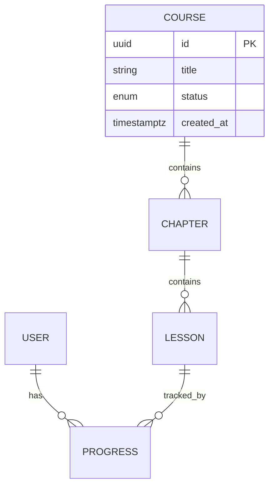

# D01-01 · AI 输出：数据规范

> **阶段**：D01 · 数据建模（按功能循环）
> **角色**：数据建模师
> **步骤**：1 步 —— AI 基于上游冻结产物直接输出，无需用户额外输入
> **上游依赖**（只读）：C01 需求与权限产物 + C02 架构与交互产物 + C03 HTML 原型 + B01 技术架构产物
> **下游消费**：D02 接口规范

---

## 一、触发提示词

```
请你扮演"数据建模师"。

上游（只读，已冻结）：
- C01：需求清单（R-ID）、角色权限矩阵
- C02：功能清单、状态机（SM-ID）、页面清单、单页布局与行为
- C03：HTML 原型
- B01：技术选型、DB 规范（命名、主键策略、通用字段）

本功能 ID：<feature-id>
关联 R-ID：<R-001, R-002, ...>

请严格按 /prompt/D-develop/D01-01-AI输出-数据规范.md 模板输出本功能的数据规范。
```

---

## 二、AI 行为约束

1. **不重定义状态机**：状态枚举与转移由 C02 状态机给出，本阶段只把状态字段建成枚举列、补 DB 约束，不画状态图、不重命名/增删状态
2. **不写路由 / 接口 / HTML**：数据层以外的内容属于 D02 或 C03
3. **命名遵守 B01**：表名、字段名、主键策略、通用字段（created_at / updated_at / deleted_at 等）一律按 B01 技术架构中的 DB 规范执行
4. **不重定义 B01 已有的全局表**：如 B01 中已定义账号/角色/审计等全局表，本阶段不重复定义，仅在关系中引用
5. **枚举与 C02 状态机对齐**：状态字段的枚举值必须与 C02 中对应 SM-ID 的状态名一一对应；发现不一致必须声明，不得自行修改
6. **未决项集中声明**：所有不确定的设计决策集中放在末尾"待确认问题"中

---

## 三、输出结构

AI 按以下顺序，在**单文件**内输出所有内容。

---

### 1. 概述

```markdown
# 数据规范 · <feature-id>

> **功能名称**：
> **关联 R-ID**：R-XXX, R-XXX
> **上游依赖**：C01（需求清单）、C02（状态机 SM-XX / 页面清单）、C03（原型）、B01（DB 规范）
> **本阶段不做**：状态机定义（在 C02）、路由/接口（在 D02）、页面/原型（在 C03）
```

---

### 2. ER 图

使用 Mermaid erDiagram 语法。复杂模型可拆为核心域 / 周边域多张图。



---

### 3. 实体/表定义

每个实体一个子节，包含以下内容：

#### 3.X `<table_name>` · <中文名>

**概述**

| 项 | 值 |
|----|-----|
| 关联 R-ID | R-XXX |
| 业务定义 | 一句话 |
| 状态机 | SM-XX（引用 C02）/ 无 |

**字段表**

| 字段 | 类型 | 必填 | 默认值 | 唯一 | 索引 | 说明 | 校验规则 |
|------|------|------|--------|------|------|------|---------|
| id | uuid | Y | gen_random_uuid() | PK | -- | 主键 | -- |
| status | text | Y | draft | -- | Y | 业务状态，枚举来源 SM-XX | IN (枚举列表) |
| created_at | timestamptz | Y | now() | -- | Y | 创建时间 | -- |
| updated_at | timestamptz | Y | now() | -- | -- | 更新时间 | -- |
| deleted_at | timestamptz | N | NULL | -- | Y | 软删除标记 | -- |

> 说明：
> - 必填列 Y/N
> - 索引列 Y 表示本字段参与索引（详见索引策略节）
> - 通用字段（id / created_at / updated_at / deleted_at）遵循 B01 规范，不再逐表解释

**关系**

| 关系 | 目标表 | 基数 | 外键字段 | 删除策略 |
|------|--------|------|---------|---------|
| 属于 | course | N:1 | course_id | RESTRICT |

---

### 4. 枚举定义

集中定义所有枚举类型，与 C02 状态机对齐。

#### 4.X `<enum_name>` · <中文名>（来源：SM-XX）

| 值 | 中文名 | 说明 | 是否默认 |
|----|--------|------|---------|
| draft | 草稿 | 初始状态 | Y |
| published | 已上架 | ... | N |

> 任何枚举值与 C02 状态机不一致时，AI 必须在"待确认问题"中声明，不得自行修改。

---

### 5. 业务规则与校验

将数据层约束和字段校验合并输出。

#### 5.1 业务约束

| BR-ID | 来源 R-ID | 涉及实体/字段 | 描述 | 实现层 | 备注 |
|-------|----------|---------------|------|--------|------|
| BR-01 | R-002 | course.title | 上架后 title 不可修改 | Service | |

> 实现层取值：DB constraint / DB trigger / Service / Application
> 状态转移规则属于 C02 状态机，此处不重复声明

#### 5.2 字段校验

| 实体 | 字段 | 校验规则 | 来源 R-ID | 实现层 |
|------|------|---------|----------|--------|
| course | title | 长度 1-120，不含特殊字符 | R-001 | DB + Application |

#### 5.3 跨字段/跨表校验

| 名称 | 描述 | 涉及字段 | 来源 R-ID | 实现层 |
|------|------|---------|----------|--------|
| 删除前检查 | 删除课程前须无进行中订单 | course.id, order.status | R-003 | Service |

---

### 6. 计算/派生字段

| 实体 | 字段 | 计算公式 | 实现方式 | 更新触发条件 |
|------|------|---------|---------|-------------|
| course | total_duration | SUM(lesson.duration) | 应用层缓存 | lesson 增删改时 |

> 实现方式取值：generated column / view / 应用层缓存 / cron 刷新

---

### 7. 索引策略

| IDX-ID | 表 | 字段（顺序敏感） | 类型 | 唯一 | 支撑的查询场景 |
|--------|-----|-----------------|------|------|---------------|
| IDX-01 | progress | (user_id, lesson_id) | btree | Y | 查指定用户某课时进度 |

**不建索引的说明**（选择度低、写多读少等场景需解释原因）

---

### 8. 种子数据建议

> 系统启动或测试环境必须存在的初始记录。无则写"无"。

| 表 | 用途 | 数据示例 | 写入时机 |
|----|------|---------|---------|
| role | 角色初始化 | admin / editor / user | 首次部署 |

---

### 9. 待确认问题

| 编号 | 问题 | AI 默认方案 | 影响范围 |
|------|------|-----------|---------|
| OQ-01 | ... | ... | 实体 XX / 接口 XX |

---

### 10. AI 自检清单

AI 输出完成后，必须逐项自检并在每项后标注 PASS / FAIL。任何 FAIL 项必须在正文中修正后再提交。

**产出完整性**

- [ ] 所有实体都有完整字段表（类型、必填、默认值、说明）
- [ ] 所有枚举字段都列出了完整枚举值与默认值
- [ ] 所有外键都标注了删除策略（RESTRICT / CASCADE / SET NULL）
- [ ] 所有业务规则都标注了实现层
- [ ] ER 图中的实体与字段表中的实体一一对应

**上游一致性**

- [ ] 状态字段枚举值与 C02 状态机（SM-ID）完全一致，未增删改名
- [ ] 未重定义 B01 中已有的全局表（账号/角色/审计等）
- [ ] 命名规范（表名、字段名、主键策略）遵循 B01
- [ ] 通用字段齐全（id / created_at / updated_at / deleted_at，按 B01 要求）
- [ ] 所有 R-ID 都至少被一个实体或业务规则覆盖

**数据建模维度覆盖**（源自旧版 12 维盘点）

- [ ] 表边界合理（一对象一表 vs 合表，已做出明确决策）
- [ ] 主键策略统一且已声明
- [ ] 一对多/多对多/自关联关系已完整定义
- [ ] 唯一约束已覆盖（业务唯一键，不仅仅是主键）
- [ ] 计算/派生字段已决定"存 vs 算"策略
- [ ] 索引覆盖了主要查询模式
- [ ] 历史/版本/软删除策略已明确

**边界检查**

- [ ] 未画 stateDiagram、未输出路由/接口/HTML
- [ ] 未引入 C02 状态机中不存在的状态值
- [ ] 单文件 ≤ 1200 行
