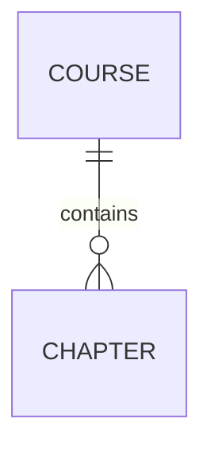

# D01-01 AI 输出：数据规范

> **阶段**：D01·D 数据建模（共享）
> **上游**：B01(DB规范) + 各系统 C01/C02/C03
> **落盘**：`docs/_shared/D01-data/<module-id>/<feature-id>/data-spec.md`

---

## 触发提示词

```
扮演"数据建模师"。
上游（已冻结）：各系统 C01 需求、C02 交互、C03 原型、B01 DB 规范。
模块：<module-id>，功能：<feature-id>，关联 R-ID：<...>
按 /prompt/D-develop/D01-01-AI输出-数据规范.md 输出。
落盘 docs/_shared/D01-data/<module-id>/<feature-id>/data-spec.md。
数据跨系统共享，需综合各系统 C02/C03 产出。
```

---

## AI 行为约束

1. 状态枚举来自 C02，只建枚举列+DB 约束，不重定义状态机
2. 不写路由/接口/HTML
3. 命名遵守 B01
4. 不重定义 B01 全局表，仅引用
5. 枚举与 C02 SM 不一致时必须声明
6. 未决项写 §99

---

## 输出结构（单文件）

```markdown
# 数据规范 · <feature-id>

> **归属**：共享
> **关联 R-ID**：R-XXX
> **不做**：状态机定义(C02)、路由/接口(D02)、页面(C03)

## 1. ER 图



## 2. 实体/表定义

### <表名>

| 项 | 值 |
|----|-----|
| 关联 R-ID | |
| 业务定义 | |
| 状态机 | SM-XX / 无 |

**字段**

| 字段 | 类型 | 必填 | 默认值 | 唯一 | 索引 | 说明 | 校验 |
|------|------|------|--------|------|------|------|------|

**关系**

| 关系 | 目标表 | 基数 | 外键字段 | 删除策略 |

## 3. 枚举定义

> 与 C02 SM 对齐。不一致写 §99。

| 值 | 中文名 | 说明 | 默认 |

## 4. 业务规则与校验

### 4.1 业务约束
| BR-ID | 来源 R-ID | 涉及实体/字段 | 描述 | 实现层 |

> 实现层：DB constraint / DB trigger / Service / Application

### 4.2 字段校验
| 实体 | 字段 | 校验规则 | 来源 R-ID | 实现层 |

### 4.3 跨字段/跨表校验

## 5. 计算/派生字段

| 实体 | 字段 | 公式 | 实现方式 | 更新触发 |

> 实现方式：generated column / view / 应用层缓存 / cron

## 6. 索引策略

| IDX-ID | 表 | 字段 | 类型 | 唯一 | 支撑查询 |

## 7. 种子数据（无则写"无"）

| 表 | 用途 | 示例 | 写入时机 |

## 8. 增量融合报告
### 8.1 本轮新增摘要
### 8.2 融合点 / 冲突点 / 已有变更

## 99. 待确认问题
| 编号 | 问题 | AI 默认方案 | 影响 |
```

---

## 质量自检

**完整性**
- [ ] 所有实体有完整字段表？
- [ ] 枚举列出完整值与默认值？
- [ ] 外键标注删除策略？ER 图与字段表对应？

**上游一致性**
- [ ] 枚举与 C02 SM 一致？
- [ ] 命名遵循 B01？未重定义 B01 全局表？
- [ ] R-ID 被实体或规则覆盖？

**建模覆盖**
- [ ] 主键策略统一？关系完整？唯一约束覆盖？
- [ ] 计算字段已决定存 vs 算？索引覆盖主查询？
- [ ] 软删除策略明确？

**边界**
- [ ] 未输出路由/接口/HTML/状态图？
- [ ] 单文件<=1200 行？
