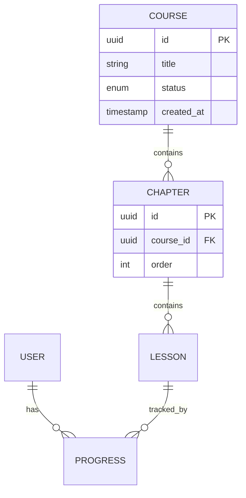

# 34 · D03 AI 输出：数据规范模板

> **阶段**：D 数据模型
> **谁产出**：AI（数据建模师）
> **落盘**：`docs/D01-data/<feature-id>/`

---

## AI 必须遵守

1. **不重定义状态机**：状态枚举与转移已由 C02 IA `03-state-machines.md` 给出。本阶段只负责把"状态字段"建成枚举列、补 DB 校验，不画状态图、不重命名状态、不新增/删除状态。
2. **不写路由 / 接口 / HTML**。
3. 命名 / 通用字段 / 主键策略遵守 B01 03-database。
4. 不重定义 B02 03-authz-data-model.md 中的认证表。
5. 仍存疑写到 99。

---

## 触发提示词

```
我已答完 D 澄清。请按 /prompt/D-develop/D01-D03-AI输出-数据规范.md 多文件结构输出，
落盘到 docs/D01-data/<feature-id>/。
状态字段的枚举值必须与 docs/C03-ia/<feature-id>/03-state-machines.md 完全一致；不得新增、改名、删除状态。
所有命名/通用字段/主键策略遵守 B01 03-database。
不重定义 B02 03-authz-data-model.md 中的认证表。
未决项写入 99-open-questions.md。
```

---

## 输出多文件清单

```
docs/D01-data/<feature-id>/
  00-index.md
  01-er-diagram.md          # mermaid erDiagram
  02-entities/              # 每个实体一个文件
    <entity>.md
  03-business-rules.md      # 数据层约束 / 触发器规则
  04-validations.md         # 字段校验、跨字段校验
  05-calculations.md        # 计算字段 / 聚合字段
  06-indexes.md             # 索引清单与设计依据
  07-volume-growth.md       # 量级、分区、归档（无则写 N/A）
  08-seed-data.md           # 种子数据（无则写 N/A）
  99-open-questions.md
```

---

## 文件 1：`00-index.md`

```markdown
<!-- TARGET-PATH: docs/D01-data/<feature-id>/00-index.md -->

# 数据模型 · <feature-id> · 索引

> **阶段**：D · 数据建模师
> **关联 R-ID**：R-XXX, R-XXX
> **上游**：本 feature C01 R 基线、本 feature C02 IA（重点 03-state-machines.md，提供状态枚举与转移）、B01 03-database、B02 03-authz-data-model.md、本 feature C04 原型 + C05 PRD、D-<feature-id>-questions-resolved
> **冻结状态**：未冻结
> **本阶段不做**：状态机定义（在 C02 IA 03-state-machines.md）、URL/路由（在 D02 L 01-routes-delta.md）、API（在 D02 L 03-endpoints/）

## 实体一览

| 实体 ID | 表名 | 中文名 | 描述 | 状态机 SM-ID（如有，链 C02）| 文件 |
|--------|------|-------|------|-----------------------------|------|
| E-1 | course | 课程 | … | SM-02 → docs/C03-ia/<f>/03-state-machines.md#SM-02 | 02-entities/course.md |

## 关系一览
（可链 ER 图）
```

---

## 文件 2：`01-er-diagram.md`

```markdown
<!-- TARGET-PATH: docs/D01-data/<feature-id>/01-er-diagram.md -->

# ER 图



> 复杂模型可分多张图：核心域 / 周边域 / 流水类。
```

---

## 文件 3：`02-entities/<entity>.md`（每个实体一份）

```markdown
<!-- TARGET-PATH: docs/D01-data/<feature-id>/02-entities/<entity>.md -->

# 实体：<中文名> (`<table_name>`)

## 概述
- **R-ID**：
- **业务定义**：
- **生命周期**：复用 docs/C03-ia/<feature-id>/03-state-machines.md#SM-XX（不在本文件重画状态图）

## 字段表

| 字段 | 类型 | 必填 | 默认 | 唯一 | 索引 | 业务说明 | 校验 |
|------|------|------|------|------|------|---------|------|
| id | uuid | ✅ | gen_random_uuid() | PK | — | 主键 | — |
| status | text/enum | ✅ | — | — | ✅ | 业务状态（枚举来源 → C02 SM-XX）| in (枚举列表) |
| created_at | timestamptz | ✅ | now() | — | ✅ | 创建时间 | — |
| updated_at | timestamptz | ✅ | now() | — | — | 更新时间 | — |
| deleted_at | timestamptz | ❌ | NULL | — | ✅ | 软删除 | — |

## 枚举值

### `status` 枚举（来源：C02 SM-XX）

| 值 | 中文名 | 说明 | 是否默认 |
|----|-------|------|---------|

> 与 C02 03-state-machines.md 中 SM-XX 的状态名一一对应；任何不一致需先回 C02 修订，不能在此偷改。

## 关系

| 关系 | 目标 | 基数 | 外键 | 删除策略 |
|------|------|------|------|---------|
| 属于 | … | N:1 | course_id | RESTRICT |

## 该实体相关
- 业务规则 → 03-business-rules.md（BR-ID）
- 校验 → 04-validations.md
- 计算字段 → 05-calculations.md
- 索引 → 06-indexes.md（IDX-ID）
```

---

## 文件 4：`03-business-rules.md`

```markdown
<!-- TARGET-PATH: docs/D01-data/<feature-id>/03-business-rules.md -->

# 业务规则与约束（数据层）

| BR-ID | 来源 R-ID | 涉及实体/字段 | 描述 | 实现层 | 错误码 |
|-------|----------|-------------|------|-------|-------|
| BR-1 | R-002 | course.title | 上架后 title 不可改 | DB trigger / Service | 40901 |

> 实现层取值：DB constraint / DB trigger / Service / Controller / Frontend
> 状态转移规则不在此处声明（属于 C02 SM 表）。本表只表达"非状态"约束。
```

---

## 文件 5：`04-validations.md`

```markdown
<!-- TARGET-PATH: docs/D01-data/<feature-id>/04-validations.md -->

# 字段校验

| 实体 | 字段 | 规则 | 来源 R-ID | 错误码 | 实现层 |
|------|------|------|----------|-------|-------|

## 跨字段 / 跨表校验
| 名称 | 描述 | 涉及字段 | 来源 R-ID | 实现层 |
|------|------|---------|----------|-------|
```

---

## 文件 6：`05-calculations.md`

```markdown
<!-- TARGET-PATH: docs/D01-data/<feature-id>/05-calculations.md -->

# 计算字段 / 聚合字段

| 实体 | 字段 | 公式 | 实现方式（generated col / view / cron / app）| 缓存策略 | 触发更新条件 |
|------|------|------|-------------------------------------------|---------|-------------|
```

---

## 文件 7：`06-indexes.md`

```markdown
<!-- TARGET-PATH: docs/D01-data/<feature-id>/06-indexes.md -->

# 索引清单

| IDX-ID | 表 | 字段（顺序敏感） | 类型 | 唯一 | 支撑查询 | 估算行数 |
|--------|----|---------------|------|------|---------|---------|
| IDX-1 | progress | (user_id, lesson_id) | btree | ✅ | 查指定用户某课时进度 | |

## 不建索引的字段说明
> 写明为什么不建（写少 / 选择度低 / 等等）。
```

---

## 文件 8：`07-volume-growth.md`

```markdown
<!-- TARGET-PATH: docs/D01-data/<feature-id>/07-volume-growth.md -->

# 量级与增长

| 表 | 第 1 年 | 第 3 年 | 单行估算 | 分区策略 | 归档策略 |
|----|--------|--------|---------|---------|---------|
```

---

## 文件 9：`08-seed-data.md`

```markdown
<!-- TARGET-PATH: docs/D01-data/<feature-id>/08-seed-data.md -->

# 种子数据

> 系统启动 / 测试环境必须存在的初始记录。无则写 N/A。

| 表 | 用途 | 数据示例 / 来源文件 | 写入时机 |
|----|------|------------------|---------|
```

---

## 文件 10：`99-open-questions.md`

```markdown
<!-- TARGET-PATH: docs/D01-data/<feature-id>/99-open-questions.md -->

# 待确认问题

| 编号 | 问题 | AI 默认方案 | 影响 |
|------|------|-----------|------|
```

---

## 输出质量自检

- [ ] 10 份文件全部产出（无 03-state-machines.md）？
- [ ] 实体表里所有字段都有：类型、必填、默认、业务说明？
- [ ] 所有枚举字段都有完整枚举值与默认？
- [ ] 状态字段（status）枚举值与 C02 03-state-machines.md 同名 SM 完全一致？
- [ ] 所有外键都有删除策略？
- [ ] 所有 BR 都标了"实现层"？
- [ ] 命名遵守 B01 03-database？
- [ ] **未画 stateDiagram-v2、未输出 URL / API / HTML**？
- [ ] 单文件 ≤ 1200 行（实体多请拆 02-entities 子目录）？
