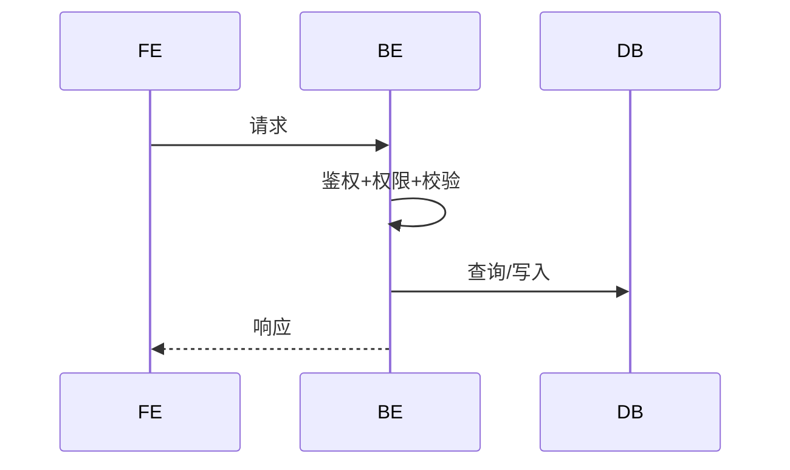

# D02-01 AI 输出：接口规范

> **阶段**：D02·L 接口设计（按系统）
> **上游**：B01(API规范) + C01(同系统权限) + C02(同系统交互) + C03(同系统原型) + D01(共享数据)
> **落盘**：`docs/<system-id>/D02-api/<module-id>/<feature-id>/api-spec.md`

---

## 触发提示词

```
扮演"接口设计师"。
上游（已冻结）：D01 共享数据、C01(同系统) 需求、C02(同系统) 交互、C03(同系统) 原型、B01 API 规范。
系统：<system-id>，模块：<module-id>，功能：<feature-id>
按 /prompt/D-develop/D02-01-AI输出-接口规范.md 输出。
落盘 docs/<system-id>/D02-api/<module-id>/<feature-id>/api-spec.md。
仅产出该系统接口，不跨系统引用。
```

---

## AI 行为约束

1. page-id 映射为 URL + 定义 API 端点
2. **page-id 不增不减**：100% 来自 C02
3. **SM 转移全覆盖**：C02 每条转移有接口承接
4. **入参/出参可溯源**：字段在 D01 有对应
5. **错误码遵守 B01**
6. **不写 UI/HTML**
7. 未决项写 §8

---

## 输出结构（单文件）

```markdown
# 接口规范 · <feature-id>

> **系统**：<system-id>
> **关联 R-ID**：R-XXX
> **不做**：表结构(D01)、页面/原型(C02/C03)

## 1. 路由表

### 1.1 page-id → URL 映射
| page-id | 页面名称 | URL | 鉴权 | 可见角色 |

> page-id 与 C02 页面清单一一对应。

### 1.2 URL 命名规则

## 2. 接口清单
| API-ID | 方法 | 路径 | 职责 | 角色 | R-ID | OP-ID | SM 转移 |

> API-ID：`API-<system>-<module>-<verb>-<noun>`

## 3. 接口详情

### 3.X `<METHOD> <PATH>` · <职责>

**基础**
| 项 | 值 |
|----|-----|
| API-ID | |
| OP-ID | |
| SM 转移 | |
| R-ID | |
| 角色 | |
| 行级权限 | |
| 幂等 | |
| 事务 | |

**请求参数**（Path/Query/Body 分列）
| 字段 | 类型 | 必填 | 校验 | 说明 | D01 来源 |

**业务流程**


**业务规则校验**
| BR-ID | 校验内容 | 失败错误码 |

**状态转移**（如承接 SM）
| SM-ID:T-X | 起态 | 终态 | 条件 | 后置动作 |

**成功响应**
```json
{ "code": 0, "data": { }, "msg": "ok" }
```

**失败响应**
| HTTP | code | 含义 | 触发条件 |

**副作用**（事件/通知/日志）

## 4. 错误码定义
| code | HTTP | 含义 | 文案 | 触发接口 |

## 5. 并发与幂等
| API-ID | 并发场景 | 策略 | 失败处理 |

> 策略：乐观锁 / 悲观锁 / 幂等键 / 队列 / 无需

## 6. 事件/Webhook（如需）
| 事件名 | 触发接口 | 同步/异步 | 载荷概要 | 消费方 |

## 7. 增量融合报告
### 7.1 本轮新增 / 融合点 / 冲突点

## 8. 待确认问题
| 编号 | 问题 | AI 默认方案 | 影响 |
```

---

## 质量自检

**完整性**
- [ ] 每接口有参数、时序图、响应？
- [ ] 标注角色和行级权限？
- [ ] 入参字段在 D01 有来源？错误码与 B01 一致？
- [ ] 写接口有并发/幂等策略？

**与 C02 对齐**
- [ ] page-id 全覆盖？SM 转移全覆盖？
- [ ] 鉴权与页面角色一致？每接口映射 OP-ID？

**与 D01/C01 对齐**
- [ ] 字段名/类型一致？校验规则与 BR-ID 一致？
- [ ] 每 R-ID 有接口承接？角色与权限矩阵一致？

**边界**
- [ ] 未写 UI/HTML？未修改 SM？未增删 page-id？
- [ ] API-ID 带 system 前缀？落盘在 `docs/<system-id>/D02-api/`？
- [ ] 不跨系统？单文件<=1200 行？
