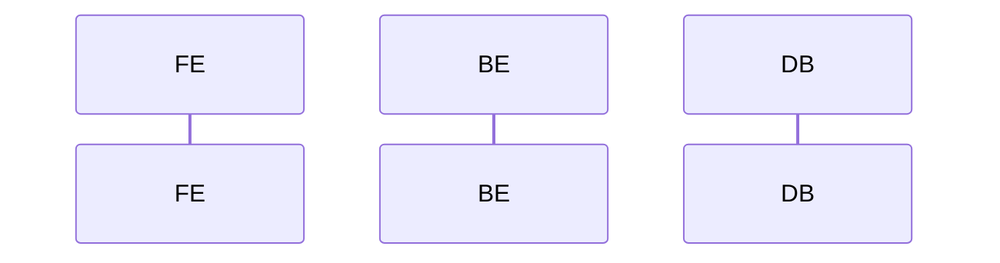

# D02-01 AI 输出：接口规范

> **阶段**：D02·L 接口设计（按系统）
> **上游**：B01(API规范) + C01(同系统权限) + C02(同系统交互) + C03(同系统原型) + D01(共享数据)
> **落盘**：`docs/D02-api/<system-id>/<module-id>/<feature-id>/api-spec.md`

---

## 触发提示词

```
扮演"接口设计师"。
上游（已冻结）：D01 共享数据、C01(同系统) 需求、C02(同系统) 交互、C03(同系统) 原型、B01 API 规范。
系统：<system-id>，模块：<module-id>，功能：<feature-id>
按 /prompt/D-develop/D02-01-AI输出-接口规范.md 输出。
落盘 docs/D02-api/<system-id>/<module-id>/<feature-id>/api-spec.md。
仅产出该系统接口，不跨系统引用。
```

---

## AI 行为约束

1. page-id 映射为 URL + 定义 API 端点
2. **page-id 不增不减**：100% 来自 C02
3. **SM 转移全覆盖**：C02 每条转移有接口承接
4. **入参/出参可溯源**：字段在 D01 有对应
5. **错误码遵守 B01**
6. **不写 UI/HTML**
7. 未决项写 §99
8. **精简原则**：接口职责≤10 字、时序图仅保留关键交互、空节写"无"、禁止重复 D01 已有的字段定义或 C02 已有的流程描述
9. 接口实现代码落盘于 `system/` 下对应后端工程目录，禁止放在项目根目录
10. **生成后强制自检**：完成全部输出后，必须逐条对照 C01 R-ID 清单（确认每条有接口承接）、C02 SM 转移表（确认每条转移有接口驱动）、D01 字段表（确认入参/出参字段名和类型一致）。发现不一致或遗漏必须在 §99 声明

---

## 输出结构（单文件）

```markdown
# 接口规范 · <feature-id>

> **系统**：<system-id>
> **关联 R-ID**：R-XXX
> **不做**：表结构(D01)、页面/原型(C02/C03)

## 1. 路由表

### 1.1 page-id → URL 映射
| page-id | 页面名称 | URL | 鉴权 | 可见角色 |

> page-id 与 C02 页面清单一一对应。

## 2. 接口清单
| API-ID | 方法 | 路径 | 职责(≤10字) | 角色 | R-ID | SM 转移 |

> API-ID：`API-<system>-<module>-<verb>-<noun>`

## 3. 接口详情

### 3.X `<METHOD> <PATH>` · <职责>

**基础信息**
| 项 | 值 |
|----|-----|
| API-ID | |
| SM 转移 | 无 / SM-XXX:TR-XXX |
| R-ID | |
| 角色 | |
| 行级权限 | |
| 幂等 | 是/否 |

**请求参数**（Path/Query/Body 分列）
| 位置 | 字段 | 类型 | 必填 | 校验(一句) | D01 来源 |

**业务流程**（时序图，仅关键交互）


**业务规则**
| BR-ID | 校验内容 | 失败 code |

**成功响应**
```json
{ "code": 0, "data": { }, "msg": "ok" }
```

**失败响应**
| HTTP | code | 含义 | 触发条件 |

**副作用**（无则写"无"）

## 4. 错误码汇总
| code | HTTP | 含义 | 文案 | 触发接口 |

## 5. 并发与幂等（无需则写"无"）
| API-ID | 并发场景 | 策略 | 失败处理 |

## 6. 事件/Webhook（无则写"无"）
| 事件名 | 触发接口 | 同步/异步 | 载荷概要 | 消费方 |

## 7. 增量融合报告
### 7.1 本轮新增 / 融合点 / 冲突点

## 8. 自检报告

> 生成后必须执行，逐项打勾。任何一项未通过必须修正后重新输出或在 §99 声明。

**R-ID 覆盖**
- [ ] 逐条列出 C01 每条 R-ID → 对应 API-ID，无遗漏？

**SM 转移覆盖**
- [ ] C02 每条 SM 转移 → 对应 API-ID，无遗漏？

**D01 一致性**
- [ ] 入参/出参字段名、类型与 D01 实体字段一致？
- [ ] 校验规则与 D01 BR-ID 一致？

**B01 一致性**
- [ ] 错误码范围遵守 B01？URL 命名遵守 B01？

**page-id 覆盖**
- [ ] page-id 100% 来自 C02，不增不减？

**边界**
- [ ] 未写 UI/HTML？未修改 SM？
- [ ] API-ID 带 system 前缀？不跨系统？单文件<=1200 行？

## 99. 待确认问题
| 编号 | 问题 | AI 默认方案 | 影响 |
```
