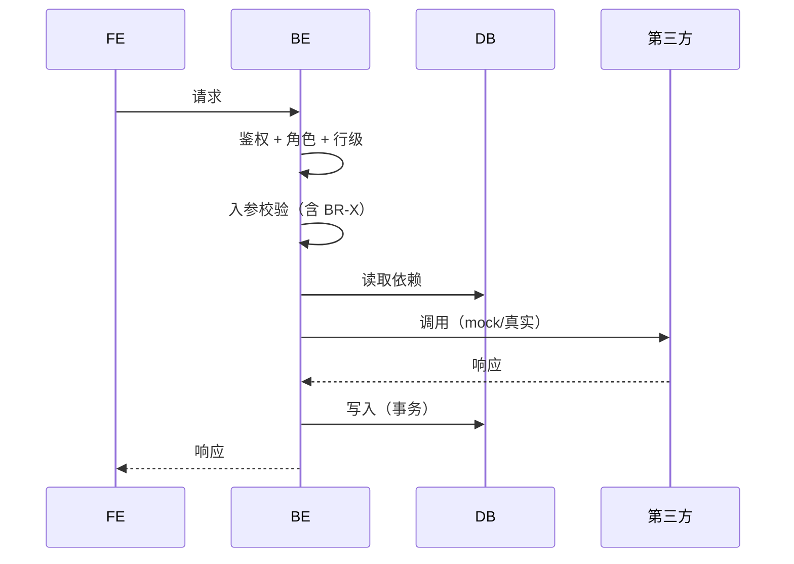

# 37 · L03 AI 输出：接口规范模板

> **阶段**：L 业务接口
> **谁产出**：AI（接口设计师 + 路由设计师）
> **落盘**：`docs/D02-api/<feature-id>/` + `docs/D02-api/_global-routes.md`

---

## AI 必须遵守

1. **本阶段同时承担"路由"与"接口"两件事**：
   - 路由：把 C02 IA `04-pages.md` 中的 page-id 反向映射成 URL 路径（含鉴权、URL 命名规则、语言策略）
   - 接口：API endpoint
2. **page-id 必须 100% 来自 C02 04-pages.md**；不得新增/删改 page-id（如发现需要新增页面，必须先回 C02 修订）。
3. **API 必须覆盖 C02 03-state-machines.md 的所有状态转移**；每条 SM 转移都要有承接接口。
4. 路径/响应/错误码遵守 docs/B01-architecture/04-api-conventions.md。
5. 入参/出参字段必须能在 docs/D01-data/<feature-id>/02-entities/ 找到（计算字段除外）。
6. 每个接口必须反向映射到 docs/C04-pages/<feature-id>/<page-id>.md 中的 OP-ID。

---

## 触发提示词

```
我已答完 L 澄清。请按 /prompt/D-develop/D02-L03-AI输出-接口规范.md 多文件结构输出，
落盘到 docs/D02-api/<feature-id>/，并同步更新 docs/D02-api/_global-routes.md。
路径/响应/错误码必须遵守 docs/B01-architecture/04-api-conventions.md。
权限要求引用 docs/C02-permissions/01-roles.md 中的角色 ID。
01-routes-delta.md 中的 page-id 必须与 docs/C03-ia/<feature-id>/04-pages.md 一一对应（不增不减）。
入参/出参字段必须能在 docs/D01-data/<feature-id>/02-entities/ 找到对应实体字段（计算字段除外）。
每个接口必须反向映射到 docs/C04-pages/<feature-id>/<page-id>.md 中的 OP-ID。
docs/C03-ia/<feature-id>/03-state-machines.md 中每条状态转移都必须有接口承接（在 03-endpoints/<file>.md 的"承接 SM 转移"小节标出）。
未决项写入 99-open-questions.md。
```

---

## 输出多文件清单

```
docs/D02-api/_global-routes.md             # 跨 feature 的全局路由表（增量同步本 feature）
docs/D02-api/<feature-id>/
  00-index.md
  01-routes-delta.md      # 本 feature 的 page-id ↔ URL 映射 + 鉴权 + URL 命名规则 + 语言策略
  02-overview.md          # 资源、URL 前缀、共用 query 参数
  03-endpoints/           # 一接口一文件
    <method>-<path>.md
  04-error-codes.md       # 本 feature 的错误码
  05-concurrency.md       # 幂等 / 限流 / 锁 / 事务策略汇总（无则写 N/A）
  06-events.md            # 本 feature 触发的事件/Webhook（如有）
  99-open-questions.md
```

---

## 文件 1：`00-index.md`

```markdown
<!-- TARGET-PATH: docs/D02-api/<feature-id>/00-index.md -->

# 路由与接口规范 · <feature-id> · 索引

> **阶段**：L · 接口设计师 + 路由设计师
> **关联 R-ID**：R-XXX
> **上游**：docs/B01-architecture/04-api-conventions.md、docs/C02-permissions/、docs/C03-ia/<feature-id>/04-pages.md（page-id 源）、docs/C03-ia/<feature-id>/03-state-machines.md（状态转移覆盖源）、docs/C04-pages/<feature-id>/（OP-ID 源）、docs/D01-data/<feature-id>/、docs/A00-meta/questions/L-<feature-id>-questions-round*-resolved.md
> **本 feature 同步至**：docs/D02-api/_global-routes.md

## 接口一览

| ID | 方法 | 路径 | 职责 | 角色 | R-ID | 反向映射 OP-ID | 承接 SM 转移 | 文件 |
|----|------|------|------|------|------|----------------|-------------|------|
| API-1 | POST | /api/courses | 创建课程 | ROLE-EDITOR | R-002 | OP-2@P-040 | SM-02:T-1 | 03-endpoints/post-courses.md |
| API-2 | GET | /api/courses | 课程列表 | * | R-001 | OP-1@P-002 | — | 03-endpoints/get-courses.md |

## 路由一览
见 [01-routes-delta.md](./01-routes-delta.md)。

## 公共约定补充
- 本 feature 特殊 header / 共享 query 参数
```

---

## 文件 2：`01-routes-delta.md`

```markdown
<!-- TARGET-PATH: docs/D02-api/<feature-id>/01-routes-delta.md -->

# 路由增量 · <feature-id>

> 本文件是本 feature 在路由层面对全局路由表 `_global-routes.md` 的"增量"。
> 必须在 AI 输出后把本表合并到 `_global-routes.md`。

## 1. URL 命名规则（如本 feature 引入新规则）
- 复用全局：见 docs/B01-architecture/04-api-conventions.md 与 _global-routes.md
- 本 feature 例外：<>

## 2. 多语言策略
- [ ] 与全局一致
- [ ] 本 feature 例外：路径前缀 / query / 子域

## 3. page-id ↔ URL 映射（必须与 C02 04-pages.md 一一对应）

| page-id | 名称 | URL 路径 | 鉴权 | 角色可见 | 备注 |
|---------|------|---------|------|---------|------|
| P-001 | 首页 | /  | 公开 | * | landing |
| P-002 | 课程列表 | /courses | 公开 | * | |
| P-003 | 课程详情 | /courses/:id | 公开 | * | |
| P-010 | 订单确认 | /orders/new | 必登 | ROLE-USER | |
| P-040 | 课程管理 | /admin/courses | 必登 | ROLE-EDITOR, ROLE-ADMIN | |

## 4. 系统兜底页路径

| page-id | 类型 | 路径 |
|---------|------|------|
| P-E401 | 401 | /401 |
| P-E403 | 403 | /403 |
| P-E404 | 404 | /404 |
| P-E500 | 500 | /500 |
| P-EMNT | maintenance | /maintenance |

## 5. 自检
- [ ] C02 04-pages.md 所有 page-id 全部出现且仅出现一次
- [ ] 没有臆造 C02 没有的 page-id
- [ ] 鉴权与 C02 05-navigation.md 角色可见性一致
- [ ] 兜底页齐
```

---

## 文件 3：`02-overview.md`

```markdown
<!-- TARGET-PATH: docs/D02-api/<feature-id>/02-overview.md -->

# 资源概览

## 资源
| 资源 | URL 前缀 | 对应实体 |
|------|---------|---------|

## 共享查询参数
| 参数 | 类型 | 默认 | 说明 |
|------|------|------|------|

## 共享 Header
| Header | 何时必带 | 说明 |
|--------|---------|------|
```

---

## 文件 4：`03-endpoints/<method>-<path>.md`（每接口一份）

```markdown
<!-- TARGET-PATH: docs/D02-api/<feature-id>/03-endpoints/<method>-<path>.md -->

# <方法> <路径> · <一句话职责>

- **API-ID**：API-N
- **反向映射 OP-ID**：<page-id>#OP-X（来自 docs/C04-pages/<feature-id>/<page-id>.md）
- **承接 SM 转移**：SM-XX:T-Y, SM-XX:T-Z（来自 docs/C03-ia/<feature-id>/03-state-machines.md；非状态接口写 —）
- **关联 R-ID**：R-XXX
- **角色要求**：ROLE-XXX（多角色用 OR/AND）
- **行级要求**：（如"仅创建者可改"）
- **幂等**：是 / 否（若是，键来自：<>）
- **限流**：<次/分钟 per user>
- **是否事务**：是 / 否

## 请求

### Path Params
| 参数 | 类型 | 必填 | 说明 |
|------|------|------|------|

### Query Params
| 参数 | 类型 | 必填 | 默认 | 说明 |
|------|------|------|------|------|

### Headers
| Header | 必填 | 说明 |
|--------|------|------|

### Body (application/json)

```json
{
  "field": "..."
}
```

| 字段 | 类型 | 必填 | 校验 | 说明 | 来源（D 字段） |
|------|------|------|------|------|---------------|

## 业务流程



## 业务规则与校验
| BR-ID | 校验内容 | 失败错误码 |
|-------|---------|----------|

## 状态转移（如承接 SM）
| SM-ID:T-X | 起态 | 终态 | 触发条件（与 C02 SM 表完全一致）| 后置动作 |
|----------|------|------|----------------------------|---------|

## 副作用
- 写日志：…
- 触发事件：…（链 06-events）
- 发通知：…

## 响应

### 成功（HTTP 200）

```json
{ "code": 0, "data": { ... }, "msg": "ok" }
```

| 字段 | 类型 | 说明 | 角色裁剪 |
|------|------|------|---------|

### 失败（按错误码）

| HTTP | 业务 code | 含义 | 触发条件 |
|------|----------|------|---------|

## 示例

### 请求
```bash
curl -X POST ...
```

### 成功响应
```json
```

### 失败响应
```json
```

## 第三方依赖与 mock
- 依赖：<>
- mock 文件：`mocks/<feature>/<endpoint>.json`
- 真实化时机：

## 测试要点
- 鉴权穿透
- 越权
- 边界值
- 幂等
- 限流
- 状态转移正确（如承接 SM）
```

---

## 文件 5：`04-error-codes.md`

```markdown
<!-- TARGET-PATH: docs/D02-api/<feature-id>/04-error-codes.md -->

# 错误码（feature 内）

> 全局段位见 B01 04-api-conventions。本表只列本 feature 占用的具体码。

| code | HTTP | 含义 | 提示文案 (zh) | 提示文案 (en) | 触发接口 |
|------|------|------|-------------|--------------|---------|
| 40901 | 409 | 课程上架后名称不可改 | … | … | API-3 |
```

---

## 文件 6：`05-concurrency.md`

```markdown
<!-- TARGET-PATH: docs/D02-api/<feature-id>/05-concurrency.md -->

# 并发 / 幂等 / 限流 / 锁

| API-ID | 并发场景 | 处理策略（乐观锁 / 悲观锁 / 队列 / 幂等键）| 失败处理 |
|--------|---------|--------------------------------------|---------|
```

---

## 文件 7：`06-events.md`（如有）

```markdown
<!-- TARGET-PATH: docs/D02-api/<feature-id>/06-events.md -->

# 事件 / Webhook

| 事件名 | 触发接口 | 同步/异步 | 载荷 schema | 消费方 |
|-------|---------|----------|------------|-------|
```

---

## 文件 8：`99-open-questions.md`

```markdown
<!-- TARGET-PATH: docs/D02-api/<feature-id>/99-open-questions.md -->

# 待确认问题
```

---

## 文件 9：`docs/D02-api/_global-routes.md`（增量同步）

```markdown
<!-- TARGET-PATH: docs/D02-api/_global-routes.md -->

# 全局路由表

> 跨 feature 共享的路由总览。每个 feature L 阶段产出后，将 01-routes-delta.md 合并到本表。

## URL 命名规则
- 资源用复数：/courses, /orders
- 详情：/<resource>/:id
- 子资源：/<resource>/:id/<sub>
- 后台前缀：/admin/...
- API 前缀：/api/...

## 多语言策略
- 默认：<>
- 切换方式：<>

## 路由表

| feature-id | page-id | 名称 | URL | 鉴权 | 角色 | 来源文件 |
|-----------|---------|------|-----|------|------|---------|
| course | P-001 | 首页 | / | 公开 | * | docs/D02-api/course/01-routes-delta.md |
| course | P-040 | 课程管理 | /admin/courses | 必登 | ROLE-EDITOR, ROLE-ADMIN | … |

## 系统兜底页（全局）
| page-id | 类型 | 路径 |
|---------|------|------|
| P-E401 | 401 | /401 |
| P-E403 | 403 | /403 |
| P-E404 | 404 | /404 |
| P-E500 | 500 | /500 |

## 一致性自检
- [ ] 每个 feature 的 C02 04-pages.md 中所有 page-id 都已合并
- [ ] 没有 URL 冲突
- [ ] 鉴权与 C02 05-navigation.md 一致
```

---

## 输出质量自检

- [ ] **C02 04-pages.md 中所有 page-id 都在 01-routes-delta.md 出现且无遗漏**？
- [ ] **C02 03-state-machines.md 中所有 SM 转移都有接口承接**（在某接口的"承接 SM 转移"出现）？
- [ ] 每个 R-ID 都至少有 1 个接口承接？
- [ ] 每个接口都标了角色要求 + 行级要求？
- [ ] 每个接口的入参字段都能在 D 找到（计算字段除外）？
- [ ] 错误码范围与全局段位一致、不冲突？
- [ ] 每个接口都有时序图？
- [ ] _global-routes.md 已同步本 feature 增量？
- [ ] 单文件 ≤ 1200 行（接口多就拆 03-endpoints/ 子目录）？
