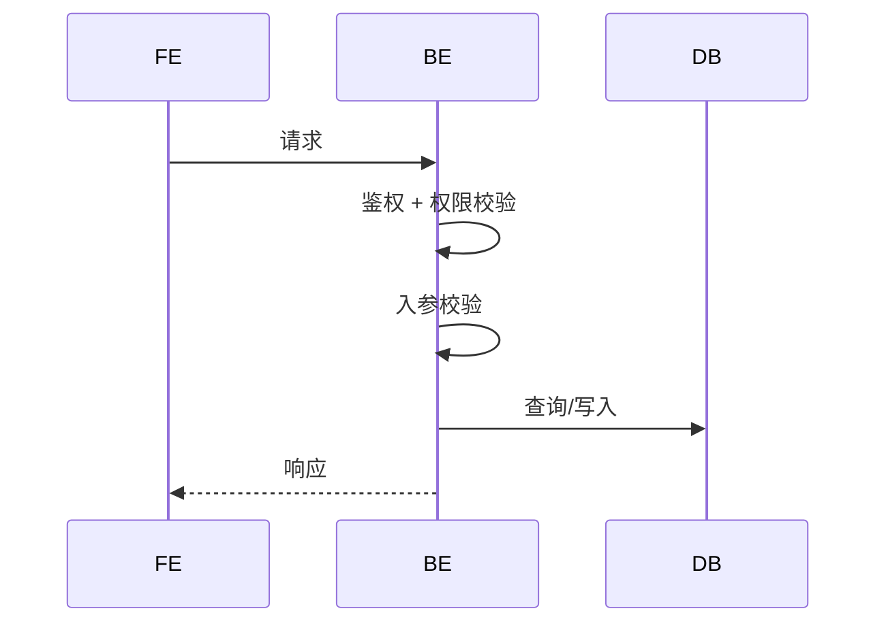

# D02-01 · AI 输出：接口规范

> **阶段**：D02 · 接口设计（按功能循环）
> **归属**：**按系统独立（_surface）**——每个系统有独立的 API 接口
> **角色**：接口设计师
> **步骤**：1 步 —— AI 基于上游冻结产物直接输出，无需用户额外输入
> **上游依赖**（只读）：B01 技术架构产物(API规范) + C01 共享需求与权限(权限矩阵) + C02 **同系统**架构与交互 + C03 **同系统** HTML 原型 + D01 **共享**数据规范
> **落盘**：`docs/<surface-id>/D02-api/<module-id>/<feature-id>/api-spec.md`
> **下游消费**：进入该系统的功能开发

---

## 一、触发提示词

```
请你扮演"接口设计师"。

上游（只读，已冻结）：
- D01（共享）：本功能数据规范（ER、实体、枚举、业务规则、索引）→ docs/_shared/D01-data/
- C01（共享）：需求清单（R-ID）、角色权限矩阵 → docs/_shared/C01-requirements/
- C02（同系统）：功能清单、状态机（SM-ID）、页面清单（page-id）、单页布局与行为（OP-ID）→ docs/<surface>/C02-ia-interaction/
- C03：HTML 原型
- B01：技术选型、API 规范（路径风格、响应格式、错误码段位、鉴权方案）

本模块 ID：<module-id>
本功能 ID：<feature-id>
关联 R-ID：<R-001, R-002, ...>

本系统 ID：<surface-id>

请严格按 /prompt/D-develop/_surface/D02-01-AI输出-接口规范.md 模板输出本系统本功能的接口规范。
落盘到 docs/<surface-id>/D02-api/<module-id>/<feature-id>/api-spec.md。
注意：仅产出该系统的接口。共享数据引用 docs/_shared/D01-data/。不跨系统引用其他系统的 D02 产出。
```

---

## 二、AI 行为约束

1. **路由与接口同时承担**：把 C02 页面清单中的 page-id 映射为 URL 路径，同时定义 API 端点
2. **page-id 不增不减**：page-id 100% 来自 C02 页面清单；如发现需要新增页面，必须声明回 C02 修订
3. **SM 转移全覆盖**：C02 状态机中每条状态转移都必须有接口承接
4. **入参/出参可溯源**：接口字段必须能在 D01 实体定义中找到对应（计算字段除外）
5. **错误码遵守 B01**：错误码段位按 B01 API 规范分配，不冲突
6. **不写 UI / 视觉 / HTML**：页面层面的内容属于 C02/C03
7. **未决项集中声明**：所有不确定的设计决策集中放在末尾"待确认问题"中

---

## 三、输出结构

AI 按以下顺序，在**单文件**内输出所有内容。

---

### 1. 概述

```markdown
# 接口规范 · <feature-id>

> **功能名称**：
> **归属**：按系统独立
> **系统**：<surface-id>
> **关联 R-ID**：R-XXX, R-XXX
> **上游依赖**：D01 共享数据规范、C01 共享需求、C02 同系统交互规范、C03 同系统原型、B01 API 规范
> **本阶段不做**：数据库表结构（在 D01 共享）、页面布局/原型（在 C02/C03 同系统）
```

---

### 2. 全局路由表（增量）

本功能对全局路由表的增量贡献。每个 feature 的路由增量最终需合并到全局路由表。

#### 2.1 page-id 与 URL 映射

| page-id | 页面名称 | URL 路径 | 鉴权 | 可见角色 | 备注 |
|---------|---------|---------|------|---------|------|
| P-001 | 课程列表 | /courses | 公开 | * | |
| P-002 | 课程详情 | /courses/:id | 公开 | * | |
| P-010 | 课程管理 | /admin/courses | 必登 | ROLE-EDITOR, ROLE-ADMIN | |

> page-id 必须与 C02 页面清单一一对应，不增不减。

#### 2.2 URL 命名规则

- 是否有本功能特有的路由例外（无则写"遵循 B01 全局规则"）
- 多端项目的 surface 前缀说明（如适用）

---

### 3. 接口清单

总览表，每个接口一行。

| API-ID | 方法 | 路径 | 职责 | 角色要求 | 关联 R-ID | 对应 OP-ID | 承接 SM 转移 |
|--------|------|------|------|---------|----------|-----------|-------------|
| API-app-course-create-courses | POST | /api/app/courses | 创建课程 | ROLE-EDITOR | R-002 | OP-1@P-app-course-010 | SM-01:T-01 |
| API-app-course-list-courses | GET | /api/app/courses | 课程列表 | * | R-001 | OP-1@P-app-course-001 | -- |

> **API-ID 命名**：`API-<surface>-<module>-<verb>-<noun>`，verb 取 create/list/get/update/delete/<业务动作>，noun 取资源复数名。API-ID 必须带 surface 前缀。

---

### 4. 接口详情

每个接口一个子节。

#### 4.X `<METHOD> <PATH>` · <一句话职责>

**基础信息**

| 项 | 值 |
|----|-----|
| API-ID | API-xx-xxx |
| 对应 OP-ID | OP-X@P-XXX（来自 C02 单页行为） |
| 承接 SM 转移 | SM-XX:T-Y（来自 C02 状态机）/ 无 |
| 关联 R-ID | R-XXX |
| 角色要求 | ROLE-XXX |
| 行级权限 | 如"仅创建者可改" / 无 |
| 幂等 | 是（键来源：XX）/ 否 |
| 事务 | 是 / 否 |

**请求参数**

Path Params（如有）：

| 参数 | 类型 | 必填 | 说明 |
|------|------|------|------|

Query Params（如有）：

| 参数 | 类型 | 必填 | 默认值 | 说明 |
|------|------|------|--------|------|

Request Body（如有）：

| 字段 | 类型 | 必填 | 校验规则 | 说明 | D01 来源字段 |
|------|------|------|---------|------|-------------|

**业务流程**



> 涉及第三方调用时增加 EXT participant。流程步骤需体现关键业务规则校验节点。

**业务规则校验**

| BR-ID | 校验内容 | 失败错误码 |
|-------|---------|----------|
| BR-01 | 上架后不可改标题 | 40901 |

**状态转移**（如承接 SM 转移）

| SM-ID:T-X | 起态 | 终态 | 触发条件 | 后置动作 |
|-----------|------|------|---------|---------|

> 转移规则与 C02 状态机表完全一致；此处仅标注接口承接关系，不重定义转移逻辑。

**成功响应**

```json
{ "code": 0, "data": { }, "msg": "ok" }
```

| 字段 | 类型 | 说明 |
|------|------|------|

**失败响应**

| HTTP 状态码 | 业务 code | 含义 | 触发条件 |
|------------|----------|------|---------|

**副作用**（如有）

- 事件触发：（链接事件节）
- 通知：
- 日志：

---

### 5. 错误码定义

本功能占用的错误码清单。段位按 B01 API 规范分配。

| code | HTTP | 含义 | 提示文案 | 触发接口 |
|------|------|------|---------|---------|
| 40901 | 409 | 课程上架后名称不可改 | 上架后不可修改课程名称 | API-xx-update-courses |

---

### 6. 并发与幂等策略

| API-ID | 并发场景 | 策略 | 失败处理 |
|--------|---------|------|---------|
| API-xx-update-courses | 多人同时编辑 | 乐观锁（version 字段） | 409 冲突提示 |

> 策略取值：乐观锁 / 悲观锁 / 幂等键 / 队列 / 无需处理
> 无并发风险的接口可不列出，但需在下方声明"以下接口无并发风险：..."

---

### 7. 事件/Webhook（如需要）

| 事件名 | 触发接口 | 同步/异步 | 载荷概要 | 消费方 |
|--------|---------|----------|---------|--------|

> 无事件需求则写"本功能无事件/Webhook 需求"。

---

### 8. 待确认问题

| 编号 | 问题 | AI 默认方案 | 影响范围 |
|------|------|-----------|---------|
| OQ-01 | ... | ... | 接口 XX / 错误码 XX |

---

### 9. AI 自检清单

AI 输出完成后，必须逐项自检并在每项后标注 PASS / FAIL。任何 FAIL 项必须在正文中修正后再提交。

**产出完整性**

- [ ] 每个接口都有完整的请求参数、业务流程时序图、成功/失败响应
- [ ] 每个接口都标注了角色要求和行级权限
- [ ] 每个接口的入参字段都能在 D01 实体定义中找到来源（计算字段除外）
- [ ] 错误码段位与 B01 全局规范一致且不冲突
- [ ] 并发/幂等策略已覆盖所有写接口

**上游一致性 —— 与 C02 对齐**

- [ ] C02 页面清单中所有 page-id 都在路由表中出现，无遗漏无多余
- [ ] C02 状态机中所有 SM 转移都有接口承接（无未覆盖的转移）
- [ ] 路由鉴权要求与 C02 页面清单中的角色可见性一致
- [ ] 每个接口都反向映射到了 C02 中的 OP-ID

**上游一致性 —— 与 D01 对齐**

- [ ] 接口入参/出参字段名、类型与 D01 实体字段一致
- [ ] 接口校验规则与 D01 业务规则（BR-ID）一致
- [ ] 状态枚举值与 D01 枚举定义一致（二者都来自 C02 SM）

**上游一致性 —— 与 C01 对齐**

- [ ] 每个 R-ID 至少有一个接口承接
- [ ] 角色 ID 引用与 C01 角色权限矩阵一致

**覆盖维度检查**

- [ ] 资源命名风格统一（REST vs RPC，已做决策）
- [ ] 列表接口的筛选/排序/分页参数完整
- [ ] 长任务有状态查询方案（如存在 >2s 的操作）
- [ ] 限流策略已覆盖敏感写接口
- [ ] 第三方依赖的失败兜底已说明（如有）
- [ ] 响应中敏感字段已标注脱敏/裁剪规则（如有）

**边界检查**

- [ ] 未写 UI / 视觉 / HTML 内容
- [ ] 未修改 C02 状态机的转移规则
- [ ] 未增删 C02 页面清单中的 page-id
- [ ] API-ID 带 surface 前缀（`API-<surface>-<module>-<verb>-<noun>`）
- [ ] 产出落盘到 `docs/<surface-id>/D02-api/` 下，未放到 _shared 或其他系统目录
- [ ] 未跨系统引用其他系统的 D02 产出
- [ ] 单文件 ≤ 1200 行
