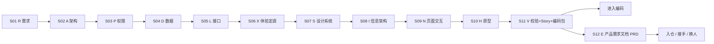

# 03 · G02 · 端到端工作流

> 串起 12 个阶段的总指挥手册。每一步告诉你：用哪份模板、给 AI 喂什么、产物落到哪、过什么 Gate。

---

## 一、阶段总线

> D/L 与 N 是**按功能**循环执行；A/P/X/S/I/H/E 是**全局一次性**沉淀。
> E 阶段可与编码并行开展（只要 V 已过 Gate），不必等代码写完才能起草 PRD；PRD 的事实来源是上游冻结产物，不是代码。

---

## 二、阶段闸门一览

| Gate | 名称 | 检查项（要点） |
|------|------|--------------|
| G-R | 需求闸门 | 无未决问题；流程主路径+异常路径齐；每条需求有唯一 R-ID |
| G-A | 架构闸门 | 技术栈、目录、DB/API/编码规范全部锁死；无遗留问题 |
| G-P | 权限闸门 | 角色枚举与 R 一致；认证流程闭合 |
| G-D | 数据闸门 | 字段齐、状态机闭合、校验完整、引用 A 数据库规范 |
| G-L | 接口闸门 | 覆盖所有 D 中的操作；错误码完备；与 D 字段一一对齐 |
| G-X | 体验闸门 | 有 ≥3 参照、≥3 反例、≥5 个可验证形容词 |
| G-S | 设计闸门 | Token 完备、组件 4 态齐、调性与 X 吻合 |
| G-I | IA 闸门 | 每个 R-ID 至少一个页面承载；路由结构清晰 |
| G-N | 交互闸门 | 单页元素齐、4 态齐、与 D/L/S/P 引用对齐 |
| G-H | 原型闸门 | 可点通；空/错/loading/无权限 4 态；三轮内稳定 |
| G-V | 校验闸门 | 一致性零红；Story ≤ 半天；编码包 ≤ 1200 行 |
| G-E | PRD 闸门 | 17 份子文件全部产出；每句话可回链上游 ID；术语统一使用 E01 §6；范围声明三桶完整覆盖；99 节为空 |

---

## 三、AI 上下文最小喂养表

> 开每一步对话时，**只**把下表列出的文件作为系统消息上传，禁止"以防万一全塞"。

| 步骤 | 系统消息（上文） | 用户消息（本轮输入） |
|------|----------------|-------------------|
| R 提问 | S00-01, S00-03, S01-R02 | R 用户输入 |
| R 输出 | S00-01, S00-03, S01-R03, R 提问已答 | 按 S01-R03 出基线 |
| A 提问 | S00-01, S00-03, S02-A02, R 基线 | A 用户输入 |
| A 输出 | S00-01, S00-03, S02-A03, R 基线, A 提问已答 | 按 S02-A03 出架构规范 |
| P 提问 | S00-01, S00-03, S03-P02, R 基线, A 输出 | P 用户输入 |
| P 输出 | S00-01, S00-03, S03-P03, R 基线, A 输出, P 提问已答 | 按 S03-P03 出权限规范 |
| D 提问 | S00-01, S00-03, S04-D02, R 基线, A 输出（DB 规范节）, P 输出 | D 用户输入 |
| D 输出 | 同上 + D 提问已答 + S04-D03 模板 | 按 S04-D03 出数据规范 |
| L 提问 | S00-01, S00-03, S05-L02, R 基线, A 输出（API 规范节）, P 输出, D 输出（本功能） | L 用户输入 |
| L 输出 | 同上 + L 提问已答 + S05-L03 模板 | 按 S05-L03 出接口规范 |
| X 提问 | S00-01, S00-03, S06-X02, R 基线 | X 用户输入 |
| X 输出 | S00-01, S00-03, S06-X03, R 基线, X 提问已答 | 按 S06-X03 出体验定调 |
| S 提问 | S00-01, S00-03, S07-S02, A 输出（前端栈）, X 输出 | S 用户输入 |
| S 输出 | 同上 + S07-S03 模板 + S 提问已答 | 按 S07-S03 出设计系统 |
| I 提问 | S00-01, S00-03, S08-I02, R 基线, P 输出 | I 用户输入 |
| I 输出 | 同上 + S08-I03 模板 + I 提问已答 | 按 S08-I03 出 IA 与页面清单 |
| N 提问 | S00-01, S00-03, S09-N02, S 输出, P 输出, D 输出（本功能）, L 输出（本功能）, I 输出（相关页面节） | N 用户输入 |
| N 输出 | 同上 + S09-N03 模板 + N 提问已答 | 按 S09-N03 出页面交互规范并做场景验证 |
| H 输出 | S00-01, S00-03, S10-H02, S 输出, I 输出, N 输出（涉及页面）, D 输出（用于 mock 数据形态） | 按 S10-H02 出 HTML 原型 |
| H 迭代 | 同上 + H 用户输入（变更清单） | 按变更清单出 vN+1 + changelog |
| V1 校验 | S00-01, S00-03, S11-V01, R 基线, A/P/S/I 输出, 当前功能的 D/L/N 输出 | 按 S11-V01 出一致性报告 |
| V2 Story | S00-01, S00-03, S11-V02, V1 已通过 | 按 S11-V02 拆 Story |
| V3 编码包 | S00-01, S00-03, S11-V03, V2 已通过 | 按 S11-V03 打编码包 |
| E 提问 | S00-01, S00-03, S12-E02, R 基线, A / P / D / L / X / S / I / N / H / V 全部冻结产物 | E 用户输入（产品背景） |
| E 输出 | 同上 + S12-E03 模板 + E 提问已答 | 按 S12-E03 出 PRD 多文件包 |

> 反例：在 D 阶段塞 X/S 输出 → 污染数据建模。D 阶段只关心"数据本身"。
> 反例：在 E 阶段塞完整代码库 → PRD 会被实现细节带偏。E 阶段的事实来源是上游冻结文档，不是代码。

---

## 四、人机分工速查

| 动作 | 人 | AI |
|------|----|-----|
| 把模糊业务说成话 | ✅ |  |
| 把话整理成结构化需求 |  | ✅ |
| 决定要不要做某需求 | ✅ |  |
| 画流程/状态/ER 图（mermaid）|  | ✅ |
| 选技术栈 | 给约束 | 出方案 |
| 写表结构字段 |  | ✅ |
| 决定字段是否合理 | ✅ |  |
| 写接口契约 |  | ✅ |
| 决定接口是否够用 | ✅ |  |
| 定产品调性与参照 | ✅ | 协助归纳 |
| 出设计 Token / 组件 |  | ✅ |
| 决定 Token 是否合调 | ✅ |  |
| 写 HTML 原型 |  | ✅ |
| 验收原型 | ✅ |  |
| 写代码 |  | ✅（V3 打包后） |

---

## 五、新项目启动 Checklist

- [ ] 在仓库根创建 `docs/` 目录（按 04-文档目录规划）
- [ ] 复制 10 模板，填需求初稿，跑 R 阶段三件套，过 G-R
- [ ] 跑 A/P 阶段，过 G-A、G-P
- [ ] 列出本期所有功能 ID
- [ ] 逐功能跑 D、L 阶段（可并行多功能），过 G-D、G-L
- [ ] 跑 X、S 阶段，过 G-X、G-S
- [ ] 跑 I 阶段，过 G-I
- [ ] 逐功能/页面跑 N 阶段，过 G-N
- [ ] H 出原型，迭代到稳定，过 G-H
- [ ] 逐功能跑 V1/V2/V3，过 G-V
- [ ] 进入编码
- [ ] V 通过后跑 E 阶段三件套，出 PRD 多文件包，过 G-E
- [ ] PRD 入仓并冻结 v1.0；后续每次产品形态变更走 PRD changelog

---

## 六、变更管理

任何已冻结文件需要修改：
1. 在原文件头"冻结状态"改为"变更中"
2. 新开一轮对话，让 AI **先生成 diff 报告**（影响哪些下游文件）再改
3. 受影响的下游文件全部需要重跑对应阶段验证
4. 重新签字冻结

> 冻结后偷偷改 → 下游所有引用断裂，调试地狱。
