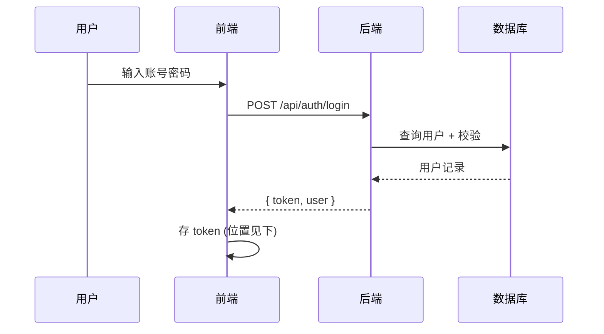
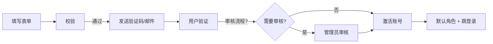

# 18 · P AI 输出：权限与认证规范模板

> **阶段**：P 权限与角色
> **谁产出**：AI（安全/权限工程师）
> **落盘**：`docs/S03-permissions/` 下多文件

---

## 触发提示词

```
我已答完 P 澄清。请按 /prompt/S03-P03-AI输出-权限规范.md 多文件结构输出到 docs/S03-permissions/。
认证方案必须与 A 输出 01-tech-stack 中的鉴权基础设施一致。
角色枚举必须与 R 基线 §3 一致（不可多不可少）。
未决项写入 99-open-questions.md。
```

---

## 输出多文件清单

```
docs/S03-permissions/
  00-index.md
  01-roles.md
  02-auth-flow.md
  03-authz-mechanism.md
  04-user-data-model.md
  05-registration.md
  99-open-questions.md
```

---

## 文件 1：`00-index.md`

```markdown
<!-- TARGET-PATH: docs/S03-permissions/00-index.md -->

# 权限与认证规范 · 索引

> **阶段**：P · 安全/权限工程师
> **上游依赖**：R 基线, A 输出, P-questions-resolved
> **冻结状态**：未冻结

## 文件清单

| 序号 | 文件 | 职责 |
|------|------|------|
| 01 | 01-roles.md | 角色定义与权限矩阵 |
| 02 | 02-auth-flow.md | 登录/登出/Token/会话 |
| 03 | 03-authz-mechanism.md | 前端守卫 + 后端拦截 + 行级控制 |
| 04 | 04-user-data-model.md | 用户/角色相关表（细化的业务表留 D 阶段） |
| 05 | 05-registration.md | 注册流程 |
| 99 | 99-open-questions.md | 未决问题 |
```

---

## 文件 2：`01-roles.md`

```markdown
<!-- TARGET-PATH: docs/S03-permissions/01-roles.md -->

# 角色定义

## 角色枚举

| 角色 ID | 显示名 | 对应 R 基线角色 | 优先级 |
|--------|-------|---------------|--------|
| ROLE-USER | 普通用户 | ... | 1 |
| ROLE-EDITOR | 内容编辑 | ... | 50 |
| ROLE-ADMIN | 超管 | ... | 99 |

## 多角色策略
- 一个用户可拥有多个角色：是 / 否
- 角色冲突时按"优先级"取最高

## 全局权限矩阵（页面/功能点级）

| 资源 / 操作 | ROLE-USER | ROLE-EDITOR | ROLE-ADMIN |
|------------|-----------|-------------|-----------|
| 公开页 | ✅ | ✅ | ✅ |
| 个人中心 | ✅(自己) | ✅(自己) | ✅(任意) |
| 课程管理 | ❌ | ✅ | ✅ |
| 用户管理 | ❌ | ❌ | ✅ |
| 报表 | ❌ | ❌ | ✅ |

> 具体到接口的权限校验，落到 L 阶段每个接口节内引用本表。
```

---

## 文件 3：`02-auth-flow.md`

```markdown
<!-- TARGET-PATH: docs/S03-permissions/02-auth-flow.md -->

# 认证流程

## 登录



## Token 策略

| 项目 | 方案 |
|------|------|
| Token 类型 | JWT / Opaque |
| Access Token 有效期 | |
| Refresh Token 有效期 | |
| 存储位置 | httpOnly Cookie / localStorage / 由 AI 推荐 |
| 携带方式 | Authorization: Bearer / Cookie |
| 刷新机制 | |

## 登出
- 前端清理 / 后端做 / 跳转

## 会话
- 自动过期：
- 多设备：
- 踢人策略：

## 密码安全

| 项目 | 方案 |
|------|------|
| 存储 | bcrypt / argon2 (cost 参数) |
| 密码规则 | |
| 登录失败限制 | |
| 锁定策略 | |

## 忘记密码
- 完整流程图（mermaid）

## 第三方登录（如有）
- 各 provider 流程，mock 时的 fixture
```

---

## 文件 4：`03-authz-mechanism.md`

```markdown
<!-- TARGET-PATH: docs/S03-permissions/03-authz-mechanism.md -->

# 授权校验机制

## 前端
- 路由守卫：无权限页面如何拦截
- 菜单过滤：不同角色看到不同菜单
- 按钮级控制：隐藏 vs 禁用 的统一规则
- Token 过期处理：自动刷新 / 跳登录

## 后端
- 中间件 / 拦截器
- 校验顺序：鉴权 → 角色 → 资源所属 → 业务
- 角色信息来源：Token 解析 / DB 查询
- 越权统一返回：HTTP 状态码 + 业务错误码 + 提示

## 行级 / 字段级（如需）
- 数据库行级安全策略 或 Service 层过滤
- 字段级脱敏规则

## 审计日志
- 必记字段：操作者、时间、IP、UA、动作、目标资源、结果
- 存储位置、保留时长
- 谁能查询
```

---

## 文件 5：`04-user-data-model.md`

```markdown
<!-- TARGET-PATH: docs/S03-permissions/04-user-data-model.md -->

# 用户/角色 数据模型

> 这里**只**定义认证/授权相关的表。具体业务表在 D 阶段。

## 表：users

| 字段 | 类型 | 必填 | 说明 |
|------|------|------|------|
| id | | ✅ | 主键 |
| email / phone | | | 登录字段 |
| password_hash | | ✅ | |
| status | enum | ✅ | active/disabled/pending |
| ... | | | |

## 表：roles
## 表：user_roles
## 表：sessions（如用 Session）
## 表：audit_logs
```

---

## 文件 6：`05-registration.md`

```markdown
<!-- TARGET-PATH: docs/S03-permissions/05-registration.md -->

# 注册流程

## 流程图



## 字段要求
## 校验规则
## 默认角色策略
## 邮箱/手机验证（如有）
## 邀请制（如有）
```

---

## 文件 7：`99-open-questions.md`

```markdown
<!-- TARGET-PATH: docs/S03-permissions/99-open-questions.md -->

# 待确认问题

| 编号 | 问题 | AI 默认方案 | 影响 |
|------|------|-----------|------|
```

---

## 输出质量自检

- [ ] 7 份文件全部产出？
- [ ] 角色枚举与 R 基线 §3 一致？
- [ ] 权限矩阵覆盖所有 R 基线中的功能/页面类目？
- [ ] 与 A 输出选定的鉴权基础设施一致？
- [ ] 未决项不在正文，集中在 99 文件？
